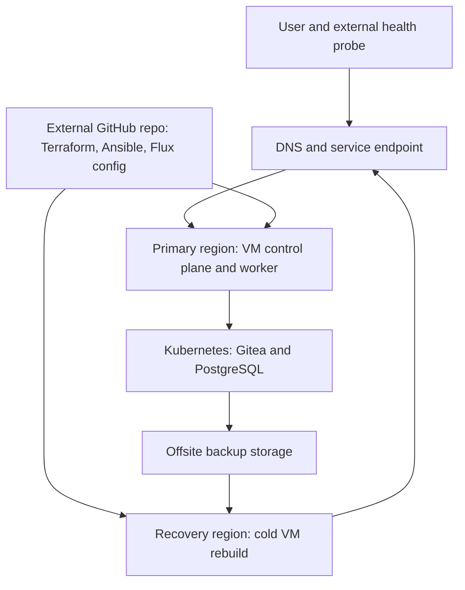

# Self-Managed Kubernetes Disaster Recovery

Recover a stateful service after losing a region. This lab runs Gitea and PostgreSQL on a kubeadm-built Kubernetes cluster on VMs. Recovery rebuilds the cluster from code, restores application data from an offsite backup, and measures downtime and data loss.

The first target is recovery within a few hours. Faster recovery is a later experiment, based on the measured bottlenecks.

## Target architecture

The recovery region has no running VMs until a drill. Terraform state, deployment source, backup storage, and recovery credentials remain available if the primary region is unavailable. The backup includes PostgreSQL data and Gitea repositories and configuration as one consistent recovery point.

## Tools and responsibilities

| Tool | Responsibility |
| --- | --- |
| Terraform | VM, network, DNS, and backup infrastructure |
| Ansible and kubeadm | VM configuration and Kubernetes bootstrap |
| Flux and Helm | Deploy and reconcile cluster add-ons and Gitea from GitHub |
| PostgreSQL and Gitea | Stateful service used to prove recovery |
| Offsite object storage | Application backups and recovery artifacts |
| External health probe | Measure outage and restored service |

## Recovery test

1. Create a Gitea user, repository, commit, and issue. Record their identifiers and a final write time.
2. Simulate loss of the primary region. Start the recovery timer when the service becomes unavailable.
3. Provision recovery VMs, bootstrap Kubernetes, and reconcile deployment configuration from GitHub.
4. Restore a verified, consistent application backup and route traffic to the recovered service.
5. Confirm login, the commit and issue, and a new push. Record actual RTO, RPO, manual steps, and cost.

See [plan.md](plan.md) for milestones and validation gates, and [docs](docs/README.md) for worklogs, decisions, troubleshooting, and the recovery runbook. The project does not depend on Gitea to store its own recovery configuration.
