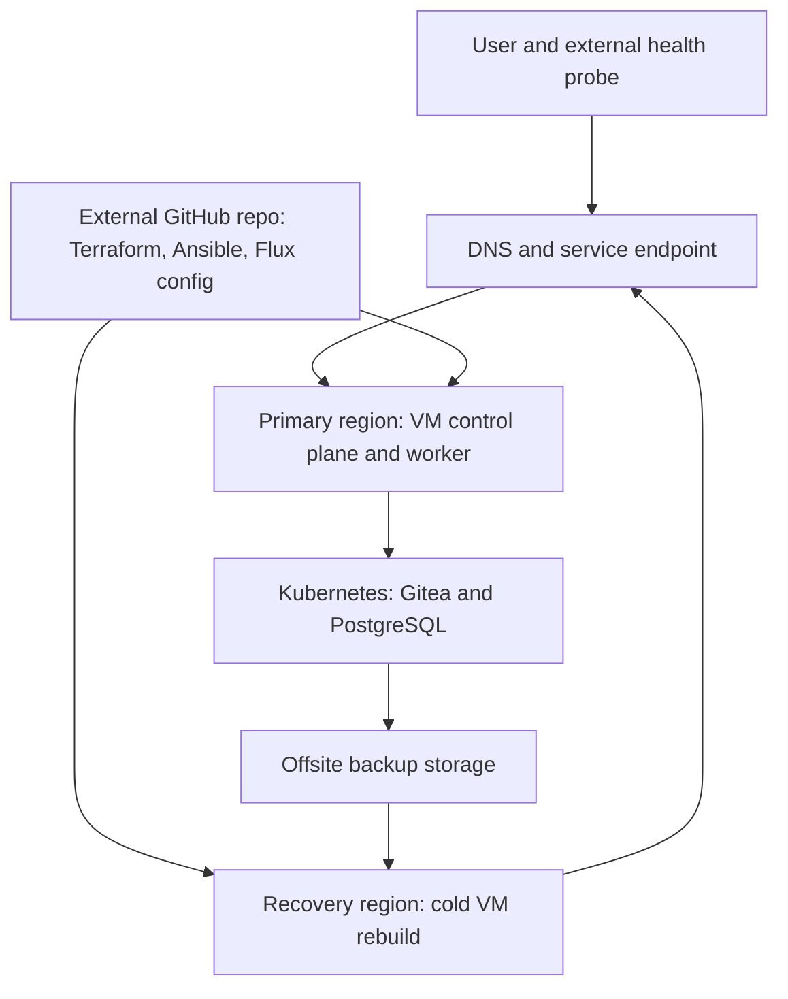

# Self-Managed Kubernetes Disaster Recovery

Recover a stateful service after losing a region. This lab runs Gitea and PostgreSQL on a kubeadm-built Kubernetes cluster on VMs. Recovery rebuilds the cluster from code, restores application data from an offsite backup, and measures downtime and data loss.

The first target is recovery within a few hours. Faster recovery is a later experiment, based on the measured bottlenecks.

**Status:** milestones 0 to 4 are complete. The primary cluster serves Gitea and takes hourly, encrypted offsite backups; a test restore took 43 seconds. Cluster metrics go to Grafana Cloud, and a security review of the running service is closed with a daily scan of its public surface. Cold recovery in the second region (milestone 5) is complete: with both primary VMs stopped, a new cluster in Belgium restored the newest backup and passed the fixture and write checks through `git-dr.sindrg.com`. The first disaster drill (milestone 6) recovered the service through `git.sindrg.com` in 19 minutes with 25 minutes of data loss; the repeat has not run. See [plan.md](plan.md).

## Target architecture

```mermaid
flowchart TD
    U["User and external health probe"] --> D["DNS and service endpoint"]
    D --> P["Primary region: VM control plane and worker"]
    P --> A["Kubernetes: Gitea and PostgreSQL"]
    A --> B["Offsite backup storage"]
    G["External GitHub repo: Terraform, Ansible, Flux config"] --> P
    G --> R["Recovery region: cold VM rebuild"]
    B --> R
    R --> D
```

The recovery region has no running VMs until a drill. Terraform state, deployment source, backup storage, and recovery credentials remain available if the primary region is unavailable. The backup includes PostgreSQL data and Gitea repositories and configuration as one consistent recovery point.

## Tools and responsibilities

| Tool | Responsibility |
| --- | --- |
| Terraform | VM, network, load balancer, and backup infrastructure |
| Ansible and kubeadm | VM configuration, Kubernetes bootstrap, and the add-ons Flux depends on |
| Flux and Helm | Deploy and reconcile the application layer from GitHub: cert-manager, PostgreSQL, Gitea, backups, monitoring, and network policies |
| Traefik and cert-manager | Route HTTPS through the Gateway API with Let's Encrypt certificates |
| SOPS and age | Keep secrets encrypted in the public repository; encrypt backups to keys the cluster does not hold |
| PostgreSQL and Gitea | Stateful service used to prove recovery |
| Offsite object storage | Hourly encrypted application backups, with a Healthchecks.io heartbeat that alerts when they stop |
| Grafana Cloud | Cluster metrics that stay readable after the primary region is lost |
| GitHub Actions | Tests and linters, a weekly check that pinned downloads still exist, and a daily scan of the public surface |
| External health probe | Measure outage and restored service from outside the cluster |

## Recovery test

1. Create a Gitea user, repository, commit, and issue. Record their identifiers and a final write time.
2. Simulate loss of the primary region. Start the recovery timer when the service becomes unavailable.
3. Provision recovery VMs, bootstrap Kubernetes, and reconcile deployment configuration from GitHub.
4. Restore a verified, consistent application backup and route traffic to the recovered service.
5. Confirm login, the commit and issue, and a new push. Record actual RTO, RPO, manual steps, and cost.

The lab models organizations that must run Kubernetes on VMs they control. [Production readiness](docs/production-readiness.md) lists what a production deployment adds.

See [plan.md](plan.md) for milestones and validation gates, the [architecture pages](docs/architecture/README.md) for how each part works, and [docs](docs/README.md) for worklogs, decisions, troubleshooting, and the recovery runbook. Run `make` from the repository root to list the operator commands; the [bootstrap runbook](docs/runbooks/kubernetes-bootstrap.md) shows when to use each one. The project does not depend on Gitea to store its own recovery configuration.

## License

[MIT](LICENSE).
