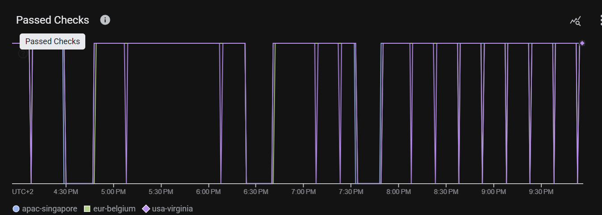
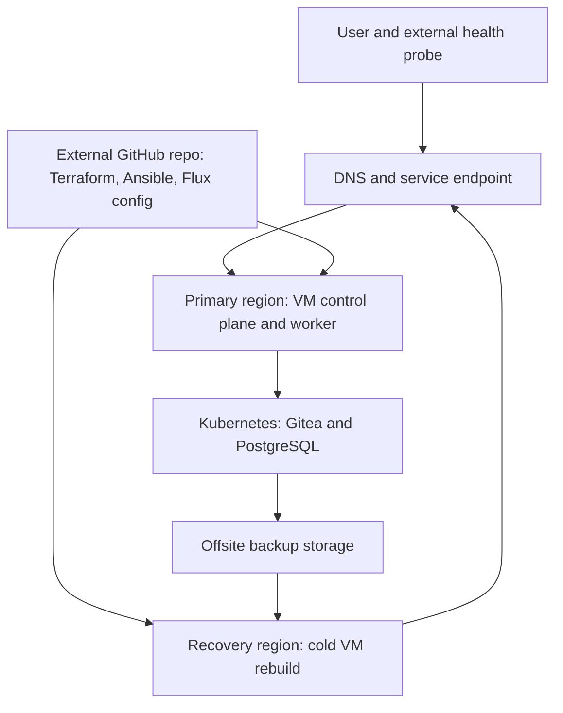

# Self-Managed Kubernetes Disaster Recovery

Recover a stateful service after losing a region. This lab runs Gitea and PostgreSQL on a kubeadm-built Kubernetes cluster on VMs. Recovery rebuilds the cluster from code, restores application data from an offsite backup, and measures downtime and data loss.

Three drills on 2026-10-04 stopped the primary region (Finland) and recovered the service in Belgium in under 20 minutes, against a target of four hours. The project is complete: every milestone in [plan.md](plan.md) passed its gate.

The lab models organizations that must run Kubernetes on VMs they control. [Production readiness](docs/production-readiness.md) lists what a production deployment adds.

## Results

| Measure | Drill 1 | Drill 2 | Drill 3 | Target |
| --- | --- | --- | --- | --- |
| Recovery time | 19 min 17 s | 17 min 36 s | 16 min 46 s | At most 4 hours |
| Data loss | 25 min 28 s | 15 min 16 s | 10 min 10 s | At most 2 hours |
| Backup interval | 60 min | 60 min | 15 min | |
| Failed steps | One check rerun | None | None | |

Recovery time runs from the first failed external probe until sign-in, a known commit and issue, and a new push work through `git.sindrg.com`. Data loss runs from the last acknowledged write to the newest restored write. [Decision 0002](docs/decisions/0002-recovery-contract.md#measurement) defines both.

What the numbers do not show:

- **The recovery is staged, not one command.** An operator runs six commands and checks the result between them: two Terraform applies, one Ansible playbook that builds the cluster and installs Flux, one restore, and two DNS changes. Flux deploys the service from Git.
- **Most of the time is the cluster build.** The restore Job takes under 30 seconds.
- **Each backup pauses the service.** A backup briefly scales Gitea to zero, four times an hour.
- **Cost was not read from billing.** The recovery environment existed for 42, 28, and 23 minutes.

The external uptime check during the three drills, in UTC+2. The wide gaps are the outages and the narrow dips are backups:

## Architecture

```mermaid
flowchart TD
    U["User and external health probe"] --> D["DNS and service endpoint"]
    D --> P["Primary region: VM control plane and worker"]
    P --> A["Kubernetes: Gitea and PostgreSQL"]
    A --> B["Offsite backup storage"]
    G["External GitHub repo: Terraform, Ansible, Flux config"] --> P
    G --> R["Recovery region: cold VM rebuild"]
    B --> R
    R --> D
```

The recovery region has no running VMs until a drill. Terraform state, deployment source, backup storage, and recovery credentials remain available if the primary region is unavailable. The backup includes PostgreSQL data and Gitea repositories and configuration as one consistent recovery point.

## Tools and responsibilities

| Tool | Responsibility |
| --- | --- |
| Terraform | VM, network, load balancer, and backup infrastructure |
| Ansible and kubeadm | VM configuration, Kubernetes bootstrap, and the add-ons Flux depends on |
| Flux and Helm | Deploy and reconcile the application layer from GitHub: cert-manager, PostgreSQL, Gitea, backups, monitoring, and network policies |
| Traefik and cert-manager | Route HTTPS through the Gateway API with Let's Encrypt certificates |
| SOPS and age | Keep secrets encrypted in the public repository; encrypt backups to keys the cluster does not hold |
| PostgreSQL and Gitea | Stateful service used to prove recovery |
| Offsite object storage | Encrypted application backups every 15 minutes, with a Healthchecks.io heartbeat that alerts when they stop |
| Grafana Cloud | Cluster metrics that stay readable after the primary region is lost |
| GitHub Actions | Tests and linters, a weekly check that pinned downloads still exist, and a daily scan of the public surface |
| External health probe | Measure outage and restored service from outside the cluster |

## Documentation

| To find | Read |
| --- | --- |
| Drill results, timelines, and failures | Worklogs [6](docs/worklogs/06-disaster-drill.md) and [7](docs/worklogs/07-faster-recovery.md) |
| The recovery procedure | [Regional recovery runbook](docs/runbooks/regional-recovery.md) |
| How each part works, with diagrams | [Architecture pages](docs/architecture/README.md) |
| Why it is built this way | [Decision records](docs/decisions/) |
| How to build it yourself | [Reproduce the project](docs/reproduce.md) |
| Everything else | [Documentation index](docs/README.md) |

Run `make` to list the operator commands.

## License

[MIT](LICENSE).
