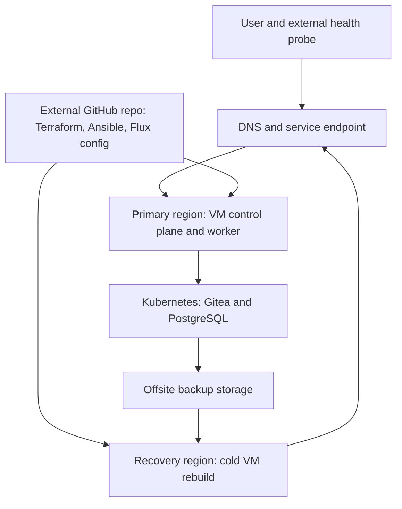

# Self-Managed Kubernetes Disaster Recovery

Recover a stateful service after losing a region. This lab runs Gitea and PostgreSQL on a kubeadm-built Kubernetes cluster on VMs. Recovery rebuilds the cluster from code, restores application data from an offsite backup, and measures downtime and data loss.

Three drills stopped the primary region and recovered the service in a second region in under 20 minutes, against a target of four hours.

**Status:** complete. Every milestone in [plan.md](plan.md) passed its gate. A primary cluster in Finland ran Gitea and took encrypted offsite backups every 15 minutes. Three disaster drills stopped it, rebuilt the service in Belgium from code and one backup set, and moved `git.sindrg.com` there. Cluster metrics went to Grafana Cloud, and a security review of the running service was closed with a daily scan of its public surface.

## Results

Three drills on 2026-10-04 stopped both primary VMs and recovered the service in the second region. Drills 1 and 2 ran with hourly backups. Drill 3 ran after the backups moved to every 15 minutes.

| Measure | Drill 1 | Drill 2 | Drill 3 | Target |
| --- | --- | --- | --- | --- |
| Recovery time: first failed external probe to sign-in, known commit and issue, and a new push through `git.sindrg.com` | 19 min 17 s | 17 min 36 s | 16 min 46 s | At most 4 hours |
| Data loss: last acknowledged write to the newest restored write | 25 min 28 s | 15 min 16 s | 10 min 10 s | At most 2 hours |
| Largest possible backup age | 60 min | 60 min | 15 min | |
| Failed steps | One check rerun | None | None | |

The recovery is automated in stages, with an operator between them. Six commands do the work: two Terraform applies, one Ansible playbook that builds the cluster and installs Flux, one restore, and two DNS changes. Flux deploys the service from Git without a command. The other 13 commands of a drill are the simulated failure, plans, checks, and waits that the operator reads before going on. No single command runs the whole recovery. The recovery environment existed for 42, 28, and 23 minutes; its cost was not read from billing. The recovery time is not the restore time: the restore Job takes under 30 seconds, and a test restore on the primary took 43 seconds, while building the cluster takes most of the rest. Each backup briefly scales the service to zero, which now happens four times an hour.

The external uptime check during the three drills, in UTC+2. The wide gaps are the outages; the narrow dips are backups:

| Evidence | Where |
| --- | --- |
| Drill results, stage timelines, probe times, failures, limits | [Disaster drill worklog](docs/worklogs/06-disaster-drill.md) |
| The 15-minute schedule, drill 3, and what it costs | [Faster recovery worklog](docs/worklogs/07-faster-recovery.md) |
| The procedure that ran | [Regional recovery runbook](docs/runbooks/regional-recovery.md) |
| First recovery with the primary stopped, without a cutover | [Cold recovery worklog](docs/worklogs/05-cold-recovery.md) |
| How the measures are defined | [Decision 0002](docs/decisions/0002-recovery-contract.md#measurement) |
| Backup and test restore | [Consistent backups worklog](docs/worklogs/04-consistent-backups.md) |

## Architecture

```mermaid
flowchart TD
    U["User and external health probe"] --> D["DNS and service endpoint"]
    D --> P["Primary region: VM control plane and worker"]
    P --> A["Kubernetes: Gitea and PostgreSQL"]
    A --> B["Offsite backup storage"]
    G["External GitHub repo: Terraform, Ansible, Flux config"] --> P
    G --> R["Recovery region: cold VM rebuild"]
    B --> R
    R --> D
```

The recovery region has no running VMs until a drill. Terraform state, deployment source, backup storage, and recovery credentials remain available if the primary region is unavailable. The backup includes PostgreSQL data and Gitea repositories and configuration as one consistent recovery point.

## Tools and responsibilities

| Tool | Responsibility |
| --- | --- |
| Terraform | VM, network, load balancer, and backup infrastructure |
| Ansible and kubeadm | VM configuration, Kubernetes bootstrap, and the add-ons Flux depends on |
| Flux and Helm | Deploy and reconcile the application layer from GitHub: cert-manager, PostgreSQL, Gitea, backups, monitoring, and network policies |
| Traefik and cert-manager | Route HTTPS through the Gateway API with Let's Encrypt certificates |
| SOPS and age | Keep secrets encrypted in the public repository; encrypt backups to keys the cluster does not hold |
| PostgreSQL and Gitea | Stateful service used to prove recovery |
| Offsite object storage | Encrypted application backups every 15 minutes, with a Healthchecks.io heartbeat that alerts when they stop |
| Grafana Cloud | Cluster metrics that stay readable after the primary region is lost |
| GitHub Actions | Tests and linters, a weekly check that pinned downloads still exist, and a daily scan of the public surface |
| External health probe | Measure outage and restored service from outside the cluster |

## Recovery test

1. Create a Gitea user, repository, commit, and issue. Record their identifiers and a final write time.
2. Simulate loss of the primary region. Start the recovery timer when the service becomes unavailable.
3. Provision recovery VMs, bootstrap Kubernetes, and reconcile deployment configuration from GitHub.
4. Restore a verified, consistent application backup and route traffic to the recovered service.
5. Confirm login, the commit and issue, and a new push. Record actual RTO, RPO, manual steps, and cost.

The lab models organizations that must run Kubernetes on VMs they control. [Production readiness](docs/production-readiness.md) lists what a production deployment adds.

## Documentation

| To find | Read |
| --- | --- |
| How each part works, with diagrams | [Architecture pages](docs/architecture/README.md) |
| Why it is built this way | [Decision records](docs/decisions/) |
| What was done and the evidence for each gate | [Worklogs](docs/worklogs/) and [plan.md](plan.md) |
| How to operate it | [Runbooks](docs/runbooks/); run `make` to list the operator commands |
| How to build it yourself | [Reproduce the project](docs/reproduce.md) |
| Everything else | [Documentation index](docs/README.md) |

## License

[MIT](LICENSE).
