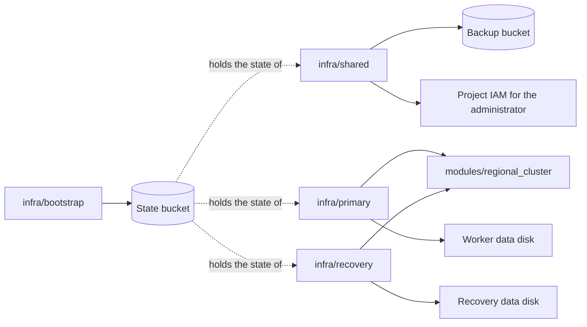
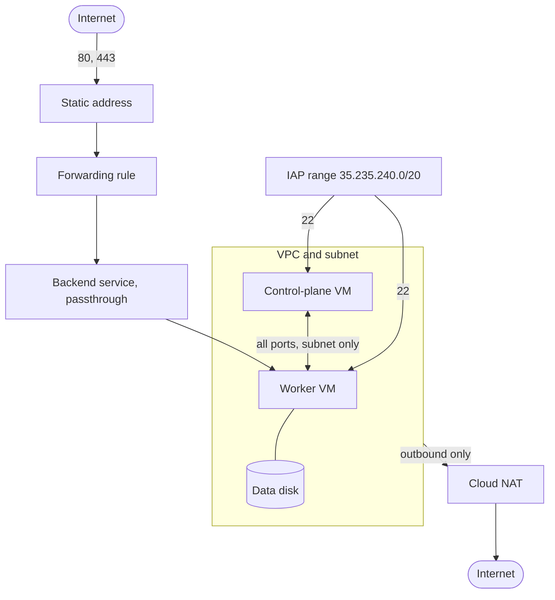

# 1. Infrastructure

Status: the bootstrap, shared, primary, and recovery roots are built. The recovery root ([decision 0008](../decisions/0008-cold-recovery.md)) was applied for the [milestone 5 gate](../worklogs/05-cold-recovery.md#validation) and is destroyed between drills.

Terraform creates everything in Google Cloud: the buckets, the networks, the VMs, and the load balancers. It creates nothing inside the VMs; that is [Ansible's job](02-ansible.md).

## Roots

A root is a directory with its own state. The split keeps resources that must outlive a region out of any regional root.

| Root | Creates | Lifetime |
| --- | --- | --- |
| `infra/bootstrap` | The state bucket and the operator's access to it | Permanent. Starts with local state, then migrates into the bucket it created. |
| `infra/shared` | The backup bucket, its IAM, and the administrator's IAP, OS Login, and instance admin roles | Permanent. Shared by every region. |
| `infra/primary` | The Finland cluster through the module, plus the worker data disk | Permanent. The data disk has `prevent_destroy`. |
| `infra/recovery` | The Belgium cluster through the same module, plus its own data disk | Created for a drill or a disaster, destroyed afterwards. Its disk has no `prevent_destroy`. |

Both buckets are in Belgium (`europe-west1`), so losing Finland loses neither the state nor the backups. Each root stores its state under its own prefix in the state bucket.

The recovery root mirrors the primary root: the same module, the same outputs, a different region, name prefix, and subnet. Nothing in it refers to a primary resource, so it applies while Finland is down.

## What the module creates

`modules/regional_cluster` is one cluster in one region. The primary and recovery roots call it with different inputs, so the two clusters cannot drift apart.

| Resource | Detail |
| --- | --- |
| VMs | Two, Ubuntu 24.04 from a pinned image, 2 vCPU and 4 GiB each, Shielded VM, no external address |
| Outbound traffic | Cloud NAT, for package and image downloads |
| Inbound SSH | Only from Google's IAP range. OS Login is on and project SSH keys are blocked. |
| Public traffic | A regional passthrough load balancer sends ports 80 and 443 to the worker. TLS ends in the cluster, not at the load balancer. |
| Node service accounts | One per node. The worker may read and create Cloud Storage objects; the control plane has no API scope. |

## Firewall rules

| Rule | From | To | Ports |
| --- | --- | --- | --- |
| `iap-ssh` | IAP range | Both nodes | 22 |
| `node-internal` | The subnet | Both nodes | All |
| `public-web` | Internet | Worker | 80, 443 |

Nothing else reaches the nodes. The Kubernetes API listens on the control plane's private address only.

## How it connects to the next layer

`make inventory` reads the selected root's outputs (instance names, private addresses, project, zone, subnet) and writes the Ansible inventory for that cluster. Terraform and Ansible share nothing else.

The backup bucket's access list, `backup_clusters` in `infra/shared`, names each cluster's worker service account. A recovery worker is added after its root is applied, because the grant needs the account to exist.

## Limits

- One zone and one worker. A zone failure is an outage.
- Terraform runs from the operator machine with personal credentials. There is no pipeline.
- The backup retention policy is unlocked, so a project owner can remove it.

See [decision 0003](../decisions/0003-regional-infrastructure-and-state.md) and the [primary infrastructure runbook](../runbooks/primary-infrastructure.md).
