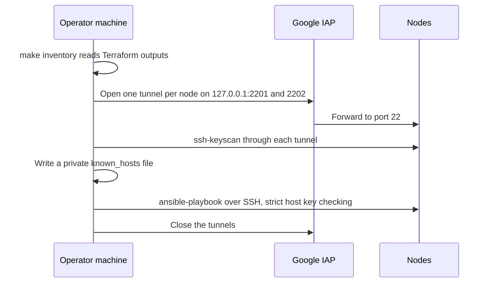
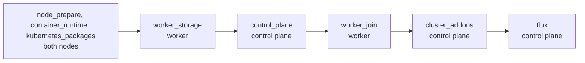

# 2. Ansible

Ansible turns two blank Ubuntu VMs into a Kubernetes cluster with Flux running, and runs the operator's routine checks. It runs on the operator machine. Nothing is installed on the nodes to support it beyond SSH and Python.

## How it reaches the nodes

The nodes have no public address, so every run goes through Google's Identity-Aware Proxy (IAP). `scripts/run_with_iap.py` wraps each playbook run.

| Piece | What it does |
| --- | --- |
| `scripts/prepare_ansible_inventory.py` | Builds the inventory from Terraform outputs. Each host is `127.0.0.1` with a fixed local port. It refuses overlapping VPC, pod, and service ranges. |
| `scripts/run_with_iap.py` | Opens the tunnels, records the host keys, runs the command, and always closes the tunnels. It prints the run's start, end, and duration. |
| OS Login | Maps the operator's Google identity to a Linux user. There are no SSH keys in project metadata. |
| `ansible.cfg` | Points at the generated inventory, keeps caches inside the repository, and turns on SSH pipelining. |

The inventory and `known_hosts` are generated files and are ignored by Git.

## The bootstrap playbook

`make bootstrap` runs `bootstrap.yml`: six plays, in order.

| Role | What it does |
| --- | --- |
| `node_prepare` | Checks the OS, installs prerequisites, disables swap, loads kernel modules, sets the networking sysctls |
| `container_runtime` | Installs a pinned `containerd.io` from Docker's repository and configures it for Kubernetes |
| `kubernetes_packages` | Installs and holds pinned `kubelet`, `kubeadm`, and `kubectl` |
| `worker_storage` | Formats the data disk only if it is blank, mounts it by UUID, and refuses the boot disk or an unexpected filesystem |
| `control_plane` | Runs `kubeadm init` once and waits for the API |
| `worker_join` | Creates a 15-minute join token on the control plane and joins the worker |
| `cluster_addons` | Installs Calico, the Gateway API CRDs, Helm, Traefik, and the Local Path Provisioner |
| `flux` | Installs Flux, sends the SOPS age key, points Flux at the repository, and waits for the first reconcile |

After the `flux` role, [Flux](04-flux.md) deploys everything else from Git. Ansible does not manage the application.

### Why reruns are safe

Each one-time step checks for its own result first: `kubeadm init` is skipped when `/etc/kubernetes/admin.conf` exists, the join when `/etc/kubernetes/kubelet.conf` exists, and `mkfs` when the disk has a filesystem. Everything else declares a state. The same command bootstraps a new cluster and repairs an existing one.

### How versions are managed

Every version is pinned in `ansible/playbooks/group_vars/all.yml`: Kubernetes, containerd, Helm, Calico, the Gateway API, the Traefik chart, the Local Path Provisioner, and Flux. `make pins` and a weekly CI job check that each pin still resolves upstream, because a recovery bootstrap downloads them long after they were chosen.

## Operator commands

`make` lists them. Two kinds exist.

| Runs on the nodes through IAP | Purpose |
| --- | --- |
| `make bootstrap` | Build or repair the cluster |
| `make validate-cluster` | Read-only: nodes, add-ons, Flux |
| `make validate-services` | Read-only: certificates, PostgreSQL, Gitea, routes, policies |
| `make restore` | Run the [restore Job](06-backup-and-restore.md) |
| `make restore-test-env` | Create or delete the test restore namespaces |

| Runs locally against the public endpoint | Purpose |
| --- | --- |
| `make create-fixtures` | Create the fixture user, repository, commit, and issue |
| `make check-fixtures` | Read-only: prove the fixtures exist |
| `make write-check` | Push a commit and print its time, for the data-loss measurement |
| `make surface` | Probe the [public surface](07-monitoring-and-checks.md) |

## How secrets pass through

The SOPS age key and the backup age key are read on the operator machine and sent to `kubectl apply` on standard input. They are never written to a node's disk, and the tasks set `no_log`.

## Limits

- One operator machine runs everything. There is no shared runner.
- `kubectl` is used on the control plane over SSH. There is no kubeconfig on the operator machine.
- Upgrades are manual: change a pin, rerun the bootstrap.

See [decision 0005](../decisions/0005-kubernetes-bootstrap-architecture.md) and the [bootstrap runbook](../runbooks/kubernetes-bootstrap.md).
