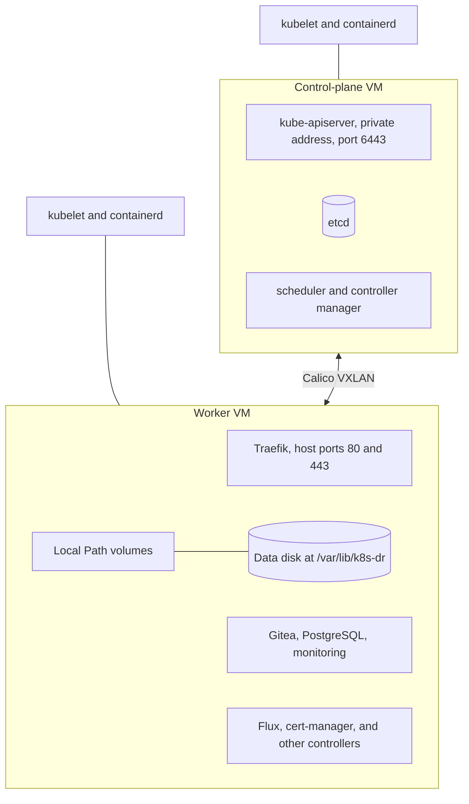
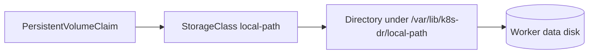

# 3. Kubernetes cluster

A kubeadm cluster with one control-plane node and one worker. This page covers what runs on the nodes before any application: the runtime, pod networking, storage, and the ingress proxy.

## Nodes

| Component | Choice | Note |
| --- | --- | --- |
| Kubernetes | 1.36, installed by kubeadm | Packages are pinned and held |
| Container runtime | containerd | systemd cgroup driver |
| Control-plane endpoint | The control-plane node's private address | Not reachable from the internet. A single address, so the node cannot be replaced without re-initializing. |
| Workload placement | The control plane keeps kubeadm's `NoSchedule` taint, so ordinary pods run on the worker | The service pods also select a `node-role.kubernetes.io/worker` label |

## Addresses

| Range | Used for |
| --- | --- |
| The VPC subnet | Node addresses |
| `192.168.0.0/16` | Pod addresses |
| `10.96.0.0/12` | Service addresses |

The inventory script refuses to continue if any two overlap.

## Pod networking

Calico, installed by the Tigera operator. Pods on different nodes talk through a VXLAN overlay, so the VPC needs no routes for pod addresses. BGP is off. Calico also enforces the Kubernetes NetworkPolicy objects described on the [service page](05-service.md).

Traffic between pods is not encrypted. It stays inside one VPC.

## Storage

The Local Path Provisioner turns each claim into a directory on the worker's dedicated data disk. The disk is separate from the boot disk, so rebuilding the VM keeps the data. The provisioner is restricted to the worker node and to that one path.

This is node-local storage. It does not replicate, and a volume cannot move to another node. The [offsite backup](06-backup-and-restore.md) is the only copy outside the region.

## Ingress proxy

Traefik is the single way in. It runs on the worker and binds host ports 80 and 443, which is where the load balancer delivers traffic.

| Setting | Value |
| --- | --- |
| Routing API | Gateway API only. The Ingress and Traefik CRD providers are off. |
| Entry points | `web` on 8000 and `websecure` on 8443 inside the pod, exposed as host ports 80 and 443 |
| Internal check port | NodePort 30080 for the HTTP entry point, reachable only inside the VPC |
| Dashboard | Off |
| Update strategy | Replace the pod, because two pods cannot bind the same host ports |

Ansible installs Traefik with Helm because Flux depends on nothing here, but the certificates and routes that Traefik serves come from Flux.

## Who installs what

| Installed by Ansible | Installed by Flux |
| --- | --- |
| Calico, Gateway API CRDs, Traefik, Local Path Provisioner, Flux itself | cert-manager, PostgreSQL, Gitea, the backup CronJob, monitoring, network policies |

The rule: Ansible installs what must exist before Flux can work. Flux installs the rest.

## Limits

- One control-plane node. If it is lost, the cluster is rebuilt, not repaired.
- Secrets in etcd are not encrypted by Kubernetes. The disk is encrypted by Google Cloud.
- No Pod Security Admission labels and no API server audit log.

See [decision 0001](../decisions/0001-use-kubeadm.md) and [decision 0005](../decisions/0005-kubernetes-bootstrap-architecture.md).
