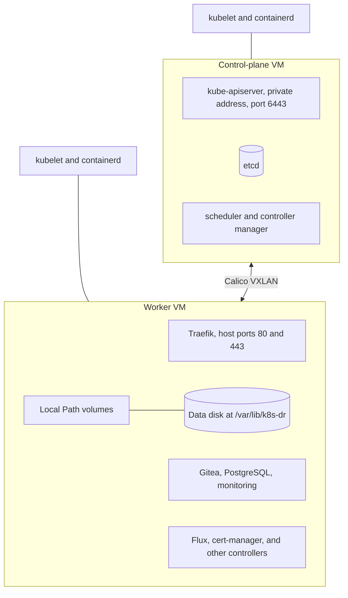
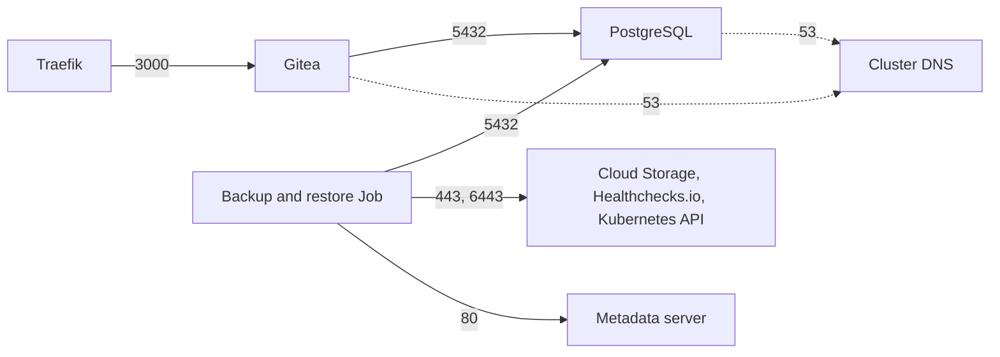
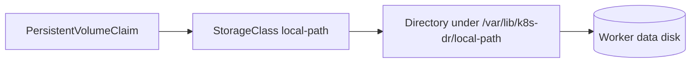

# 3. Kubernetes cluster

A kubeadm cluster with one control-plane node and one worker. This page covers what runs on the nodes before any application: the runtime, pod networking, network policies, and storage. The ingress proxy has [its own page](06-traffic-and-certificates.md).

## Nodes

| Component | Choice | Note |
| --- | --- | --- |
| Kubernetes | 1.36, installed by kubeadm | Packages are pinned and held |
| Container runtime | containerd | systemd cgroup driver |
| Control-plane endpoint | The control-plane node's private address | Not reachable from the internet. A single address, so the node cannot be replaced without re-initializing. |
| Workload placement | The control plane keeps kubeadm's `NoSchedule` taint, so ordinary pods run on the worker | The service pods also select a `node-role.kubernetes.io/worker` label |

## Addresses

| Range | Used for |
| --- | --- |
| The VPC subnet | Node addresses |
| `192.168.0.0/16` | Pod addresses |
| `10.96.0.0/12` | Service addresses |

The inventory script refuses to continue if any two overlap.

## Pod networking

Calico, installed by the Tigera operator. Pods on different nodes talk through a VXLAN overlay, so the VPC needs no routes for pod addresses. BGP is off. Calico also enforces Kubernetes NetworkPolicy objects.

Traffic between pods is not encrypted. It stays inside one VPC.

## Network policies

The `gitea` and `postgresql` namespaces deny all traffic by default. These are the only flows allowed.

| Namespace | Policy |
| --- | --- |
| `gitea`, `postgresql` | Default deny, plus the flows above |
| `traefik` | Egress only to cluster DNS, the Kubernetes API, and Gitea |
| `cert-manager`, `monitoring` | All egress except the metadata server |
| `flux-system` | Flux's own policies, which allow all egress |
| `kube-system`, Calico, Local Path Provisioner | None |

The metadata server matters because it hands the node's service account token to any pod that can reach it. Only the backup and restore Job needs that token. Flux owns every policy, so a recovery cluster gets the same ones. A unit test compares the allowed flows to a fixed list.

## Storage

The Local Path Provisioner turns each claim into a directory on the worker's dedicated data disk. The disk is separate from the boot disk, so rebuilding the VM keeps the data. The provisioner is restricted to the worker node and to that one path.

This is node-local storage. It does not replicate, and a volume cannot move to another node. The [offsite backup](09-backup-and-restore.md) is the only copy outside the region.

## Who installs what

| Installed by Ansible | Installed by Flux |
| --- | --- |
| Calico, Gateway API CRDs, Traefik, Local Path Provisioner, Flux itself | cert-manager, PostgreSQL, Gitea, the backup CronJob, monitoring, network policies |

The rule: Ansible installs what must exist before Flux can work. Flux installs the rest.

## Limits

- One control-plane node. If it is lost, the cluster is rebuilt, not repaired.
- Secrets in etcd are not encrypted by Kubernetes. The disk is encrypted by Google Cloud.
- No Pod Security Admission labels and no API server audit log.

See [decision 0001](../decisions/0001-use-kubeadm.md) and [decision 0005](../decisions/0005-kubernetes-bootstrap-architecture.md).
