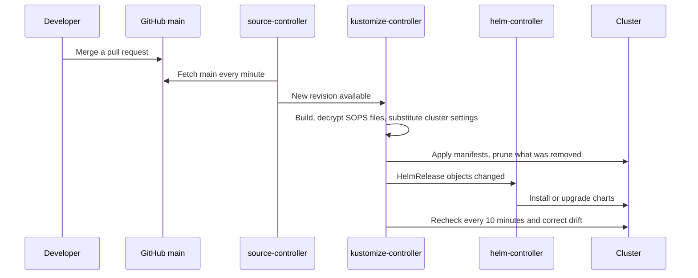
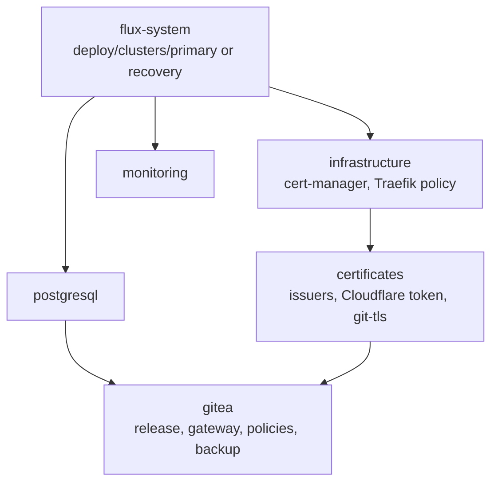
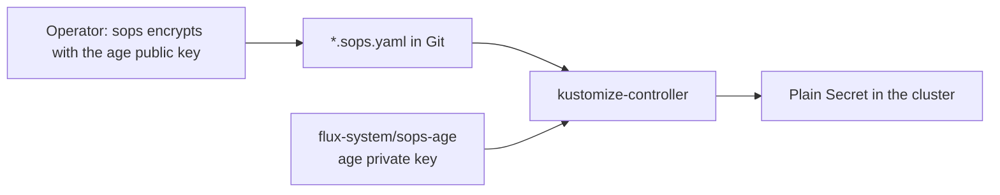

# 4. Flux

Status: built on the primary cluster. `deploy/clusters/recovery` and the `git_cluster_host` setting are designed in [decision 0008](../decisions/0008-cold-recovery.md) and not built.

Flux makes the cluster match the `deploy/` directory on the `main` branch. Nobody runs `kubectl apply` for the application: a merge is the deployment.

## The loop

Flux reads the public repository anonymously over HTTPS. It holds no GitHub credential and never writes to Git.

## How it is installed and managed

The Ansible `flux` role applies the pinned Flux release, creates the `sops-age` Secret, and applies one `GitRepository` and one root `Kustomization` that points at `deploy/clusters/<cluster>`. From then on Flux manages itself from Git, and Ansible only touches it again to rotate the key or change the branch.

To test a branch before merging, run `make bootstrap FLUX_GIT_BRANCH=<branch>`.

## The Kustomization tree

The root Kustomization applies the cluster's directory, which holds two things: that cluster's settings, and a reference to `deploy/sync`, the list of Kustomizations every cluster runs. Because both clusters read the same list, a recovery cluster cannot drift from the primary's layout. Each Kustomization is applied and health-checked on its own.

| Kustomization | Path | Waits for health | Note |
| --- | --- | --- | --- |
| `infrastructure` | `deploy/infrastructure` | Yes | Controllers and CRDs that others need |
| `certificates` | `deploy/certificates` | No | A slow Let's Encrypt order must not fail a bootstrap |
| `postgresql` | `deploy/apps/postgresql` | Yes | |
| `gitea` | `deploy/apps/gitea` | Yes | Needs the database and the certificate first |
| `monitoring` | `deploy/monitoring` | No | Nothing depends on it, so a failure cannot block the service |

Arrows are `dependsOn`: a Kustomization is not applied until the ones it depends on are ready.

## Per-cluster settings

Each cluster directory has a `cluster-settings.yaml` ConfigMap with the only values that differ between clusters. Flux substitutes them into manifests as `${git_host}` and similar. Everything else under `deploy/` is shared.

| Setting | Primary | Recovery | Used for |
| --- | --- | --- | --- |
| `git_host` | `git.sindrg.com` | `git.sindrg.com` | The public name, Gitea's URLs, and a certificate |
| `git_cluster_host` | `git-primary.sindrg.com` | `git-dr.sindrg.com` | Reaching one cluster directly, and a second certificate |
| `git_issuer` | Production | Production, or staging for rebuild tests | Which Let's Encrypt issuer signs the certificates |
| `backup_cluster` | `primary` | `recovery` | The prefix this cluster writes backups under |
| `backup_suspend` | `false` | `true` until a restore is verified | Whether the backup CronJob is suspended |
| `cluster_name` | `primary` | `recovery` | The label on its metrics |

## Secrets

Secrets are committed to the public repository, encrypted with SOPS and age. Only the `data` and `stringData` fields are encrypted, so the files still diff and review.

The private key reaches the cluster once, from the operator machine, during the bootstrap. It also lives in the operator's credential store, because a recovery cluster needs it.

## Pruning

Every Kustomization has `prune: true`: deleting a manifest from Git deletes the object. Two protections stop that from destroying data. The `gitea` and `postgresql` namespaces carry a no-prune annotation, and the PostgreSQL volume claim is not owned by Flux.

## Charts

Three of the Kustomizations contain a `HelmRelease`. The [Helm page](05-helm.md) covers how those work.

## Limits

- Whoever can merge to `main` controls the cluster. The branch requires a pull request but no approval.
- The in-cluster age key decrypts every secret in the repository.
- Flux shows drift only through its own status. No alert is sent when a reconcile fails.

See [decision 0006](../decisions/0006-service-deployment-architecture.md) and the [service deployment runbook](../runbooks/service-deployment.md).
