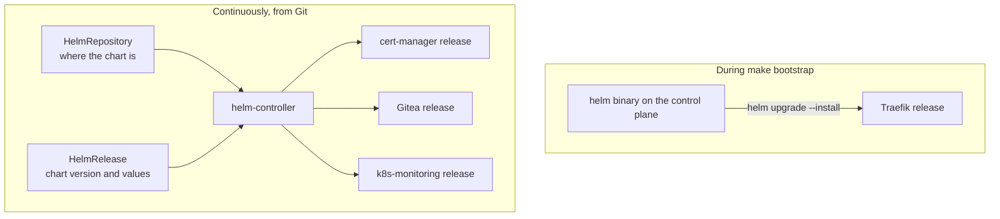

# 5. Helm

Helm packages a set of Kubernetes manifests as a chart with adjustable values. This project uses it only where an upstream project ships a chart worth reusing. It is run in two different ways, by two different owners.

## Two ways Helm runs

| | Helm run by Ansible | Helm run by Flux |
| --- | --- | --- |
| Charts | Traefik | cert-manager, Gitea, k8s-monitoring |
| Why | Traefik must exist before Flux has anything to route | Everything after the cluster works belongs in Git |
| Who runs Helm | The `cluster_addons` role runs the `helm` command on the control plane | The helm-controller pod, with no command to run |
| Where the values are | `ansible/roles/cluster_addons/templates/traefik-values.yml.j2` | Inline in each `release.yaml` under `deploy/` |
| How an upgrade happens | Change the chart version in `group_vars/all.yml`, then `make bootstrap` | Change the version in `release.yaml` and merge |

Nobody runs `helm install` by hand. The `helm` binary on the control plane is still useful for reading: `helm list -A` shows all four releases, because Flux stores its releases in the same format.

## The charts

| Release | Namespace | Chart version | Repository | Installs |
| --- | --- | --- | --- | --- |
| `traefik` | `traefik` | 41.6.0 | `traefik.github.io/charts` | The ingress proxy and its GatewayClass |
| `cert-manager` | `cert-manager` | v1.21.2 | `charts.jetstack.io` | The certificate controller, its webhook, and its CRDs |
| `gitea` | `gitea` | 12.7.0 | `dl.gitea.com/charts` | The Gitea Deployment, Services, and configuration |
| `k8s-monitoring` | `monitoring` | 4.5.2 | `grafana.github.io/helm-charts` | The Alloy collector, kube-state-metrics, and node-exporter |

PostgreSQL is deliberately not a chart. The common chart depends on images that are no longer published for free under fixed versions, so the database is a plain StatefulSet from the official image. See the [PostgreSQL page](08-postgresql.md).

## How a Flux release works

Each chart has two objects in Git, next to each other:

| Object | File | Says |
| --- | --- | --- |
| `HelmRepository` | `repository.yaml` | The chart repository URL, checked hourly |
| `HelmRelease` | `release.yaml` | The chart name, the exact version, and the values |

The helm-controller renders the chart with those values and installs or upgrades the release. It rechecks every hour and corrects drift. A failed install or upgrade is retried three times.

## How it is managed

- **Versions are exact.** No ranges, so nothing upgrades by itself. `make pins` and a weekly CI job confirm that each pinned chart version still exists in its repository.
- **Values are in Git.** They are reviewed like any other change. Per-cluster values such as the hostname are substituted by Flux from the [cluster settings](04-flux.md#per-cluster-settings) before Helm sees them.
- **Secrets stay out of values.** A release refers to an existing Secret by name, for example `gitea-admin` or `grafana-cloud-metrics`. Those Secrets come from SOPS files.
- **CRDs survive.** cert-manager's chart installs its CRDs and keeps them if the release is removed, so issued certificates survive a reinstall.
- **The Helm binary is verified.** Ansible downloads a pinned Helm version and checks its SHA-256 before installing it.

## Limits

- Chart upgrades are manual, and a major chart version can change its values. Each upgrade needs a read of the chart's release notes.
- Charts are downloaded from public repositories during a recovery. If one is unreachable, that release waits.
- The Traefik release was first installed by an older Helm version than a new cluster uses. See [decision 0005](../decisions/0005-kubernetes-bootstrap-architecture.md).

See [decision 0006](../decisions/0006-service-deployment-architecture.md).
