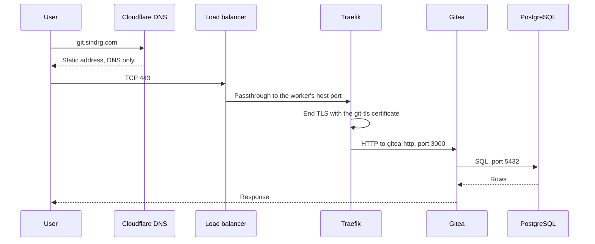
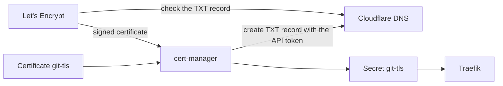
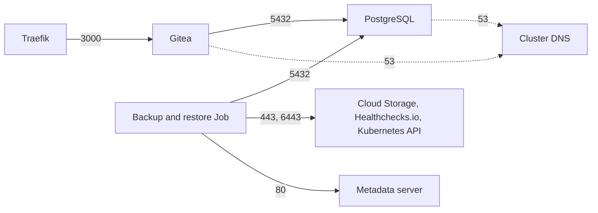

# 5. Service

Gitea with a PostgreSQL database, served at `git.sindrg.com` over HTTPS. The service exists to prove recovery: it holds real state in two places, a database and a file volume.

## The request path

Cloudflare only answers DNS. It does not proxy traffic, so the client connects straight to the load balancer and Traefik sees the client's address. Plain HTTP on port 80 gets a 301 redirect to HTTPS.

## Routing objects

| Object | Namespace | Role |
| --- | --- | --- |
| `Gateway` `gitea` | `gitea` | Two listeners for the hostname: HTTP, and HTTPS with the `git-tls` Secret |
| `HTTPRoute` `gitea-https-redirect` | `gitea` | Sends HTTP to HTTPS |
| `HTTPRoute` `gitea` | `gitea` | Sends HTTPS to the `gitea-http` Service |

## Certificates

cert-manager proves control of the name with a DNS-01 challenge, so issuance needs no inbound request and works before the service is reachable. Two issuers exist: production, and staging for rebuild tests, because production allows five certificates per name each week. cert-manager renews 30 days before expiry.

A CAA record on `sindrg.com` allows only Let's Encrypt to issue, and forbids wildcard certificates.

## Gitea

| Aspect | Setting |
| --- | --- |
| Deployment | One replica from the official chart, replaced on update because the volume attaches to one pod |
| Data | A 10 GiB volume with repositories and attachments; sessions in the database |
| Access | Registration is off and sign-in is required to view anything. `/api/healthz` stays open for probes. |
| Git transport | HTTPS only. SSH is off. |
| Outbound | None. Mirroring, migrations, and the update check are off. |
| Container | Non-root, no privilege escalation, all capabilities dropped |

## PostgreSQL

One PostgreSQL 18 instance as a StatefulSet from the official image, pinned by digest, with a 10 GiB volume. It has no service account token and runs as a non-root user. The connection from Gitea is not encrypted; network policy limits who can open it.

## Network policies

The `gitea` and `postgresql` namespaces deny all traffic by default. These are the only flows allowed.

| Namespace | Policy |
| --- | --- |
| `gitea`, `postgresql` | Default deny, plus the flows above |
| `traefik` | Egress only to cluster DNS, the Kubernetes API, and Gitea |
| `cert-manager`, `monitoring` | All egress except the metadata server |
| `flux-system` | Flux's own policies, which allow all egress |

## Fixtures

A fixture user, repository, commit with a known SHA, and issue live in the service. Every recovery check proves that they still exist and that a new push works. See `recovery/fixtures.yaml`.

## Limits

- One replica of each. A pod restart is a short outage.
- No rate limit or web application firewall in front of the sign-in page.
- No `Strict-Transport-Security` header yet.

See [decision 0006](../decisions/0006-service-deployment-architecture.md) and [decision 0010](../decisions/0010-service-hardening.md).
