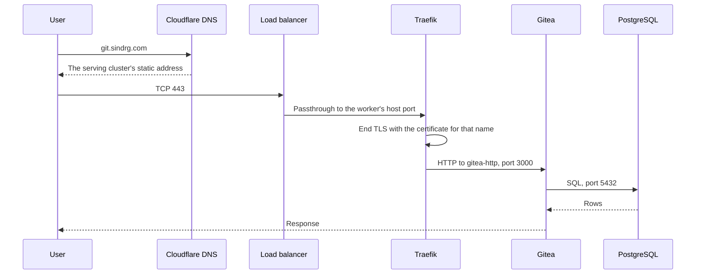
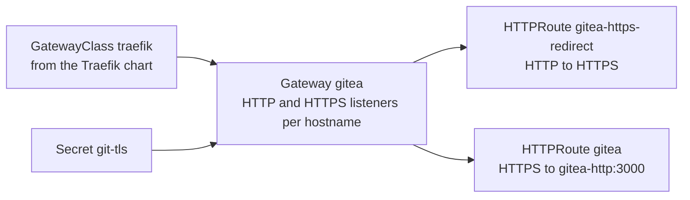
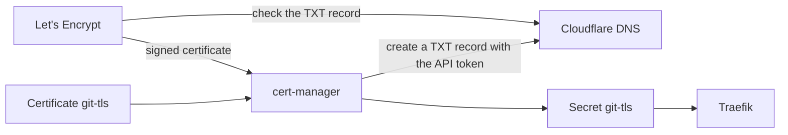

# 6. Traffic and certificates

Status: built on the primary cluster for `git.sindrg.com`. The per-cluster hostnames `git-primary.sindrg.com` and `git-dr.sindrg.com` are designed in [decision 0008](../decisions/0008-cold-recovery.md) and not built.

How a request reaches Gitea, and how the certificate that protects it is issued.

## The request path

| Hop | Detail |
| --- | --- |
| DNS | Cloudflare answers with a 60-second TTL. It does not proxy, so the client connects straight to Google Cloud. |
| Load balancer | A regional passthrough load balancer forwards TCP 80 and 443 to the worker unchanged. It does not end TLS, and Traefik sees the client's address. |
| Traefik | Binds host ports 80 and 443 on the worker. Ends TLS and routes by hostname. |
| Gitea | Receives plain HTTP inside the cluster. A network policy allows only Traefik. |

Plain HTTP on port 80 gets a 301 redirect to HTTPS.

## Hostnames

Every cluster serves two names, each with its own certificate.

| Name | Points to | Purpose |
| --- | --- | --- |
| `git.sindrg.com` | Whichever cluster is serving users | The public name. Gitea builds its links and clone URLs from it. |
| `git-primary.sindrg.com` | Always the primary | Reach the primary directly |
| `git-dr.sindrg.com` | Always the recovery cluster | Test the recovery cluster through its own load balancer and TLS before any user is sent there |

The recovery cluster is configured for `git.sindrg.com` from the start. It obtains that certificate before DNS points to it, so a cutover waits on nothing but the DNS change.

## Traefik

Traefik is the single way in. Ansible installs it with [Helm](05-helm.md), because it must exist before Flux has anything to route.

| Setting | Value |
| --- | --- |
| Routing API | Gateway API only. The Ingress and Traefik CRD providers are off. |
| Entry points | `web` on 8000 and `websecure` on 8443 inside the pod, exposed as host ports 80 and 443 |
| Internal check port | NodePort 30080 for the HTTP entry point, reachable only inside the VPC |
| Dashboard | Off |
| Update strategy | Replace the pod, because two pods cannot bind the same host ports |
| Egress | Only cluster DNS, the Kubernetes API, and Gitea |

## Routing objects

Flux owns the routes. They live in the `gitea` namespace next to the service they expose.

## Certificates

cert-manager proves control of a name with a DNS-01 challenge. Issuance needs no inbound request, so it works before the name points at the cluster. That is what lets a recovery cluster hold a valid `git.sindrg.com` certificate while the primary still serves the name.

| Aspect | Detail |
| --- | --- |
| Issuers | Let's Encrypt production, and staging for rebuild tests |
| Rate limit | Production allows five certificates per exact name each week. Each certificate covers one name, so every cluster build uses one for `git.sindrg.com` and one for its own name. |
| Renewal | Automatic, 30 days before expiry |
| CAA | A record on `sindrg.com` allows only Let's Encrypt to issue and forbids wildcard certificates |
| Private key | Created in the cluster and never backed up. A new cluster gets a new key and certificate. |

## DNS records

Records are created by hand in Cloudflare, DNS only, with a 60-second TTL. A cutover is one edit: point `git.sindrg.com` at the recovery cluster's static address.

## Limits

- One Traefik pod on one node. Replacing it is a short outage.
- The DNS cutover is manual.
- No rate limit or web application firewall, and no `Strict-Transport-Security` header yet.
- The Cloudflare token in the cluster can edit the whole zone.

See [decision 0006](../decisions/0006-service-deployment-architecture.md) and [decision 0008](../decisions/0008-cold-recovery.md).
