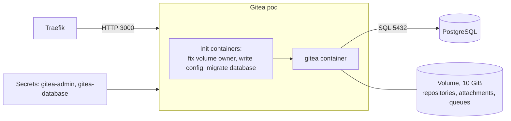

# 7. Gitea

Status: built on the primary cluster.

Gitea is the application. It was chosen because it holds state in two places at once, a database and a file volume, and a recovery must bring both back from the same moment.

## What runs

| Aspect | Setting |
| --- | --- |
| Deployment | One replica from the official chart, installed by [Flux and Helm](05-helm.md) |
| Updates | The old pod stops before the new one starts, because the volume attaches to one pod |
| Placement | The worker node, where the data disk is |
| Container | Non-root, no privilege escalation, all capabilities dropped, default seccomp profile |
| Memory | 256 MiB requested, 1 GiB limit |

## Where the state is

| State | Lives in | In the backup |
| --- | --- | --- |
| Users, issues, pull requests, settings, sessions | PostgreSQL | Yes, in the database dump |
| Git repositories, attachments, avatars | The Gitea volume | Yes, in the volume archive |
| Queues | The Gitea volume (LevelDB) | Yes |
| Cache | Memory | No; rebuilt on start |
| Configuration | Git, as chart values | No; Flux recreates it |
| Admin and database passwords | SOPS files in Git | No; Flux recreates them |

Configuration and secrets come from Git, and data comes from the backup. A recovery needs both, and neither contains the other.

## Configuration

The chart writes `app.ini` from the values in `deploy/apps/gitea/release.yaml`. The choices that matter:

| Setting | Value | Why |
| --- | --- | --- |
| `DOMAIN`, `ROOT_URL` | `git.sindrg.com` on every cluster | Gitea builds links and clone URLs from it, so it must not change at cutover |
| `DISABLE_REGISTRATION` | On | Nobody can create an account |
| `REQUIRE_SIGNIN_VIEW` | On | Anonymous visitors see only the sign-in page. `/api/healthz` stays open for probes. |
| SSH | Off | Git over HTTPS only; SSH would need another public port |
| Mirroring, migrations, update check | Off | The pod has no internet access |
| Sessions | In the database | A restart does not sign users out |
| Bundled PostgreSQL and Valkey | Off | The database is [separate](08-postgresql.md); one replica needs no shared cache |

## Fixtures

A fixture user, repository, commit with a known SHA, and issue live in the service, defined in `recovery/fixtures.yaml`. They are the proof that a recovery worked.

| Command | Proves |
| --- | --- |
| `make check-fixtures` | The user can sign in; the repository, commit, and issue exist |
| `make write-check` | A new push is accepted, and records its time |

Both go through the public endpoint the way a user would. The write check's timestamps are also how data loss is measured: the newest write check found after a restore, compared to the last one made before the failure.

## How it is managed

- A change is a pull request against `release.yaml`. Flux and Helm roll it out.
- A Gitea upgrade is a chart version change. The chart's init container migrates the database schema on start.
- The admin password is in `deploy/apps/gitea/admin.sops.yaml`.

## Limits

- One replica. A restart or an hourly backup is a short outage.
- Sign-in is a password. There is no second factor and no rate limit.
- A backup records the Gitea version. Restoring into a different version relies on Gitea's migration on start.

See [decision 0006](../decisions/0006-service-deployment-architecture.md) and [decision 0010](../decisions/0010-service-hardening.md).
