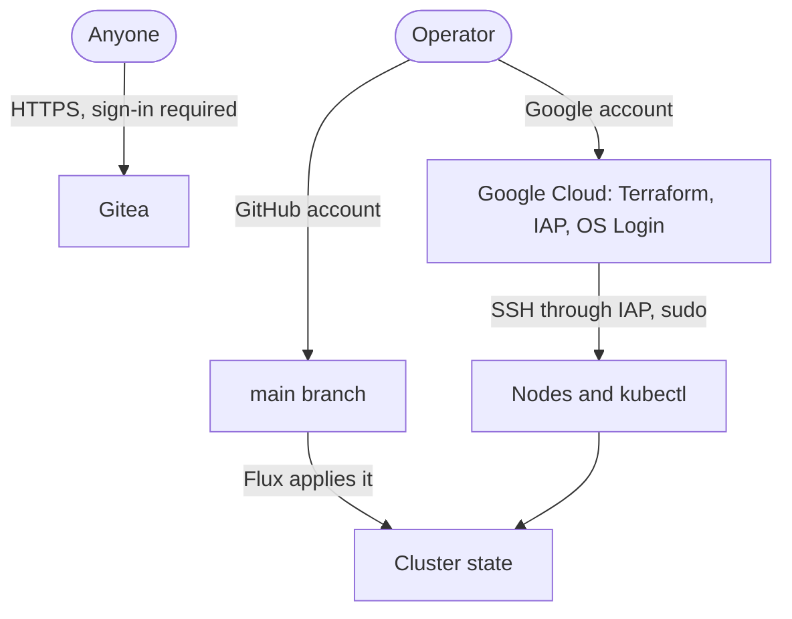

# 8. Access and secrets

Who can do what, which keys exist, and what each one unlocks.

## Ways in

There are three ways to change the system, and each is one account:

| Path | Protected by | Reaches |
| --- | --- | --- |
| Google account | Google sign-in | Everything in the project, root on both nodes, cluster admin |
| GitHub account | GitHub sign-in; `main` requires a pull request | Everything Flux deploys, which is the whole application layer |
| Gitea admin account | A random password in a SOPS file | The Gitea instance |

Nothing else has administrative access. There are no service account keys, no SSH keys in project metadata, and no kubeconfig outside the control-plane node.

## Machine identities

| Identity | Can do | Cannot do |
| --- | --- | --- |
| Worker node service account | Read the backup bucket; create objects under its own prefix | Delete or overwrite backups; call any other Google API |
| Control-plane node service account | Nothing; it has no API scope | |
| Flux | Read the public repository anonymously; cluster admin inside the cluster | Write to Git |
| Backup Job service account | Scale the `gitea` Deployment and read pods in its namespace | Anything else in the cluster |
| GitHub Actions | Read the repository; publish the backup image from `main` | Reach the cluster or the project |

## Keys and secrets

| Secret | Lives in | Unlocks |
| --- | --- | --- |
| SOPS age private key | Operator credential store, and `flux-system/sops-age` in the cluster | Every `*.sops.yaml` file in the repository |
| Backup age private key | Operator credential store. In the cluster only while a restore runs. | Every backup set |
| Offline age private key | Offline | Every backup set, if the backup key is lost |
| Cloudflare API token | SOPS file, decrypted into `cert-manager` | DNS edits for `sindrg.com` |
| Grafana Cloud token | SOPS file, decrypted into `monitoring` | Writing metrics |
| Healthchecks.io ping URL | SOPS file, decrypted into `gitea` | Sending heartbeats |
| Database and Gitea admin passwords | SOPS files, decrypted into `postgresql` and `gitea` | The database; the Gitea instance |
| Fixture user password | SOPS file under `recovery/`, decrypted only on the operator machine | The fixture account |
| Cluster admin kubeconfig | `/etc/kubernetes/admin.conf` on the control plane, root only | The cluster |
| Terraform state | State bucket | Resource details; treated as sensitive |

The repository is public, so the encrypted files are public too. Their safety rests on the SOPS age private key.

## What recovery needs

A recovery in another region must not depend on anything in the primary region. It needs:

1. The Google account, for Terraform and IAP.
2. The repository on GitHub.
3. The SOPS age private key, so Flux can decrypt the secrets.
4. The backup age private key, so the restore Job can read a set.
5. The state bucket and the backup bucket, both outside the primary region.

All five are held outside Finland.

## What a compromise reaches

| If this is compromised | The attacker gets | Contained by |
| --- | --- | --- |
| The Gitea pod | The repositories and the database | No internet egress, no metadata server, a non-root container |
| The Traefik pod | The TLS private key and all traffic | Egress only to DNS, the Kubernetes API, and Gitea |
| Any pod on the worker that can reach the metadata server | Read access to encrypted backups; the ability to add objects under the prefix | Backups are encrypted to keys the cluster does not hold; no delete or overwrite |
| The cluster or a node | Every secret in the repository through the SOPS key, including the Cloudflare token | Old backups stay unreadable; the retention policy blocks deletion |
| The GitHub account | Control of the cluster through Flux | The pull request rule; no approval is required |
| The Google account | Everything | Nothing in this design |

## Open questions

Recorded in [decision 0010](../decisions/0010-service-hardening.md#not-decided): detection inside the cluster, a separate SOPS key for `recovery/`, a narrower Cloudflare token, and a dedicated project for the lab.
