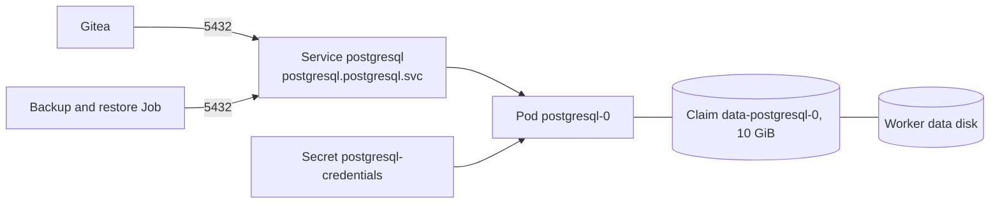
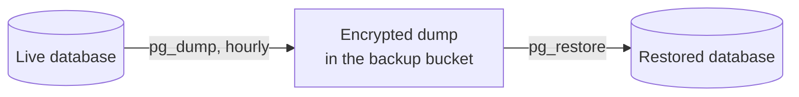

# 8. PostgreSQL

Status: built on the primary cluster.

One PostgreSQL 18 instance holds all of Gitea's relational data. It is a plain StatefulSet from the official image, not a chart and not an operator.

## What runs

| Aspect | Setting |
| --- | --- |
| Workload | StatefulSet, one replica, in its own `postgresql` namespace |
| Image | `postgres:18.6-trixie`, pinned by digest |
| Database and role | One database, `gitea`, owned by one role, `gitea` |
| Service | ClusterIP on port 5432. Not exposed outside the cluster. |
| Storage | A 10 GiB Local Path volume on the worker's data disk |
| Container | Non-root user 999, no privilege escalation, all capabilities dropped, no service account token |
| Health | `pg_isready` for readiness and liveness |
| Memory | 256 MiB requested, 1 GiB limit |

## Who can connect

A default-deny network policy allows connections to port 5432 from two kinds of pod only: Gitea, and the backup and restore Job. The database has no route to the internet.

The connection is not encrypted. It stays on the pod network inside one VPC, and the policy limits who can open it.

## Credentials

The password is a random value stored in two SOPS files, one per namespace. Flux decrypts them into `postgresql-credentials` for the server and `gitea-database` for the clients. The two must hold the same value.

The image reads the password only when it initializes an empty data directory. Changing it later takes an `ALTER ROLE` in the database as well as a new SOPS value.

## Data protection

| Layer | Protects against |
| --- | --- |
| The volume is on a dedicated disk | Losing the pod, or rebuilding the worker VM |
| Flux does not own the volume claim, and the namespace is never pruned | A manifest removed from Git deleting the data |
| The disk has `prevent_destroy` in Terraform | A `terraform destroy` deleting the data |
| The hourly `pg_dump` in the [backup set](09-backup-and-restore.md) | Losing the disk, the zone, or the region |

The dump is taken while Gitea is scaled to zero, so it matches the file archive taken at the same moment. The backup tool image is built from the same PostgreSQL image as the server, so `pg_dump` and `pg_restore` always match the server version.

A restore drops and recreates the `gitea` database, then loads the dump in a single transaction: it either fully applies or leaves an empty database with Gitea stopped.

## How it is managed

- A change is a pull request against `deploy/apps/postgresql/`. Flux applies it.
- A minor version upgrade is a new image digest; the pod restarts on the same data.
- A major version upgrade cannot reuse the data directory. The path is a backup, a new empty instance, and a restore.
- For a database shell, run `psql` inside the pod from the control plane over IAP.

## Limits

- One instance and no replica. A pod restart is an outage for Gitea.
- No point-in-time recovery. The hourly dump is the only recovery point, so up to an hour of writes can be lost. The target allows two.
- The volume is node-local and cannot move to another node.
- No connection pooling, no metrics exporter, and no automatic tuning. The load is one small Gitea.

See [decision 0006](../decisions/0006-service-deployment-architecture.md) and [decision 0007](../decisions/0007-consistent-backups.md).
