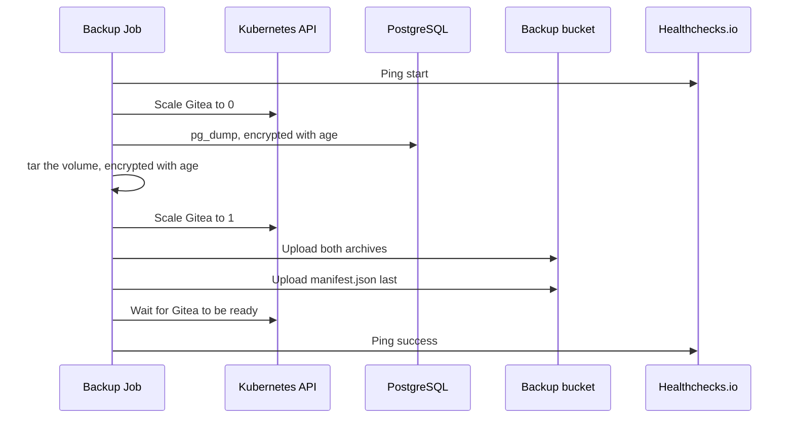
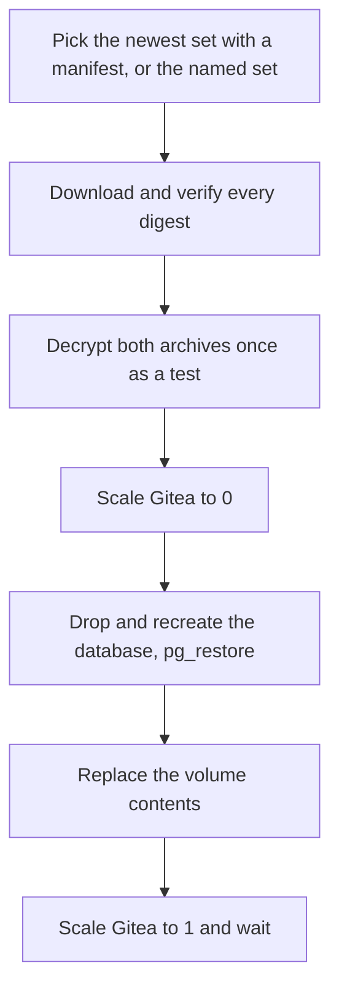

# 9. Backup and restore

Every 15 minutes a CronJob captures the database and the Gitea volume as one consistent set, encrypts it, and uploads it to a bucket in another region. A restore Job reverses it. This is the only path by which data leaves the primary region.

## Backup

The CronJob `gitea-backup` runs at minutes 7, 22, 37, and 52 of every hour on the worker ([decision 0012](../decisions/0012-backup-every-15-minutes.md)), with the Gitea volume mounted read-only.



Stopping Gitea for the capture is what makes the set consistent: the database and the files are taken while nothing writes. Gitea is back before the upload starts, so the pause is seconds, not the upload time.

If any step fails, the script scales Gitea back up and pings the failure endpoint. A retry is not attempted; the next scheduled run is the retry.

## A backup set

```text
primary/20260929T170701Z/
  postgresql.dump.age
  gitea-data.tar.gz.age
  manifest.json
```

The prefix is the cluster name from the [cluster settings](04-flux.md#per-cluster-settings), so the primary writes under `primary/` and a recovery cluster under `recovery/`. The set name is its UTC start time. `manifest.json` lists each file's SHA-256 and size and is written last, so a set without a manifest is incomplete and a restore ignores it.

## Encryption

Each archive is encrypted to two age public keys before it leaves the pod: a backup key kept with the recovery credentials, and an offline key. The cluster holds only the public keys, so a compromised cluster cannot read old backups.

## The bucket

| Control | Effect |
| --- | --- |
| Location | Belgium, outside the primary region |
| Writer access | Each cluster's worker service account can create objects only under its own prefix. It cannot delete or overwrite. |
| Reader access | Clusters can read every prefix, so a recovery cluster can restore the primary's sets |
| Retention | 14 days, during which no one can delete a set without first removing the policy |
| Versioning and soft delete | On; soft delete keeps removed objects for 7 days |

The Job gets its token from the metadata server. No service account key exists.

### Fencing

After a failover, the operator removes `primary` from `backup_clusters` in `infra/shared` and applies it. A primary that comes back can then no longer write backups, and a restore never has to choose between two clusters' sets under one prefix.

## Alerting

Healthchecks.io expects a success ping every hour with one hour of grace. It alerts when pings stop or a failure ping arrives, which is when no backup has completed inside the two-hour data-loss target. The period did not change with the 15-minute schedule.

## Restore

`make restore RESTORE_NAMESPACE=<namespace>` runs a Job with the same image, service account, and network policy as the backup.



Everything above the scale-down changes nothing, so a wrong key or a damaged set fails while the current data is intact. After the first destructive step, a failure leaves Gitea stopped so that nothing serves a partial restore.

The backup age private key is sent from the operator machine into a Secret that exists only while the Job runs. The playbook suspends the backup CronJob for the duration and deletes the Secret afterwards, even on failure.

The namespace has no default. `gitea` replaces a live service; `gitea-restore` is a test copy. A restore reads the `primary/` prefix by default, whichever cluster runs it, which is what a recovery cluster needs.

## Test restores

`make restore-test-env` creates `gitea-restore` and `postgresql-restore` on the same cluster from the same manifests, without the public Gateway or the backup CronJob. A restore into it, followed by the fixture checks through a port-forward, proves a set restores without touching the live service. The first test restore took 43 seconds.

## Limits

- The backup bucket is in the same project as the cluster.
- The retention policy is unlocked.
- Test restores are run by hand, not on a schedule.
- Gitea is unavailable for a short time at every backup, four times an hour. The uptime check reports one failed check in one or two regions per backup.

A recovery cluster starts with its backups suspended, so a bootstrap writes no set before the restore is verified. A change in Git enables them after the cutover, and its sets land under `recovery/`. See [decision 0008](../decisions/0008-cold-recovery.md#amendment-recovery-backups-stay-suspended-until-the-cutover).

See [decision 0007](../decisions/0007-consistent-backups.md) and the [backup and restore runbook](../runbooks/backup-restore.md).
