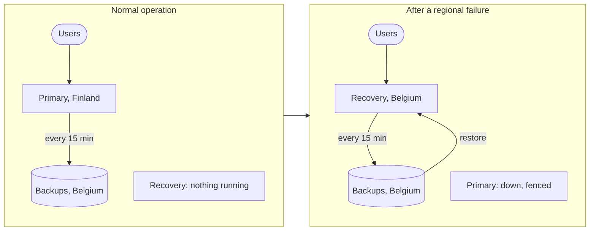
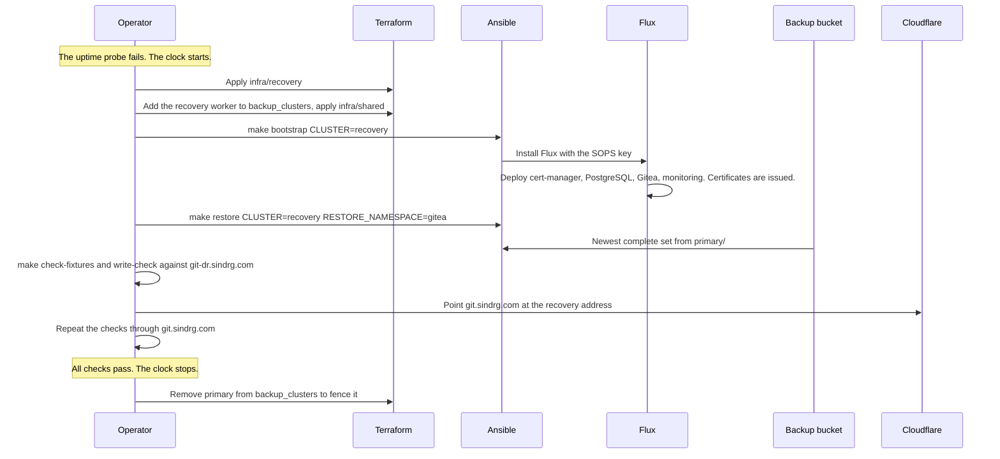

# 10. Regional recovery

This is what the project exists to prove: after losing the primary region, the service comes back in another region from code and one backup, inside a measured time and with a measured data loss.

## Targets

| Measure | Target | Starts | Stops |
| --- | --- | --- | --- |
| Recovery time | At most 4 hours | The uptime probe's first failed check | Sign-in, the known commit and issue, and a new push all work through `git.sindrg.com` |
| Data loss | At most 2 hours | The last acknowledged write before the failure | The newest write present after the restore |

Backups run every 15 minutes, so the expected data loss is under 15 minutes plus the time since the last write.

## Cold recovery

Belgium has no VMs until they are needed. That is the cheapest design and the slowest: the whole cluster is built during the outage.

## What survives the loss of Finland

| Needed for recovery | Where it is |
| --- | --- |
| Terraform, Ansible, and Flux code | GitHub |
| Terraform state | State bucket, Belgium |
| Backup sets | Backup bucket, Belgium |
| SOPS age key and backup age key | Operator credential store |
| DNS control | Cloudflare |
| Pinned packages, charts, and images | Public repositories, checked weekly by the pin check |

Nothing on the list is in Finland. Drill 1 recovered with both primary VMs stopped and used nothing else there.

## The procedure

| Step | Reuses |
| --- | --- |
| Build the network, VMs, and load balancer | The same Terraform module as the primary |
| Build the cluster | The same playbook, with `CLUSTER=recovery` |
| Deploy the service | The same `deploy/` manifests, with the recovery cluster settings |
| Load the data | The same restore Job the test restore uses |
| Verify | The same fixture checks used every day |

No step is written for recovery only. Each one is exercised on the primary first, so the recovery path is not untested code.

## Why two hostnames

The recovery cluster is tested through `git-dr.sindrg.com` before any user reaches it, through its own load balancer, certificate, and routes. If the checks fail there, nothing is cut over. Because the cluster already holds a `git.sindrg.com` certificate, the cutover itself is one DNS edit with a 60-second TTL. See [traffic and certificates](06-traffic-and-certificates.md#hostnames).

## Keeping the two clusters apart

| Risk | Control |
| --- | --- |
| A returning primary writes backups that look newer than the recovery cluster's | Each cluster writes under its own prefix, and the primary's writer grant is removed after failover |
| A command meant for recovery runs against the primary | `CLUSTER` selects a separate inventory per cluster |
| The recovery cluster serves stale or empty data to users | It is checked through `git-dr.sindrg.com` before the cutover |
| Both clusters serve `git.sindrg.com` | DNS points to one address at a time |

## Drills

A drill simulates the failure by stopping both primary VMs. Stopping keeps the disks, so the primary resumes unchanged afterwards, and it matches the real failure: nothing in the region answers.

The gates that used it:

| Milestone | What it proves |
| --- | --- |
| 5. Cold recovery | The recovered service passes the fixture checks through `git-dr.sindrg.com` while the primary is stopped. Public DNS is not changed. |
| 6 and 7. Disaster drills | The full procedure with the cutover, timed, with recovery time and data loss recorded. Run three times; see the [comparison](../worklogs/07-faster-recovery.md#comparison). |

After a drill, `terraform destroy` removes the recovery environment and the primary is started again.

## Limits

- Recovery time is dominated by building a cluster from nothing. A faster design, such as a warm standby, costs more to keep running. Milestone 7 shortened the data loss instead ([decision 0012](../decisions/0012-backup-every-15-minutes.md)).
- The cutover is a DNS command the operator runs, and clients may cache the old address for the TTL.
- There is no failback procedure. Returning to Finland would be a second recovery in the other direction.
- The buckets, the state, and both clusters are in one Google Cloud project. Losing the project or the account is not covered.
- Recovery depends on public package, chart, and image repositories being reachable.

See the [regional recovery runbook](../runbooks/regional-recovery.md).
