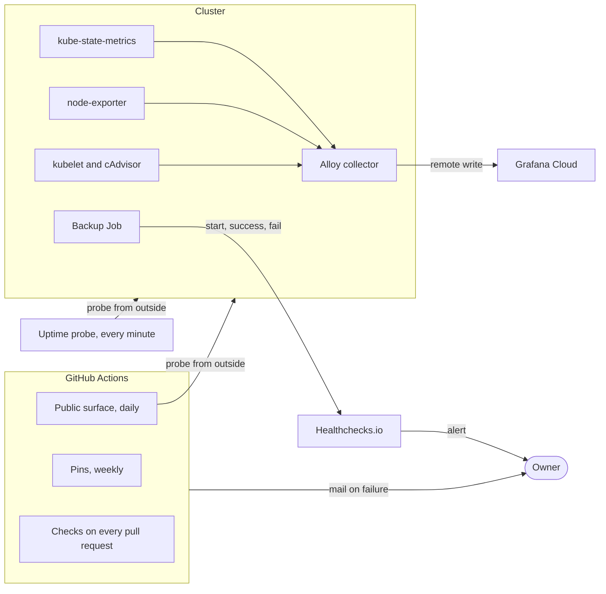

# 11. Monitoring and checks

Status: built. The external uptime probe of [decision 0011](../decisions/0011-external-uptime-probe.md) is applied from `infra/shared` and passing; its results have not been read across an outage.

What watches the system, from inside and from outside, and what does not.

## Overview

| Signal | Where it runs | Tells you | Alerts |
| --- | --- | --- | --- |
| Cluster metrics | In the cluster, stored in Grafana Cloud | Node, pod, and object state, during and after a failure | No |
| Backup heartbeat | Healthchecks.io | Whether a backup completed in the last two hours | Yes |
| Uptime probe | An external service, every minute | When the service stopped answering and when it came back | Yes |
| Public surface scan | GitHub Actions, daily | Whether the outside view has regressed | Yes, by workflow failure mail |
| Pin check | GitHub Actions, weekly | Whether a pinned download has disappeared upstream | Yes, by workflow failure mail |
| Validation playbooks | Operator machine, on demand | Whether the cluster and service are healthy now | No |

## Metrics

Flux installs Grafana's `k8s-monitoring` chart into the `monitoring` namespace. One Alloy collector scrapes the kubelet, cAdvisor, node-exporter, and kube-state-metrics and sends the result to Grafana Cloud. The data lives outside both regions, so the dashboards survive the loss of the cluster they describe.

Only metrics are collected. Logs, traces, and the chart's own telemetry are off. The collector configuration is in Git, not in the Grafana Cloud UI, so a recovery cluster gets the same one. Metrics are labelled with the cluster name from the cluster settings, so the primary and a recovery cluster appear side by side in the same dashboards.

## Uptime probe

An external probe requests the public endpoint every minute. Its first failed check starts the recovery clock and its first success after cutover helps stop it, so it must run outside both regions. It uses `/api/healthz`, which stays open without sign-in. The probe is a Cloud Monitoring uptime check with checkers in three regions; it shares the Google Cloud project with both clusters, which [decision 0011](../decisions/0011-external-uptime-probe.md#known-limits) records as a limit.

## Public surface scan

`scripts/check-public-surface.sh` checks what an outside client can see. It needs no credential.

| Group | Checks |
| --- | --- |
| TLS | 1.0 and 1.1 refused, 1.2 and 1.3 accepted, certificate not close to expiry |
| HTTP | Redirect to HTTPS, security headers |
| Gitea | Anonymous API refused, registration disabled |
| Network | SSH, the Kubernetes API, the kubelet, and the NodePort do not answer |
| DNS | CAA restricts issuance, the zone is signed |

Each check has three outcomes: pass, fail, or inconclusive. A probe that could not run never counts as a pass. Accepted findings are listed in the script, and a listed finding that starts passing fails the run until its line is removed, so the list cannot go stale.

## Continuous integration

| Workflow | Runs on | Does |
| --- | --- | --- |
| Ansible | Pull requests and `main` | Unit tests, yamllint, ansible-lint, playbook syntax, `terraform fmt` and `validate` |
| Docs | Pull requests and `main` | Trailing whitespace, final newlines, broken local links |
| Pins | Pull requests, `main`, weekly | Every pinned package, chart, manifest, and image digest still resolves |
| Public surface | Daily, and pull requests that change it | The scan above |
| Backup image | Changes to `images/backup` | Builds the tool image and publishes it from `main` |

The unit tests in `tests/` read the manifests, the Terraform module, and the Ansible roles and assert the properties that matter: allowed network flows, pinned versions, the Flux dependency order, and the backup Job's settings. Actions are pinned by commit SHA.

## Validation playbooks

`make validate-cluster` and `make validate-services` collect read-only evidence over IAP: nodes Ready, add-ons rolled out, Flux reconciled at a revision, certificates issued, volumes bound, routes accepted, and the HTTP redirect working. They are the gate after a bootstrap, a restart, or a restore.

## Not covered

- **Logs.** No API server audit log, and no Gitea or Traefik access log leaves the node. A compromise inside the cluster would not be noticed.
- **Metric alerts.** Nothing alerts on node health, disk usage, or a failed Flux reconcile.

See [decision 0009](../decisions/0009-cluster-metrics.md) and [decision 0010](../decisions/0010-service-hardening.md).
