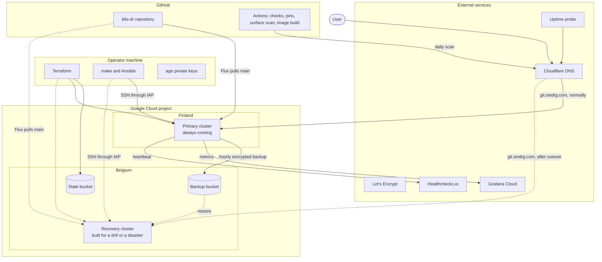

# Architecture

How the parts of this project work and how they connect. Each page covers one part: what it does, what it owns, how it is run, and where its limits are.

The pages describe the final design: a primary cluster in Finland, and a recovery cluster in Belgium that is built from the same code only when it is needed. Not all of it exists yet. Each page states its status under the title, and [the table below](#what-is-built) lists what is still to come. For why a design was chosen, follow the links to the [decision records](../README.md).

## The whole system

Solid lines exist all the time. Dashed lines exist only while the recovery cluster does.

The idea in one paragraph: everything needed to rebuild the service lives outside Finland. The code is on GitHub, the Terraform state and the backups are in Belgium, the keys are with the operator, and the monitoring is with external services. If Finland disappears, the same Terraform, Ansible, and Flux code builds an identical cluster in Belgium, a restore Job loads the newest backup, and one DNS change sends users there.

## Who owns what

Every resource has exactly one owner. A change goes through that owner, never around it.

| Layer | Owner | Source | How a change is applied |
| --- | --- | --- | --- |
| State bucket, backup bucket, project IAM | Terraform | `infra/bootstrap`, `infra/shared` | `terraform apply` from the operator machine |
| Network, VMs, load balancer, data disk | Terraform | `infra/primary`, `infra/recovery`, `infra/modules/regional_cluster` | `terraform apply` from the operator machine |
| Node configuration and the Kubernetes cluster | Ansible and kubeadm | `ansible/roles` | `make bootstrap` |
| Calico, Gateway API CRDs, Traefik, Local Path Provisioner, the Flux install | Ansible, with Helm for Traefik | `ansible/roles/cluster_addons`, `ansible/roles/flux` | `make bootstrap` |
| cert-manager, certificates, PostgreSQL, Gitea, backups, monitoring, network policies | Flux, with Helm for the charts | `deploy/` | Merge to `main`; Flux applies it within about a minute |
| Application data | The restore Job | The backup bucket | `make restore` |
| DNS records for `sindrg.com` | By hand | Cloudflare dashboard | Manual edit, recorded in a worklog |

## Pages

| Page | Covers |
| --- | --- |
| [1. Infrastructure](01-infrastructure.md) | Terraform roots, state, network, VMs, and the load balancer |
| [2. Ansible](02-ansible.md) | How the operator reaches the nodes, the roles, and the operator commands |
| [3. Kubernetes cluster](03-kubernetes-cluster.md) | kubeadm, the container runtime, pod networking, network policies, and storage |
| [4. Flux](04-flux.md) | How Git becomes cluster state, and how secrets are decrypted |
| [5. Helm](05-helm.md) | Which charts are used, who runs Helm, and how chart versions and values are managed |
| [6. Traffic and certificates](06-traffic-and-certificates.md) | DNS, the load balancer, Traefik, the Gateway API, and cert-manager |
| [7. Gitea](07-gitea.md) | The application: deployment, configuration, data, and fixtures |
| [8. PostgreSQL](08-postgresql.md) | The database: deployment, credentials, data, and how it is backed up |
| [9. Backup and restore](09-backup-and-restore.md) | The hourly backup, the bucket, and the restore Job |
| [10. Regional recovery](10-regional-recovery.md) | How the service moves to Belgium, and how the move is measured |
| [11. Monitoring and checks](11-monitoring-and-checks.md) | Metrics, the backup heartbeat, the uptime probe, the surface scan, and CI |
| [12. Access and secrets](12-access-and-secrets.md) | Identities, keys, where each secret lives, and what a compromise reaches |

## What is built

| Part | Status |
| --- | --- |
| Primary infrastructure, cluster, service, backups, test restore | Built and validated (milestones 1 to 4) |
| Cluster metrics, hardening, daily surface scan | Built and validated |
| Recovery Terraform root, recovery Flux settings, shared sync definition, `CLUSTER` selection | Designed in [decision 0008](../decisions/0008-cold-recovery.md); not built (milestone 5) |
| Per-cluster hostnames `git-primary` and `git-dr` | Designed in decision 0008; not built (milestone 5) |
| External uptime probe | Required by [decision 0002](../decisions/0002-recovery-contract.md); not chosen or built |
| Disaster drill with measured recovery time and data loss | Not run (milestone 6) |
| Failback to the primary | Not planned |
