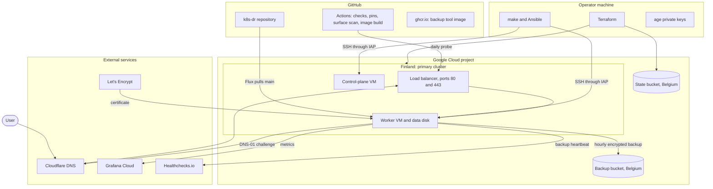

# Architecture

How the parts of this project work and how they connect. Each page covers one layer: what it does, what it owns, how it is run, and where its limits are.

These pages describe the implemented primary cluster. The recovery region is planned in [decision 0008](../decisions/0008-cold-recovery.md) and marked as planned where it appears. For why a design was chosen, follow the links to the [decision records](../README.md).

## The whole system

## Who owns what

Every resource has exactly one owner. A change goes through that owner, never around it.

| Layer | Owner | Source | How a change is applied |
| --- | --- | --- | --- |
| State bucket, backup bucket, project IAM | Terraform | `infra/bootstrap`, `infra/shared` | `terraform apply` from the operator machine |
| Network, VMs, load balancer, data disk | Terraform | `infra/primary`, `infra/modules/regional_cluster` | `terraform apply` from the operator machine |
| Node configuration and the Kubernetes cluster | Ansible and kubeadm | `ansible/roles` | `make bootstrap` |
| Calico, Gateway API CRDs, Traefik, Local Path Provisioner, the Flux install | Ansible | `ansible/roles/cluster_addons`, `ansible/roles/flux` | `make bootstrap` |
| cert-manager, certificates, PostgreSQL, Gitea, backups, monitoring, network policies | Flux | `deploy/` | Merge to `main`; Flux applies it within about a minute |
| DNS records for `sindrg.com` | By hand | Cloudflare dashboard | Manual edit, recorded in a worklog |

## Pages

| Page | Covers |
| --- | --- |
| [1. Infrastructure](01-infrastructure.md) | Terraform roots, state, network, VMs, and the load balancer |
| [2. Ansible](02-ansible.md) | How the operator reaches the nodes, the roles, and the operator commands |
| [3. Kubernetes cluster](03-kubernetes-cluster.md) | kubeadm, the container runtime, pod networking, storage, and Traefik |
| [4. Flux](04-flux.md) | How Git becomes cluster state, and how secrets are decrypted |
| [5. Service](05-service.md) | The request path, certificates, Gitea, PostgreSQL, and network policies |
| [6. Backup and restore](06-backup-and-restore.md) | The hourly backup, the bucket, and the restore Job |
| [7. Monitoring and checks](07-monitoring-and-checks.md) | Metrics, the backup heartbeat, the surface scan, and CI |
| [8. Access and secrets](08-access-and-secrets.md) | Identities, keys, where each secret lives, and what a compromise reaches |
