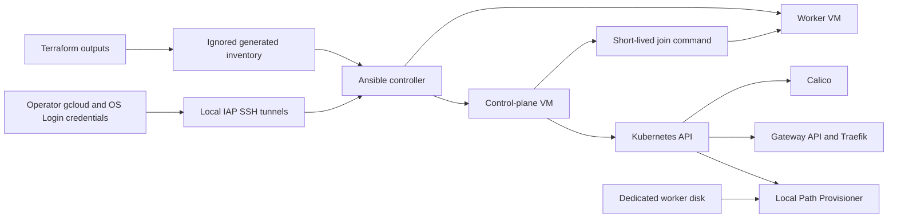

# 0005: Kubernetes bootstrap architecture

Status: Accepted. Amended on 2026-09-23 for the ingress reachability check. Implemented and validated in the [milestone 2 worklog](../worklogs/02-kubernetes-bootstrap.md) on 2026-09-25.

Date: 2026-09-23

## Goal

Build the Milestone 2 Kubernetes cluster repeatably from the operator machine without public node addresses or a dependency on either primary VM. The automation must prepare Ubuntu, initialize a single kubeadm control plane, join one worker, install the minimum networking, ingress, and storage components, and support the same process after both VM boot disks are replaced.

The milestone gate requires observed evidence that both nodes are `Ready`, a disposable application is reachable, the worker rejoins after a restart, and a fresh VM rebuild follows the same automated procedure. Implementation does not close the gate. The operator runs the infrastructure, deployment, restart, and validation commands and supplies sanitized results for the worklog.

## Scope

Milestone 2 includes:

- An operator-side Ansible environment with pinned dependencies.
- Private administration through Identity-Aware Proxy (IAP) and OS Login.
- Ubuntu host preparation, containerd, kubelet, kubeadm, and kubectl.
- A declarative kubeadm configuration for one control plane and one worker.
- Calico networking, Traefik with Gateway API, and Local Path Provisioner.
- Safe mounting of the dedicated worker data disk.
- A disposable application and private validation path.
- Idempotency checks, worker restart validation, and a clean boot-disk rebuild procedure.

Milestone 2 does not include Flux, Gitea, PostgreSQL, public DNS, TLS certificates, application backups, or recovery-region VMs. Those belong to later milestones.

## Decisions

### Use small Ansible roles controlled from outside the cluster

Use one top-level bootstrap playbook composed from roles with coherent responsibilities:

| Unit | Responsibility |
| --- | --- |
| Controller setup | Create a local Python virtual environment and install pinned Ansible dependencies. |
| Inventory preparation | Select only the Terraform outputs needed for the two nodes and produce an ignored local inventory. |
| Node preparation | Configure kernel modules, sysctl settings, swap, time synchronization, required packages, and host firewall state. |
| Container runtime | Install and configure containerd with the systemd cgroup driver. |
| Kubernetes packages | Configure the per-minor `pkgs.k8s.io` repository, install exact package versions, and hold them. |
| Worker storage | Discover, validate, format only when blank, and mount the dedicated data disk. |
| Control plane | Render the kubeadm configuration and run `kubeadm init` only when the control plane is not initialized. |
| Worker join | Generate a short-lived join command on the control plane and execute it on an unjoined worker without logging the token. |
| Cluster add-ons | Reconcile Calico, Gateway API CRDs, Traefik, and Local Path Provisioner from pinned releases. |

This split keeps host configuration, cluster creation, and cluster add-ons independently understandable and testable. A single large playbook would have fewer files but would mix host state, credentials, and Kubernetes reconciliation. Kubespray would provide a broader production installer, but it would hide much of the kubeadm workflow this lab is intended to practice.

The automation runs from the external operator machine. Running Ansible from the control-plane VM would make recovery depend on a primary-region host and would violate the recovery boundary.

### Keep IAP transport explicit and local

The VMs have no public addresses. An operator wrapper starts one local IAP tunnel to TCP 22 on each VM, waits until both local ports accept connections, runs Ansible against those localhost ports, and terminates the tunnels when Ansible exits. The ignored inventory contains the local ports, OS Login username, SSH key path, instance roles, private node addresses, project, and zone. It contains no join token or kubeconfig.

The wrapper solves the mismatch between Ansible's normal SSH transport and private Compute Engine VMs. Its trade-off is two local forwarding processes and fixed local ports during a run. Direct SSH `ProxyCommand` integration is not selected because the current documented `gcloud compute start-iap-tunnel` interface exposes a listening local port and does not document a standard-input proxy mode. A temporary bastion or public node address would add infrastructure and attack surface without helping the recovery goal.

Inventory generation reads the required values from the primary Terraform root rather than duplicating resource names. The primary root will expose the project and zone in addition to its existing instance-name and private-address outputs. Generated inventory remains ignored because it can contain real project, node, and network identifiers.

### Pin a compatible component set

Use the following initial compatibility baseline:

| Component | Baseline | Reason |
| --- | --- | --- |
| Ubuntu | A pinned Ubuntu 24.04 LTS image self-link | Removes the moving image-family dependency before the rebuild test. |
| Kubernetes | 1.36.2 | Calico 3.32 is tested with Kubernetes 1.34 through 1.36. Kubernetes 1.37 is outside that tested range. |
| Calico | 3.32.2 | Current 3.32 patch documented by the Calico operator installation guide. |
| Gateway API | 1.6.1 Standard channel | Matches the current Traefik Gateway API documentation and avoids experimental CRDs. |
| Traefik Helm chart | 41.6.0 | Supports Traefik Proxy 3.6 through 3.7 and defaults to 3.7.13. |
| Local Path Provisioner | 0.0.36 | Latest immutable release identified during design, including current security fixes. |

The implementation records the exact Ansible, Python package, containerd, Kubernetes Debian package, Helm, and chart versions in tracked dependency or variable files. It must not resolve an unbounded `latest` release during bootstrap. Updating a pin is an explicit change followed by the same validation gate.

Use the Kubernetes community repository at `pkgs.k8s.io`, which publishes a separate package repository for each Kubernetes minor version. Configure both containerd and kubelet to use the systemd cgroup driver because Ubuntu uses systemd and Kubernetes requires the runtime and kubelet cgroup drivers to agree.

### Use Calico VXLAN on non-overlapping configurable networks

Install Calico through the Tigera Operator and tracked custom resources. Use the Kubernetes API datastore, Calico IP address management, and VXLAN encapsulation. Do not enable BGP or IP-in-IP.

The existing internal VPC firewall allows TCP, UDP, and ICMP between nodes. VXLAN uses UDP 4789 and fits that rule. Calico's default IP-in-IP mode uses IP protocol 4, which the current firewall does not allow. Selecting VXLAN avoids broadening the firewall solely for the CNI.

The pod and service CIDRs are tracked Ansible variables. Preflight checks must reject overlap between either cluster CIDR, the primary VPC subnet, and each other. The same defaults can be used in the recovery region only when that region's subnet also does not overlap.

Ubuntu host firewall software remains inactive on the nodes for this milestone because an independent iptables manager can conflict with Calico. GCP VPC firewall rules remain the network perimeter. Kubernetes NetworkPolicy is available through Calico, but workload policies belong with the workloads in Milestone 3.

### Preserve the worker disk and fail safely

Address the dedicated disk through its stable Compute Engine device link, not a transient `/dev/sdX` name. The worker-storage role follows these rules:

1. Fail if the expected device link is missing or resolves to the boot disk.
2. If no filesystem signature exists, create an ext4 filesystem.
3. If ext4 already exists, preserve it.
4. Fail on any unexpected filesystem instead of reformatting it.
5. Mount it persistently at `/var/lib/k8s-dr` and verify it is a mount point before creating `/var/lib/k8s-dr/local-path`.
6. Install Local Path Provisioner with only the worker node mapped to that path.

The playbook never reformats a nonblank disk. This protects later workload data and lets boot-disk replacement preserve the local persistent-volume directory. The trade-off is that local volumes remain tied to one zonal disk and one worker. Offsite backup, not local storage, is the cross-region recovery mechanism.

### Make cluster creation rerunnable without hiding destructive repair

Host and add-on tasks are idempotent. Cluster-creation tasks use explicit state markers:

- Run `kubeadm init` only when `/etc/kubernetes/admin.conf` is absent.
- Join the worker only when `/etc/kubernetes/kubelet.conf` is absent.
- Create a fresh, short-lived join token for an unjoined worker and protect token-bearing tasks with `no_log`.
- Use Helm upgrade/install or server-side apply with pinned artifacts for add-ons.
- Wait on observable conditions such as API availability, node readiness, deployments, and Gateway status instead of fixed sleeps.

The automation does not run `kubeadm reset`, delete Kubernetes state, or reformat disks as an automatic recovery action. If existing state is inconsistent, it stops with diagnostics. Reset or replacement is a separate operator decision so evidence is not destroyed during troubleshooting.

### Validate ingress privately

Traefik uses the Gateway API provider and a fixed HTTP NodePort for the Milestone 2 test only. The disposable application includes a Deployment, ClusterIP Service, Gateway, and HTTPRoute. The validation playbook sends HTTP requests from the control plane to the worker's private address and the Traefik NodePort, with and without the test hostname. See the [amendment](#amendment-in-cluster-reachability-check).

This path proves scheduling, cross-node pod networking, NodePort handling, Service routing, Gateway API reconciliation, and Traefik without adding public ingress. It does not prove public DNS, TLS, or an internet-facing load balancer. Milestone 3 must design those resources before Gitea is exposed.

### Amendment: in-cluster reachability check

Date: 2026-09-23.

**Problem:** the original design reached the application through an interactive `gcloud compute ssh --tunnel-through-iap -- -N -L` forward from the operator machine. On the first attempt, the SSH session ended with `Failed to send all data from [stdin]` and `client_loop: send disconnect: Broken pipe` (exit `255`). The cause is not confirmed. The same IAP and OS Login path works reliably through `scripts/run_with_iap.py`, which uses `gcloud compute start-iap-tunnel` with a local port instead of the standard-input proxy mode that `gcloud compute ssh` uses.

**Decision:** `validate.yml` requests the application with `ansible.builtin.uri` from the control plane to `http://<worker private address>:30080/`. It expects `200` with the persistent marker when it sends `Host: milestone2.local`, and `404` without it.

**Trade-offs:**

| | Interactive SSH forward | In-cluster request (selected) |
| --- | --- | --- |
| Transport | `gcloud compute ssh` standard-input proxy, long-lived | The existing IAP runner, short-lived |
| Repeatable in recovery drills | Manual, second terminal | Part of `validate.yml` |
| Infrastructure change | None | None |
| Proves access from the operator machine | Yes | No |
| Tests cross-node networking | No, the request enters on the worker | Yes, the request leaves the control plane |

The check no longer proves that the operator can open HTTP to the cluster from outside the VPC. Milestone 2 does not require that path, and Milestone 3 designs public exposure separately. If operator access is needed later, `gcloud compute start-iap-tunnel` to port 30080 is the fallback. It needs a firewall rule that allows the IAP range on that port.

## Data and credential flow

Real inventory, kubeconfigs, SSH keys, join commands, tokens, and raw command output remain untracked. The repository contains examples with placeholders, pinned public artifact references, and sanitized validation instructions only.

## Failure handling

Preflight checks stop before cluster initialization when:

- The nodes are not the expected Ubuntu release or architecture.
- Required IAP or sudo access is unavailable.
- The private node addresses or cluster CIDRs are invalid or overlapping.
- Swap cannot be disabled.
- The worker disk is missing, is the boot disk, has an unexpected filesystem, or is not mounted at the expected path.
- Package or artifact versions cannot be resolved exactly.
- containerd and kubelet cgroup settings disagree.

After initialization, failures report the failing layer and relevant sanitized commands. Troubleshooting records must distinguish hypotheses from confirmed causes. Join tokens, kubeconfigs, private addresses, project IDs, and unsanitized logs must not enter the repository.

## Validation design

The operator procedure will provide commands, expected results, and evidence requests in this order:

1. Validate local dependencies, tracked configuration, Terraform convergence, IAP SSH, and disk identity.
2. Run the bootstrap playbook twice. The second run must make no unintended changes and must leave both nodes `Ready`.
3. Confirm Calico, CoreDNS, Traefik, Gateway API resources, and Local Path Provisioner are healthy.
4. Deploy the disposable application with a persistent-volume claim and constrain it to the worker.
5. Reach it from the control plane through the worker's private address, the Traefik NodePort, and the Gateway route.
6. Restart the worker through the operator-controlled GCP command, wait for `Ready`, and repeat the application and storage checks.
7. Remove the disposable resources.
8. Review a Terraform plan that replaces only the two VM boot disks and their attachment relationship while preserving the worker data disk, network, buckets, and state.
9. Apply the reviewed replacement, rerun the same bootstrap playbook, and repeat the node, add-on, ingress, and storage checks.

Record sanitized validation results in the Milestone 2 worklog. All four gate conditions had evidence on 2026-09-25.

## Trade-offs and limitations

- A one-control-plane cluster has no local control-plane availability. This is intentional for the cold-recovery lab.
- Local Path Provisioner does not replicate volumes or enforce requested capacity. The dedicated disk improves persistence across pod and boot-disk replacement, not region loss.
- Fixed local tunnel ports can conflict with another local process. The wrapper checks availability and fails with a clear message rather than selecting undocumented ports.
- The chosen component versions are compatible and reproducible, but they require planned upgrades. Automatic package upgrades are intentionally disabled for Kubernetes packages.
- The private ingress check covers the Milestone 2 data path but does not validate public service exposure.
- Replacing boot disks is disruptive. It is appropriate before Milestone 3 creates application data and remains an explicit operator action.

## References

- [Installing kubeadm](https://kubernetes.io/docs/setup/production-environment/tools/kubeadm/install-kubeadm/)
- [Kubernetes container runtimes](https://kubernetes.io/docs/setup/production-environment/container-runtimes/)
- [kubeadm v1beta4 configuration](https://kubernetes.io/docs/reference/config-api/kubeadm-config.v1beta4/)
- [Calico system requirements](https://docs.tigera.io/calico/latest/getting-started/kubernetes/requirements)
- [Calico operator installation](https://docs.tigera.io/calico/latest/getting-started/kubernetes/quickstart)
- [Traefik Kubernetes Gateway provider](https://doc.traefik.io/traefik/providers/kubernetes-gateway/)
- [Gateway API](https://github.com/kubernetes-sigs/gateway-api)
- [Local Path Provisioner](https://github.com/rancher/local-path-provisioner)
- [IAP TCP forwarding](https://docs.cloud.google.com/iap/docs/using-tcp-forwarding)
- [Ansible inventory connection variables](https://docs.ansible.com/ansible/latest/user_guide/intro_inventory.html)
