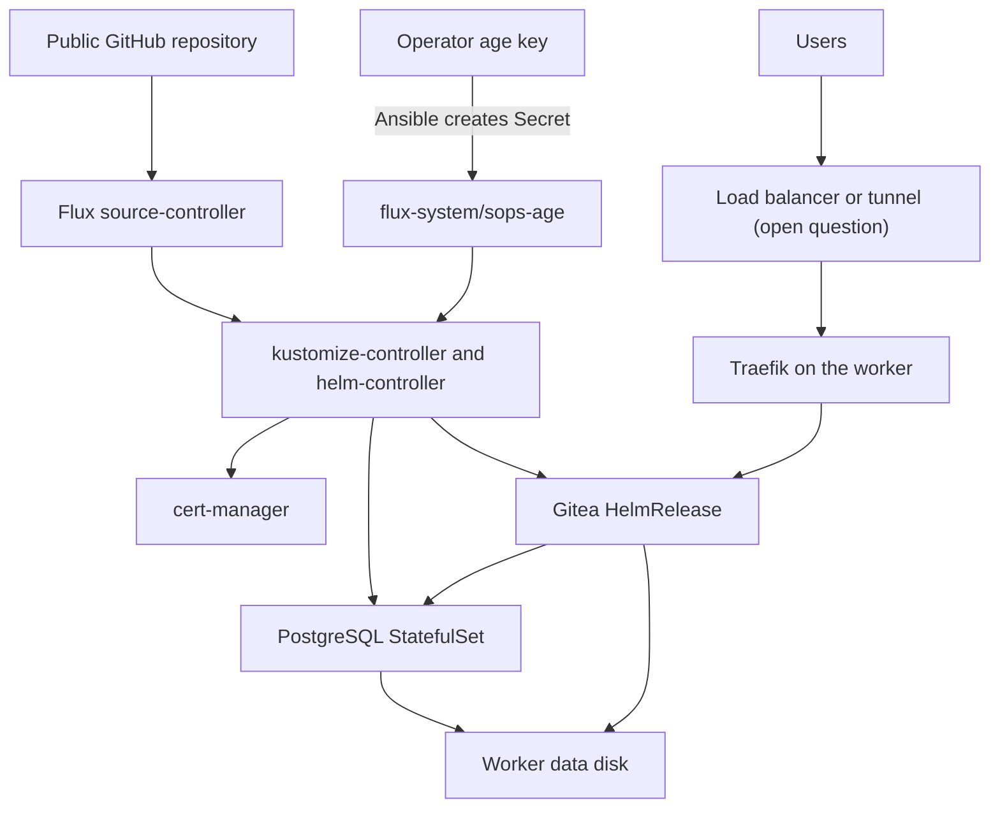

# 0006: Service deployment architecture

Status: Proposed. Needs operator decisions on the [open questions](#open-questions) before milestone 3 implementation starts.

Date: 2026-09-25

## Goal

Deploy Gitea and PostgreSQL through Flux from the external GitHub repository, expose Gitea at `git.sindrg.com` over HTTPS, and create the recovery fixtures. The same configuration must rebuild in Belgium with no primary-region dependency. The [milestone 3 gate](../../plan.md#3-service-deployment) requires that Git changes reconcile, Gitea works after its pods restart, and all fixture data remains.

The project models an organization that must manage Kubernetes at the operating system level, for example for regulatory control of hosts, patching, and data paths. Choices below prefer keeping TLS termination, secrets, and data inside infrastructure the operator controls.

## Decisions

### Install Flux from a pinned release and read the public repository

Ansible installs the Flux controllers from the pinned release manifest, for example `https://github.com/fluxcd/flux2/releases/download/v2.9.5/install.yaml`. It then applies one `GitRepository` that reads this public repository over HTTPS and one `Kustomization` per cluster.

| Option | Trade-off |
| --- | --- |
| Pinned `install.yaml` plus a read-only HTTPS source (selected) | No GitHub token or deploy key exists, so recovery needs no GitHub credential. Flux version changes follow the same pin, check, and validation path as the other add-ons. Flux does not manage its own upgrade from Git. |
| `flux bootstrap github` | Flux manages itself from Git. Bootstrap needs a GitHub token with administration rights to create a deploy key, and every recovery repeats that step with a live credential. |

The repository is public, so it must never contain a plaintext secret. See [secrets](#encrypt-secrets-with-sops-and-age).

### Split ownership between Ansible and Flux

**Rule:** Ansible owns what must exist before Flux can reconcile or what `validate_cluster.yml` checks. Flux owns everything else. No resource has two owners.

| Owner | Components |
| --- | --- |
| Ansible | Host configuration, kubeadm, Calico, Gateway API CRDs, Traefik, Local Path Provisioner, Flux controllers, the SOPS decryption key Secret |
| Flux | cert-manager, PostgreSQL, Gitea, the Gitea Gateway listener and HTTPRoute, network policies |

Traefik stays with Ansible. Moving an existing Helm release to Flux means adopting it in place or reinstalling it, and both change a validated milestone 2 component for no recovery benefit. The README tool table will change to say that Flux deploys the application layer.

### Encrypt secrets with SOPS and age

Store Kubernetes Secrets in Git encrypted with [SOPS](https://github.com/getsops/sops) and an age key. The Flux kustomize-controller decrypts them in the cluster. Ansible creates the `sops-age` Secret in `flux-system` from a local key file path given at run time. The private key never enters Git.

The age private key becomes a recovery credential. Store it with the other recovery credentials, available without the primary region.

| Option | Trade-off |
| --- | --- |
| SOPS with age (selected) | Native Flux support, one offline key, and no cloud dependency. Rotation is manual: re-encrypt files and replace the Secret. |
| Sealed Secrets | The controller generates its key inside the cluster. A regional loss destroys that key unless it is backed up separately, which adds a recovery step. |
| External Secrets with Secret Manager | Central audit and rotation, and the usual production choice. On self-managed Kubernetes it needs a service account key or workload identity federation with a public OIDC issuer, which is more setup than this lab needs. |

Secrets in scope: the Gitea administrator password, the PostgreSQL password, and the Cloudflare API token for certificates. Milestone 4 adds the backup encryption password.

### Run PostgreSQL from the official image, not the chart's subchart

Gitea chart 12.7.0 still depends on Bitnami `postgresql`, `postgresql-ha`, `valkey`, and `valkey-cluster` subcharts. Bitnami stopped publishing free versioned images in 2025, so those dependencies are not a stable base. Disable all four.

Run PostgreSQL as a single-replica StatefulSet from the official `postgres` image, pinned by tag and digest, with a `local-path` volume on the worker disk. Configure Gitea to use memory cache and database-backed sessions and queues, which fit one Gitea replica.

| Option | Trade-off |
| --- | --- |
| Official image, plain StatefulSet (selected) | Fewest components. Backups are `pg_dump`, as [decision 0002](0002-recovery-contract.md) planned. No failover, which one worker cannot provide anyway. |
| [CloudNativePG](https://cloudnative-pg.io/) | An operator with continuous WAL archiving to GCS, which could cut the database recovery point to minutes. Git repositories would still follow the hourly backup, so the two would need aligning. A candidate for milestone 7. |
| Bitnami subchart | Frozen images. Rejected. |
| SQLite | Simplest, but does not exercise the database recovery the lab is meant to prove. |

### Deploy Gitea from the official chart

Deploy the [Gitea chart](https://gitea.com/gitea/helm-gitea) through a Flux `HelmRelease` pinned to 12.7.0 (Gitea 1.27.0). Use one replica, a `Recreate` strategy for the `ReadWriteOnce` volume, disabled registration, and HTTPS Git only. Git over SSH would need another public TCP port and is out of scope.

### Expose Gitea through a passthrough load balancer, subject to decision

This needs an operator decision. The recommendation is option A.

**A. Regional external passthrough network load balancer (recommended).** Terraform in the regional module adds a static external address, a passthrough load balancer to the worker, and firewall rules for 80 and 443 plus the Google health-check ranges. The VMs keep no external addresses. A passthrough load balancer cannot remap ports, so Traefik binds host ports 80 and 443 on the worker, and its NodePort 30080 stays for the private validation. cert-manager issues Let's Encrypt certificates with the DNS-01 challenge through a Cloudflare API token scoped to DNS edits for the zone. Cloudflare DNS records stay DNS-only, with a 60-second TTL.

**B. Cloudflare Tunnel.** A `cloudflared` Deployment connects outbound, so there is no public address, load balancer, or inbound firewall rule, and no load balancer charge. Cloudflare terminates TLS and can read the traffic. Cutover becomes a change in Cloudflare's tunnel routing, not the DNS record that [decision 0002](0002-recovery-contract.md) measures. Two connectors that share one tunnel can serve traffic at the same time, so failover needs a fencing step.

| | A. Passthrough load balancer | B. Cloudflare Tunnel |
| --- | --- | --- |
| TLS terminates | In the cluster (Traefik) | At Cloudflare |
| Public surface | One static address, ports 80 and 443 | None inbound |
| Recurring cost | A forwarding rule and a static address, billed hourly | None for this use |
| New recovery credential | Cloudflare DNS token | Tunnel token |
| Fits the regulatory model | Yes | Only if the third-party TLS termination is acceptable |
| Cutover | DNS record change, as decision 0002 measures | Tunnel route change |

**Rejected: an external address on the worker VM.** It is cheapest, but it breaks the boundary that no VM has a public address.

**Certificate limits.** Let's Encrypt allows five certificates for the same set of names every seven days. Rebuilds and drills issue new certificates. Use the staging issuer for rebuild tests, and issue `git.sindrg.com` and `git-dr.sindrg.com` as separate certificates.

### Restrict traffic with network policies

Deny all ingress and egress in the Gitea and PostgreSQL namespaces by default. Allow Traefik to Gitea on its HTTP port, Gitea to PostgreSQL on 5432, and both to cluster DNS. Allow Gitea no other egress; repository mirroring is out of scope.

### Create fixtures through the Gitea API

Create the recovery fixtures from the operator machine through the public endpoint: one user, one repository with a known commit, and one issue. Record their identifiers and the creation time in the milestone 3 worklog. The identifiers are not secret. The recovery checks in decision 0002 compare against them.

## Layout

The repository gains a `deploy/` tree: shared manifests in `deploy/base/` and one directory per cluster under `deploy/clusters/`. The primary and recovery clusters differ only in hostname and certificate issuer.

## Consequences

- Recovery credentials grow by the age private key and the Cloudflare token (or tunnel token). Both must be in the external credential store before the first drill.
- Flux, cert-manager, the Gitea chart, and the PostgreSQL image become pins, so `scripts/check_pins.py` must check them.
- Option A adds Terraform resources to the regional module and a recurring cost for as long as the primary runs.
- Hourly backups in milestone 4 must capture PostgreSQL and the Gitea volume from one point in time. This decision does not settle how; see [open questions](#open-questions).

## Open questions

1. **Public exposure:** option A or B? The recommendation is A.
2. **PostgreSQL major version:** 18, the current major, unless you need to match an existing version.
3. **Milestone 4, recorded here so it is not lost:** how to pause writes for a consistent backup (scale Gitea to zero, or dump and reconcile with `gitea doctor`); a separate backup prefix per cluster, with a rule that stops a returning primary from uploading backups after failover; and whether the job that writes backups gets create-only access.
