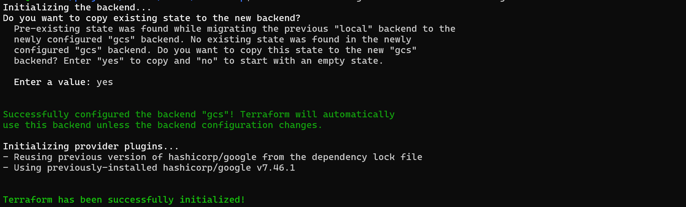

# Milestone 1: Primary infrastructure

Status: Complete. The milestone gate passed on 2026-09-23.

## Scope

Provision a primary control-plane VM and worker VM, their private network, restricted administration, offsite backup storage, and remote Terraform state. Recovery credentials must remain available without the primary VMs. See [milestone 1](../../plan.md#1-primary-infrastructure).

## Work completed

- Added a bootstrap Terraform root for a Belgium GCS state bucket with versioning, public-access prevention, bucket IAM, and an explicit local-state migration procedure.
- Added the primary Terraform root, including a Finland regional cluster module, private VMs, IAP SSH, Cloud NAT, a dedicated worker disk, a separate Belgium backup bucket, and IAM access.
- Added placeholder configuration, local-file ignore rules, a cost calculator input table, and the [operator procedure](../runbooks/primary-infrastructure.md).
- Recorded the architecture and its trade-offs in [decision 0003](../decisions/0003-regional-infrastructure-and-state.md).
- Recorded the observed budget errors in [troubleshooting](../troubleshooting/02-billing-budget-apply-errors.md) and clarified the tracked variable examples. Local values and provider lock files were not changed.
- Removed the budget resource, required budget and billing inputs, and project-number lookup. Updated the example, operator procedure, plan, and [decision 0004](../decisions/0004-remove-budget-alert.md). Local `terraform.tfvars` was not edited.

## Validation gate

The milestone is complete because the validation record shows that:

1. Terraform can reproduce the primary VMs from code.
2. The control plane and worker can communicate over the intended private network.
3. Terraform state, backup storage, and recovery credentials remain accessible without the primary VMs.

## Validation record

| Date | Check and command | Result and sanitized evidence |
| --- | --- | --- |
| 2026-09-23 | `terraform plan -detailed-exitcode -input=false -no-color -compact-warnings` in `infra/primary` | Exited `0` with `No changes. Your infrastructure matches the configuration.` The refresh covered 20 resources in remote state. Combined with the recorded apply, this confirms that the deployed primary infrastructure converges from the tracked configuration. |
| 2026-09-23 | `gcloud compute instances list --filter='labels.environment=primary'` and `gcloud compute disks describe` | Returned two running VMs in the configured Finland zone, each with a private address and no external address. The worker disk was `READY`, 50 GiB, and attached. Names, IDs, and addresses were suppressed from the recorded output. |
| 2026-09-23 | `gcloud compute ssh "$WORKER_NAME" --tunnel-through-iap --command="ping -c 3 $CONTROL_PLANE_IP"` | Exited `0` with three replies and 0% packet loss over the private network. The one-shot SSH command exited after the check. |
| 2026-09-23 | `gcloud compute ssh "$WORKER_NAME" --tunnel-through-iap --command='curl -fsSI https://example.com'` | Exited `0` and returned HTTP 200, confirming IAP administration and outbound HTTPS through Cloud NAT. The one-shot SSH command exited after the check. |
| 2026-09-23 | `terraform state list`, `gcloud storage buckets describe`, and `gcloud storage ls` from the operator machine | Remote primary state listed 20 resources and the primary backend prefix contained one state object. The state and backup buckets both reported `EUROPE-WEST1`, and both were accessible using Application Default Credentials held outside the primary VMs. The backup bucket was empty, as expected before milestone 4. |
| 2026-09-23 | `terraform apply` in `infra/primary` | Failed during configuration evaluation: `Call to unknown function` for `round()` at `main.tf:101`. The clean plan recorded above verifies the correction. |
| 2026-09-23 | `terraform apply` in `infra/primary` | Failed provider validation: `all_updates_rule` required a Monitoring notification channel or Pub/Sub topic. The clean plan recorded above verifies the correction. |
| 2026-09-23 | `terraform apply` in `infra/primary` | Partial apply: the Finland VMs, network and NAT, worker data disk, backup bucket, and IAM resources were created. Budget creation failed with HTTP 403 because local ADC had no quota project. The budget was removed, and the clean plan recorded above confirms convergence. |
| 2026-09-23 | `terraform output instance_names`, `terraform output internal_ips`, `terraform output backup_bucket_name`, and `gcloud compute instances list` | Results showed two running VMs in Finland with internal addresses and no external NAT addresses; the backup bucket output returned a name. This does not establish node connectivity or independent storage access. |
| 2026-09-23 | `gcloud compute disks describe "$(terraform output -raw worker_data_disk_name)" --project="$PROJECT_ID" --zone=europe-north1-a` | The result showed a 50 GiB balanced disk in READY state, attached to the worker VM. A separate `--format=...` shell line failed with `command not found`; the disk describe itself succeeded. |

## Gate conclusion

The refreshed Terraform plan, live resource queries, private node ping, and external credential checks satisfy all three milestone 1 gate conditions. The checks prove convergence of the current deployment, not a destructive clean rebuild. They also prove access from an operator machine while the primary VMs are running, not access during a simulated Finland outage. Milestones 5 and 6 cover cold rebuild and regional-loss testing.

## Selected screenshots

These sanitized excerpts record results from 2026-09-24. The [validation record](#validation-record) contains the commands and results behind them.

