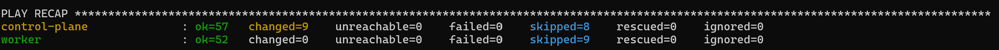
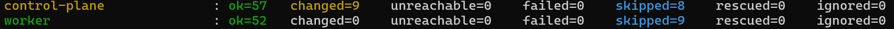
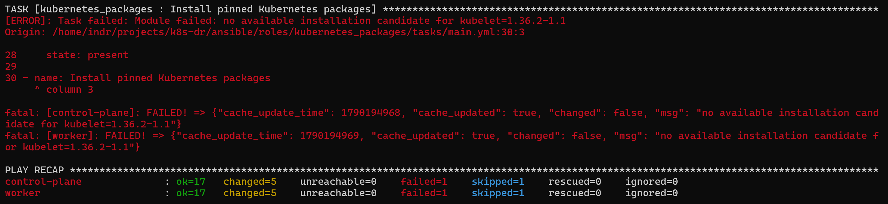
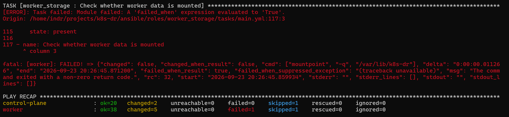
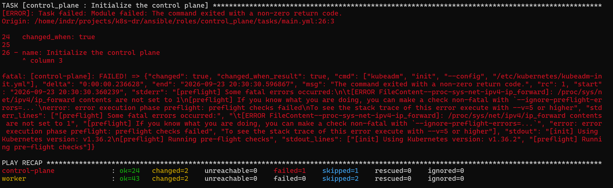

# Milestone 2: Kubernetes bootstrap

Status: Complete. The milestone gate passed on 2026-09-25. See [Gate conclusion](#gate-conclusion).

## Scope

Configure Linux, containerd, kubelet, kubeadm, and kubectl with Ansible. Initialize the control plane, join the worker, install a CNI, and add only the ingress and storage components required for the service. Automate a rebuild from fresh VMs. See [milestone 2](../../plan.md#2-kubernetes-bootstrap).

## Work completed

Implemented on branch `feat/milestone-2-kubernetes-bootstrap`, following the [implementation plan](../plans/2026-09-23-kubernetes-bootstrap.md). Live runs exposed several issues that were fixed in this branch. See [Failures and fixes](#failures-and-fixes).

| Area | Files | Summary |
| --- | --- | --- |
| Toolchain and CI | `ansible/requirements.txt`, `ansible.cfg`, `ansible/.yamllint.yml`, `.github/workflows/ansible.yml` | Pinned controller packages. CI runs unit tests, yamllint, ansible-lint, playbook syntax checks, and `terraform validate` without a backend. |
| Inventory | `scripts/prepare_ansible_inventory.py`, `infra/primary/outputs.tf` | Builds an ignored JSON inventory from Terraform outputs and rejects malformed or overlapping network data. |
| IAP access | `scripts/run_with_iap.py` | Opens one IAP tunnel per node, scans host keys into a private `known_hosts`, runs Ansible, and stops every tunnel on exit. |
| Node preparation | `ansible/roles/node_prepare/`, `container_runtime/`, `kubernetes_packages/` | Configures Ubuntu, containerd with the systemd cgroup driver, and held Kubernetes 1.36.2 packages. |
| Worker storage | `ansible/roles/worker_storage/` | Refuses the boot disk and unexpected filesystems, formats only a blank data disk, and mounts it by UUID. |
| Cluster creation | `ansible/roles/control_plane/`, `worker_join/` | Initializes kubeadm once and joins the worker with a protected, unlogged join command. Partial state stops the run instead of resetting. |
| Add-ons | `ansible/roles/cluster_addons/` | Installs Calico 3.32.2 with VXLAN, Gateway API 1.6.1 Standard CRDs, Traefik chart 41.6.0 on NodePort 30080, and Local Path Provisioner 0.0.36 restricted to the worker disk. |
| Test application | `ansible/manifests/milestone2-app.yml`, `ansible/playbooks/deploy_test_app.yml`, `validate.yml`, `cleanup_test_app.yml` | Deploys a private nginx app with a PVC marker and an HTTPRoute for `milestone2.local`, collects read-only evidence, and removes the app. |
| Procedure | `docs/runbooks/kubernetes-bootstrap.md` | Lists operator commands, expected results, and evidence for each gate condition. |

Local checks: `python3 -m unittest discover -s tests`, yamllint with `ansible/.yamllint.yml`, `ansible-lint ansible`, and `--syntax-check` for all four playbooks pass. These checks are not gate evidence.

## Validation gate

The milestone is complete because the validation record shows that:

1. Both nodes report `Ready` after bootstrap.
2. A disposable app schedules and can be reached through the intended path.
3. The worker rejoins after a restart.
4. A fresh rebuild follows the same automated steps.

## Validation record

| Date | Check and command | Result and sanitized evidence |
| --- | --- | --- |
| 2026-09-23 | `bootstrap.yml` through `scripts/run_with_iap.py`, then `validate.yml -v` (runs `kubectl get nodes -o wide`) | Passed. Bootstrap recap: control plane `ok=57 changed=9 unreachable=0 failed=0`, worker `ok=52 changed=0 unreachable=0 failed=0`. `k8sdr-primary-control-plane` (`control-plane`) and `k8sdr-primary-worker` (`worker`) are `Ready`, `v1.36.2`, Ubuntu 24.04.5 LTS, `containerd://2.2.1`. All pods in `calico-system`, `kube-system`, `tigera-operator`, `traefik`, and `local-path-storage` are `Running`; all six deployments are fully available. `validate.yml` then stopped at `Read Gateway conditions` with `namespaces "milestone2-test" not found`, as expected before the test application is deployed. |
| 2026-09-24 | `deploy_test_app.yml`, `validate.yml -v`, pod deletion and rollout, then `validate.yml`, through `scripts/run_with_iap.py` | Passed after the permission fix below. Deployment recap: `ok=6 changed=2 failed=0`. Validation recap before and after pod replacement: `ok=10 changed=0 failed=0`. Both nodes were `Ready`; the app pod was `Running` on the worker; the PVC remained `Bound` to the same PV. Gateway `Programmed=True` and HTTPRoute `Accepted=True`. The routed request returned `200` with `milestone2 persistent marker`; the request without the test host returned `404`. The replacement pod had a new name, and the mounted directory mode was `0755`. |
| 2026-09-24 | `gcloud compute ssh ... --command='sudo systemctl reboot'`, `findmnt /var/lib/k8s-dr`, then `validate.yml -v` through `scripts/run_with_iap.py` | Passed after recovery. `findmnt` showed the worker data disk mounted as `ext4`. The first IAP validation attempt failed scanning the worker SSH host key; a second attempt reached the cluster while several worker pods were `Unknown` and the HTTP check returned connection refused. Follow-up `kubectl get pods --all-namespaces` showed all pods `Running`; `validate.yml -v` then exited `0` with both nodes `Ready`, the PVC bound to the same PV, and HTTP `200` with the same marker plus `404` without the test host. The updated `validate.yml` with readiness waits exited `0` (`ok=12 changed=0 failed=0`). |
| 2026-09-24 | `terraform plan -out=milestone2-rebuild.tfplan` with two VM `-replace` targets, `terraform apply milestone2-rebuild.tfplan`, inventory regeneration, `bootstrap.yml`, `deploy_test_app.yml`, `validate.yml -v`, and `terraform plan -detailed-exitcode -input=false -no-color -compact-warnings` | Partial gate evidence. Terraform plan and apply excerpts show `3 to add, 0 to change, 3 to destroy` and `3 added, 0 changed, 3 destroyed`. Terraform outputs showed new private node addresses, and the refreshed plan exited `0` with `No changes`. On fresh VMs, the worker storage role found the existing ext4 filesystem and skipped `mkfs`; kubeadm initialized the control plane and joined the worker. The first Calico DaemonSet existence wait retried twice, then passed. The add-on role completed with `ok=28 changed=15 failed=0`. Test-app deployment completed with `ok=6 changed=2 failed=0`; validation completed with `ok=12 changed=0 failed=0`, both nodes `Ready`, PVC `Bound`, app on worker, HTTP `200` with the marker and `404` without the host. The complete `bootstrap.yml` rerun recap is recorded on 2026-09-25. |
| 2026-09-25 | Inventory regeneration with `scripts/prepare_ansible_inventory.py`, then `bootstrap.yml` twice and `cleanup_test_app.yml` through `scripts/run_with_iap.py` | Inventory regeneration exited without errors. Both `bootstrap.yml` runs on the rebuilt VMs ended with the same recap: control plane `ok=57 changed=9 unreachable=0 failed=0 skipped=8`, worker `ok=52 changed=0 unreachable=0 failed=0 skipped=9`. On both runs, `Pre-pull control-plane images`, `Initialize the control plane`, `Join the worker to the cluster`, `Create ext4 only on a blank worker data device`, `Mount worker data`, `Apply Kubernetes networking sysctls`, and `Restart containerd with the current configuration` were skipped. All nine changed tasks were in `cluster_addons`: the worker label, `kubectl apply` of Calico, Gateway API, and Local Path resources, the StorageClass annotation, and `helm upgrade --install` for Traefik. These report `changed` on every run. Cleanup ended with `ok=2 changed=2 failed=0`. This cleanup ran before a final validation, so the app was redeployed for the next check. |
| 2026-09-25 | `deploy_test_app.yml`, `validate.yml -v`, then `cleanup_test_app.yml` through `scripts/run_with_iap.py` | Passed. Deployment recap: `ok=6 changed=2 unreachable=0 failed=0`. Validation recap: `ok=12 changed=0 unreachable=0 failed=0`. With `failed=0`, validation confirms that both nodes reached `Ready`, the Calico, CoreDNS, Local Path Provisioner, Traefik, and test-app rollouts completed, the routed request returned `200` with `milestone2 persistent marker`, and the request without the test host returned `404`. Cleanup recap: `ok=2 changed=2 unreachable=0 failed=0`. |

## Gate conclusion

All four gate conditions have evidence:

| Gate condition | Evidence |
| --- | --- |
| Both nodes report `Ready` | 2026-09-23 bootstrap and every later `validate.yml` run |
| A disposable app schedules and is reachable | 2026-09-24 app validation, including pod replacement with the same PV |
| The worker rejoins after a restart | 2026-09-24 reboot, `findmnt`, and validation without a new join |
| A fresh rebuild follows the same steps | 2026-09-24 VM replacement and bootstrap, then the 2026-09-25 bootstrap reruns and validation on the rebuilt VMs |

Limits of this evidence:

- The rebuild replaced both VMs and boot disks. It kept the network, buckets, state, and worker data disk by design. A rebuild of the whole environment in another region is milestone 5 work.
- `validate.yml` asserts node readiness, rollouts, and the HTTP responses. It lists the PVC, Gateway, and HTTPRoute without asserting their status; those were checked by reading the output on 2026-09-24.
- The reachability check runs inside the VPC. HTTP access from the operator machine is not tested.

## Selected screenshots

These sanitized excerpts come from the runs on 2026-09-23 to 2026-09-25. The [validation record](#validation-record) supplies their command context and limitations.

## Failures and fixes

### Validation raced worker recovery after reboot

- **Symptom:** Immediately after `findmnt` succeeded on the rebooted worker, the first `scripts/run_with_iap.py` attempt failed with `host key scan failed for worker`. The next attempt reached the control plane while several worker pods were `Unknown` or unready, and the Gateway request failed with connection refused.
- **Confirmed cause:** `kubectl get nodes` reported the worker `Ready` before its workloads had recovered. Pod and event output showed worker containers restarting and temporary readiness probe failures. A later `kubectl get pods --all-namespaces` showed all pods `Running`, and the same HTTP check passed. The exact cause of the one failed SSH key scan is unconfirmed; a transient SSH service or IAP tunnel response during reboot is the current hypothesis.
- **Fix:** `scripts/run_with_iap.py` now retries `ssh-keyscan` for up to 30 seconds after the IAP listener opens. `validate.yml` waits for both nodes and the Calico, CoreDNS, Local Path Provisioner, Traefik, and test-app rollouts before collecting status and requesting HTTP. Both waits are read-only.
- **Verification:** A unit test reproduces a failed first key scan followed by a successful second scan. The updated `validate.yml` ran against the recovered cluster with `ok=12 changed=0 failed=0`; all five rollout waits passed, the marker request returned `200`, and the request without the test host returned `404`. The retry path itself was tested locally, not during another reboot.

### Test app returned 403 through the Gateway route

- **Symptom:** On the first `validate.yml` attempt, `Request the application through the Gateway route` returned `403 Forbidden` from nginx. The route reached the app, but nginx could not serve `index.html`.
- **Confirmed cause:** Live nginx logs reported `index.html is forbidden (13: Permission denied)`. The PVC mount was `0770 root:root`; the marker file existed as `0644 root:root`; nginx workers ran as UID and GID `101`. The workers could not traverse the mounted directory.
- **Fix:** The disposable app's init container now sets the mounted directory to `0755` before preserving or creating the marker. This exposes only the test content already served by nginx. A regression test runs the manifest's init command against a `0770` directory and checks its resulting mode and existing marker.
- **Verification:** The regression test failed before the change and passed after it. `deploy_test_app.yml` exited `0`, and `validate.yml -v` exited `0` with the routed `200` response and marker, plus `404` without the host. After deleting the pod and waiting for the replacement, `validate.yml` again exited `0`; the PVC stayed bound to the same PV and the marker remained readable. Later restart and rebuild evidence appears in the [validation record](#validation-record).

### Undefined shared variables on the first bootstrap run

- **Symptom:** On the first live `bootstrap.yml` run, task `container_runtime : Install the pinned containerd package` failed with `'containerd_deb_version' is undefined`.
- **Confirmed cause:** Ansible loads `group_vars/` only from the inventory file's directory and the playbook's directory. The shared variables were in `ansible/group_vars/all.yml`, next to neither `ansible/inventory/generated/hosts.json` nor `ansible/playbooks/`, so every pinned version and path was undefined. Reproduced locally with `ansible-inventory --playbook-dir ansible/playbooks --host <node>`, which returned no variables. The local checks missed it because syntax checks and file-reading tests do not resolve variables.
- **Fix:** Moved the file to `ansible/playbooks/group_vars/all.yml`, which Ansible loads for every playbook in that directory. Added `tests/test_ansible_variable_loading.py`, which resolves each shared variable through `ansible-inventory` for an inventory outside `ansible/`.
- **Verification:** The new test passes locally, and a local probe playbook prints `containerd_deb_version` from a generated-style inventory. On the live rerun, `Install the pinned containerd package` reported `changed` on both nodes, and the run continued to the next failure below.

### Kubernetes package revision not published

- **Symptom:** On the second live `bootstrap.yml` run, task `kubernetes_packages : Install pinned Kubernetes packages` failed on both nodes with `no available installation candidate for kubelet=1.36.2-1.1`. Recap: `ok=17 changed=5 unreachable=0 failed=1` per node.
- **Confirmed cause:** The `pkgs.k8s.io` `core:/stable:/v1.36` repository publishes Kubernetes 1.36.2 only as package revision `1.36.2-2.1` for `kubelet`, `kubeadm`, and `kubectl`. The pin used revision `1.1`, which does not exist. Checked with `curl -fsSL https://pkgs.k8s.io/core:/stable:/v1.36/deb/Packages`.
- **Fix:** Set `kubernetes_deb_version` to `1.36.2-2.1`. The Kubernetes version stays 1.36.2, as decided in ADR 0005.
- **Verification:** On the next live run, package installation passed on both nodes, and the run continued to the next failure below.

### Mount check misread the `mountpoint` exit code

- **Symptom:** On the third live `bootstrap.yml` run, task `worker_storage : Check whether worker data is mounted` failed on the worker. `mountpoint -q /var/lib/k8s-dr` returned `rc=32`. Recap: control plane `failed=0`, worker `ok=38 changed=5 failed=1`.
- **Confirmed cause:** util-linux `mountpoint` returns `32` when the directory is not a mount point and `1` for errors such as a missing path. The role treated `1` as "not mounted" and failed on `32`. Confirmed with `man mountpoint` for util-linux 2.39.3, the version on Ubuntu 24.04, and locally: an unmounted directory returns `32`, and a missing path returns `1`.
- **State before the fix:** Earlier tasks in the same run formatted the blank data disk as ext4 and wrote its UUID entry to `/etc/fstab`. A rerun detects `ext4`, skips `mkfs`, and continues to the mount.
- **Fix:** Accept `0` and `32`, and mount only on `32`. Added a contract test that pins both expressions.
- **Verification:** On the next live run, the worker play finished with `failed=0` (`ok=43`).

### Handlers lost after failed runs

- **Symptom:** On the fourth live `bootstrap.yml` run, `control_plane : Initialize the control plane` failed at kubeadm preflight with `[ERROR FileContent--proc-sys-net-ipv4-ip_forward]: /proc/sys/net/ipv4/ip_forward contents are not set to 1`. Preflight runs before kubeadm writes any state.
- **Confirmed cause:** `node_prepare` applied `/etc/sysctl.d/99-kubernetes.conf` only through a handler. Handlers run at the end of a play and are skipped when a task fails. The first run wrote the file and then failed at containerd, so the handler never ran. Later runs reported the file task as `ok`, so it never notified the handler again. The file was correct, but the kernel values were never applied.
- **Same cause, not yet observed:** `container_runtime` restarted containerd only through a handler. On the second run, `Configure containerd for Kubernetes` reported `changed`, and the play then failed at package installation. containerd therefore kept running with its package defaults instead of the systemd cgroup configuration. This is inferred from the task sequence, not observed on the node.
- **Fix:** Removed both handlers. `node_prepare` now reads the three sysctls on every run, runs `sysctl --system` when any is not `1`, and fails if they are still not `1`. `container_runtime` validates the configuration, then restarts containerd when its `ActiveEnterTimestamp` is older than the configuration file's modification time. Contract tests pin both behaviors.
- **Verification:** Local tests, yamllint, ansible-lint, and syntax checks pass. A local probe of the restart condition returns `True` for a stale or missing start time and `False` for a start after the change. On the fifth live run, the control plane initialized, the worker joined (`ok=58 failed=0`), and the run continued to the next failure below.

### Worker label used the inventory name instead of the node name

- **Symptom:** On the fifth live `bootstrap.yml` run, task `cluster_addons : Label the worker node for workload placement` failed with `Error from server (NotFound): nodes "worker" not found`. Recap: control plane `ok=36 changed=4 failed=1`, worker `ok=58 changed=4 failed=0`.
- **Confirmed cause:** The task labeled `{{ groups['kube_workers'] | first }}`, which is the Ansible inventory hostname `worker`. `kubeadm init` and `kubeadm join` register nodes by `gcp_instance_name` (`nodeRegistration.name` and `--node-name`), so the Kubernetes node is `k8sdr-primary-worker`. The Local Path Provisioner `nodePathMap` used the same wrong name. That would not fail the play, but the provisioner would treat the worker as unlisted and leave its PVCs Pending. The contract test pinned the wrong expression, so local checks passed.
- **Fix:** Both references now use `{{ hostvars[groups['kube_workers'] | first].gcp_instance_name }}`. The contract tests pin the new expression for the label task and the `nodePathMap`.
- **Verification:** Local unit tests (53), yamllint, and ansible-lint pass. Resolving the expression locally against the generated inventory returns `k8sdr-primary-worker`. On the sixth live run, the label task reported `changed`, and the run continued to the next failure below.

### Calico rollout check raced the Tigera operator

- **Symptom:** On the sixth live `bootstrap.yml` run, task `cluster_addons : Wait for Calico on every node` failed after 0.1 seconds with `Error from server (NotFound): namespaces "calico-system" not found`. Recap: control plane `ok=38 changed=5 failed=1`, worker `failed=0`.
- **Confirmed cause:** The Tigera operator creates the `calico-system` namespace and the `calico-node` DaemonSet asynchronously after it reconciles the `Installation`. `kubectl rollout status` fails immediately when the object does not exist, and the earlier operator rollout check returned before reconciliation. Immediately after the failure, `kubectl get ns` showed `calico-system` created about 16 seconds after `tigera-operator`, and `kubectl get tigerastatus` later reported `calico` as `Available=True`. Calico itself was healthy.
- **Fix:** Added `Wait for the operator to create the Calico node DaemonSet`, which retries `kubectl get daemonset/calico-node -n calico-system` every 5 seconds for up to 5 minutes before the rollout check. A contract test pins the task and its order.
- **Verification:** Local unit tests (54), yamllint, and ansible-lint pass. The seventh live run, `python3 scripts/run_with_iap.py ... bootstrap.yml`, exited `0`. Recap: control plane `ok=57 changed=15 unreachable=0 failed=0`, worker `ok=52 changed=0 unreachable=0 failed=0`. Calico already existed on that run, so the retry path passed on its first attempt; the race itself is exercised only on a fresh cluster (see [Rebuild from fresh VMs](../runbooks/kubernetes-bootstrap.md#rebuild-from-fresh-vms)).
- **Follow-up validation:** `validate.yml -v` listed `k8sdr-primary-control-plane` (`control-plane`) and `k8sdr-primary-worker` (`worker`), both `Ready` on `v1.36.2` with `containerd://2.2.1`. All pods in `calico-system`, `kube-system`, `tigera-operator`, `traefik`, and `local-path-storage` were `Running`. The run stopped at `Read Gateway conditions` (`failed=1`), which the runbook expects before the test application is deployed.
- **Observed, not blocking:** `tigerastatus/tiers` reports `Degraded` with `Waiting for Tigera API server to be ready`. The `Installation` does not request the Calico API server, and `calico`, `ippools`, and every Calico pod are healthy. Hypothesis: this status is expected without an `APIServer` resource. It is not investigated further in this milestone.

### Operator port forward dropped with a broken pipe

- **Symptom:** In [Validate the disposable application](../runbooks/kubernetes-bootstrap.md#validate-the-disposable-application), step 2 of the earlier runbook, `gcloud compute ssh <worker> --tunnel-through-iap -- -N -L 18080:127.0.0.1:30080` exited `255` with `WARNING: [0] Failed to send all data from [stdin].` and `client_loop: send disconnect: Broken pipe`. It is unclear whether the connection failed immediately or later.
- **Cause (hypothesis, not confirmed):** the IAP WebSocket behind the `gcloud compute ssh` standard-input proxy closed. The same IAP and OS Login access works reliably through `scripts/run_with_iap.py`, which uses `gcloud compute start-iap-tunnel` with a local port. The failure is in the SSH transport, not in the cluster, and says nothing about the application.
- **Fix:** Replaced the interactive forward with two read-only requests in `validate.yml`. They go from the control plane to the worker's private address on NodePort 30080, and expect `200` with the marker when sending `Host: milestone2.local`, and `404` without it. The pod-replacement step now runs through the IAP runner instead of `gcloud compute ssh`. [ADR 0005](../decisions/0005-kubernetes-bootstrap-architecture.md#amendment-in-cluster-reachability-check) records the change and its trade-off: the check no longer proves access from the operator machine.
- **Verification:** Local unit tests, yamllint, ansible-lint, and syntax checks pass. Rendering the request URL against the generated inventory gives the worker's private address on port `30080`. The live validation returned `200` with the marker and `404` without the test host, including after the worker restart and VM rebuild.

## Remaining work

These items do not block the gate:

- `validate.yml` fails until the test application is deployed. Splitting cluster and application checks would give recovery drills a cluster-only check.
- `tigerastatus/tiers` is `Degraded` (see the Calico entry above). Not investigated.
- Ansible prints `INJECT_FACTS_AS_VARS` deprecation warnings for `ansible_*` facts in `node_prepare`. They do not affect results before ansible-core 2.24.
