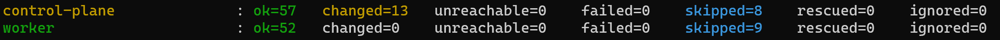
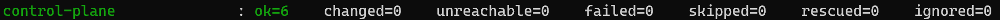
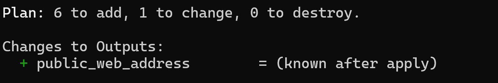
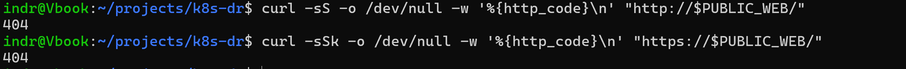
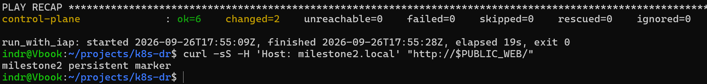
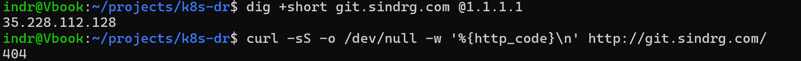
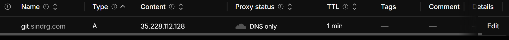

# Milestone 3: Service deployment

Status: In progress. The preparation gate passed on 2026-09-25. Implementation started on 2026-09-26.

## Scope

Bootstrap Flux from the external GitHub repository, deploy Gitea and PostgreSQL with persistent volumes, and create the recovery fixtures. See [milestone 3](../../plan.md#3-service-deployment).

## Preparation

The [pre-milestone 3 steps](../../plan.md#before-milestone-3-recovery-readiness) change the layout and tooling before the worker disk holds service data.

### Work completed

| Area | Files | Summary |
| --- | --- | --- |
| Shared Terraform root | `infra/shared/`, `infra/primary/`, `infra/modules/regional_cluster/` | New root for the backup bucket, its IAM members, and project administrator grants. The primary root owns the worker data disk; the module attaches a disk ID. One-time `moved`, `removed`, and `import` blocks migrate existing resources. See the [decision 0003 amendment](../decisions/0003-regional-infrastructure-and-state.md#amendment-shared-root-and-root-owned-data-disk). |
| Output contract | `infra/primary/outputs.tf`, `scripts/prepare_ansible_inventory.py`, `tests/` | Region-neutral `zone` and `subnet_cidr` outputs. A test checks that each regional root declares every output the inventory needs. |
| Tracked boot image | `infra/modules/regional_cluster/variables.tf` | The tested `ubuntu-2404-noble-amd64-v20260918` image is the module default instead of an ignored local value. |
| Procedures | `docs/runbooks/terraform-shared-root-migration.md`, `primary-infrastructure.md`, `kubernetes-bootstrap.md` | One-time migration steps, the fresh-deployment order, and the image confirmation step. |
| Split validation | `ansible/playbooks/validate_cluster.yml`, `validate_test_app.yml`, `validate.yml` | Cluster checks run without an application, so a recovery drill can use them right after bootstrap. `validate.yml` imports both, so existing commands still work. The app checks now fail unless the Gateway is `Programmed`, the HTTPRoute is `Accepted`, and the PVC is `Bound`; milestone 2 only listed them. |
| Run timing | `scripts/run_with_iap.py` | Prints UTC start and finish times, elapsed seconds, and the exit code after each command. No new dependency. Per-task timing through the `ansible.posix.profile_tasks` callback would add a Galaxy collection download to the recovery path, so it is deferred until milestone 7 needs task-level bottlenecks. |
| Pin check | `scripts/check_pins.py`, `.github/workflows/pins.yml` | Confirms every pinned artifact in `group_vars/all.yml` still resolves: the Kubernetes package revision, the containerd build, the Traefik chart, and the Calico, Gateway API, Local Path, and Helm files. Runs on pull requests, on `main`, and weekly. A unit test fails when a new version pin is not checked. |
| Service architecture | `docs/decisions/0006-service-deployment-architecture.md`, `docs/production-readiness.md`, `docs/decisions/0001-use-kubeadm.md` | Decisions for Flux, the Ansible and Flux ownership boundary, SOPS secrets, PostgreSQL 18, Gitea, public exposure through a passthrough load balancer (option A), and network policies. Accepted on 2026-09-25. Records the regulatory VM rationale and the production gap. |
| Helm 4 | `ansible/playbooks/group_vars/all.yml`, `tests/`, `docs/decisions/0005-kubernetes-bootstrap-architecture.md` | Helm CLI pin moved from 3.22.0 to 4.3.0 on 2026-09-26 because Helm 3 security fixes end on 2027-02-10. The Traefik install tasks and flags are unchanged. See the [decision 0005 amendment](../decisions/0005-kubernetes-bootstrap-architecture.md#amendment-helm-4). Validated on the cluster on 2026-09-26. |
| Decision notes | `plan.md`, `docs/decisions/0006-service-deployment-architecture.md`, `docs/production-readiness.md` | Milestone 4 backup bucket hardening: a writer that cannot delete or overwrite, a retention policy with a recorded lock decision, explicit soft delete, and noncurrent-version expiry. A decision 0006 amendment records why Gitea stays over Forgejo and confirms that Gitea chart 12.7.0 still declares the Bitnami subcharts. Documentation only; no Terraform change. |
| Make targets | `Makefile`, `tests/test_makefile.py`, `docs/runbooks/kubernetes-bootstrap.md` | Short names for the inventory, bootstrap, validation, test-app, local check, and pin check commands. The runbook uses the targets, and `make -n <target>` prints the full command. `make` ships with Ubuntu, so the recovery path gains no dependency. A test fails when a playbook is missing from the `make check` syntax checks. |
| CI uses `make check` | `.github/workflows/ansible.yml`, `Makefile` | CI runs `make check BIN=` instead of its own copy of the test, lint, and syntax-check steps, so the playbook list exists once. `BIN` defaults to `.venv/bin/`; CI clears it because it installs tools into the system Python. |
| containerd source | `ansible/roles/container_runtime/tasks/main.yml`, `group_vars/all.yml`, `scripts/check_pins.py`, `tests/` | Installs `containerd.io` `2.3.6-1~ubuntu.24.04~noble` from Docker's repository instead of Ubuntu's `containerd`. The pin check reads Docker's noble index. A contract test fails if the role installs from another source. Validated on the cluster on 2026-09-26 during the public endpoint bootstrap. |

Local checks: `terraform fmt -check -recursive` and `terraform validate` pass for the bootstrap, shared, and primary roots. `python3 -m unittest discover -s tests`, yamllint, ansible-lint, and syntax checks for all six playbooks pass. These checks are not gate evidence.

### Findings

**The containerd pin will stop resolving.** Ubuntu's archive index lists only the newest build of a package in each pocket. `curl -fsSL "https://api.launchpad.net/1.0/ubuntu/+archive/primary?ws.op=getPublishedBinaries&binary_name=containerd&exact_match=true&distro_arch_series=https://api.launchpad.net/1.0/ubuntu/noble/amd64"` on 2026-09-25 showed `2.2.1-0ubuntu1~24.04.3` as `Published` and `2.2.1-0ubuntu1~24.04.2` as `Superseded`. When Ubuntu publishes the next build, `containerd={{ containerd_deb_version }}` fails on a fresh node, including in a recovery drill.

- `scripts/check_pins.py` detects this. Run against a copy of the variables with `~24.04.2`, it exits `1` with `2.2.1-0ubuntu1~24.04.2 is no longer published`. With the Kubernetes revision `1.36.2-1.1` from the milestone 2 failure, it exits `1` with `1.36.2-1.1 not published for kubelet, kubeadm, kubectl`.
- Options, not yet decided: install containerd from a source that keeps old versions, such as Docker's `containerd.io` repository or the upstream release archive with a checksum; or accept the risk and update the pin whenever the check fails. Either change needs the milestone 2 bootstrap validation again.
- Resolved on 2026-09-26: containerd now comes from Docker's `containerd.io` repository, pinned to `2.3.6-1~ubuntu.24.04~noble`. See the [decision 0005 amendment](../decisions/0005-kubernetes-bootstrap-architecture.md#amendment-containerd-from-dockers-repository). Validated on the cluster on 2026-09-26.

### Validation record

| Date | Check and command | Result and sanitized evidence |
| --- | --- | --- |
| 2026-09-25 | `terraform plan` in `infra/primary` on the refactor branch, against remote state | `Plan: 0 to add, 0 to change, 0 to destroy.` `module.primary_cluster.google_compute_disk.worker_data` moved to `google_compute_disk.worker_data`. The backup bucket, its two IAM members, and three project IAM members "will no longer be managed by Terraform, but will not be destroyed". The tracked boot image caused no VM change. |
| 2026-09-25 | `terraform init -backend-config=backend.hcl` and `terraform plan` in `infra/shared`, against remote state with prefix `shared` | `Plan: 6 to import, 0 to add, 1 to change, 0 to destroy.` Imports: the backup bucket, its two IAM members, and the three `google_project_iam_member.admin` grants. The change sets the bucket label `environment` from `primary` to `shared`. The local `terraform.tfvars` and `backend.hcl` are ignored by Git. |
| 2026-09-25 | `python3 scripts/check_pins.py` | Exited `0`. All nine checks passed, including Kubernetes `1.36.2-2.1`, containerd `2.2.1-0ubuntu1~24.04.3` in `noble-updates`, and Traefik chart `41.6.0`. |
| 2026-09-25 | `scripts/run_with_iap.py ... validate_cluster.yml -v` | Passed. Recap: control plane `ok=6 changed=0 unreachable=0 failed=0`. `run_with_iap: started 2026-09-25T20:16:12Z, finished 2026-09-25T20:16:53Z, elapsed 41s, exit 0`. Both nodes `Ready` on `v1.36.2`, Ubuntu 24.04.5 LTS; all 17 pods `Running`; the `traefik` GatewayClass `Accepted`. The cluster check ran without the test application. |
| 2026-09-25 | `gcloud storage ls --all-versions` on the primary state prefix | Recorded the newest primary state generation as the rollback point before any apply. Not needed. |
| 2026-09-25 | `terraform apply shared-migration.tfplan` in `infra/shared` | `Apply complete! Resources: 6 imported, 0 added, 1 changed, 0 destroyed.` `terraform state list` shows the bucket, two bucket IAM members, and three `google_project_iam_member.admin` entries. |
| 2026-09-25 | Removed the four backup variables and `boot_image` from the local primary `terraform.tfvars`, then `terraform apply primary-migration.tfplan` in `infra/primary` | The first apply attempt failed with `Failed to load "primary-migration.tfplan" as a plan file` because no plan file existed. A new plan showed `Plan: 0 to add, 0 to change, 0 to destroy.` with the disk move, six resources no longer managed, and the output renames. Its apply reported `Apply complete! Resources: 0 added, 0 changed, 0 destroyed.` |
| 2026-09-25 | `terraform plan -detailed-exitcode` in `infra/shared` and `infra/primary`, `terraform output -raw zone`, `terraform state list` | Both plans exited `0`. `zone` returned the Finland zone. The primary state no longer lists the bucket or project IAM members. |
| 2026-09-25 | `gcloud projects get-iam-policy` filtered to the administrator member, then `gcloud compute ssh <worker> --tunnel-through-iap --command=true` | The member still holds `roles/iap.tunnelResourceAccessor`, `roles/compute.osAdminLogin`, and `roles/compute.instanceAdmin.v1`. IAP SSH exited `0`. |
| 2026-09-25 | `scripts/prepare_ansible_inventory.py --terraform-dir infra/primary`, then `validate_cluster.yml` through `scripts/run_with_iap.py` | Inventory generation from the renamed outputs exited `0`. Validation recap: control plane `ok=6 changed=0 unreachable=0 failed=0`; `elapsed 18s, exit 0`. |
| 2026-09-25 | Deleted `infra/shared/migrations.tf` and `infra/primary/migrations.tf`, then `terraform plan -detailed-exitcode` in both roots | Both exited `0`. |
| 2026-09-25 | GitHub Actions on PRs #7, #8, and #9 | `docs` and `validate` passed on all three. The `pins` job passed on #8 and #9. |
| 2026-09-26 | `scripts/run_with_iap.py ... bootstrap.yml` with `helm_version: "4.3.0"` | Passed. Recap: control plane `ok=57 changed=13 unreachable=0 failed=0 skipped=8`; worker `ok=52 changed=0 unreachable=0 failed=0 skipped=9`. With `failed=0`, the Helm version task matched `v4.3.0`, `helm upgrade --install` upgraded the Traefik release that Helm 3.22.0 installed, and the Traefik rollout and `Accepted` GatewayClass waits passed. The `run_with_iap` timing line was not captured. |
| 2026-09-26 | `scripts/run_with_iap.py ... validate_cluster.yml -v` after the Helm 4 bootstrap | Passed. Recap: control plane `ok=6 changed=0 unreachable=0 failed=0`. The playbook fails unless both nodes are `Ready`, the rollouts complete, and the `traefik` GatewayClass is `Accepted`. The timing line was not captured. |

The preparation gate passed on 2026-09-25: both roots plan with no changes, IAP access works, cluster-only validation passes, the pin check passes in CI, and decision 0006 is accepted.

## Implementation

Follow the [service deployment procedure](../runbooks/service-deployment.md).

### Work completed

| Area | Files | Summary |
| --- | --- | --- |
| Public endpoint | `infra/modules/regional_cluster/`, `infra/primary/outputs.tf`, `ansible/roles/cluster_addons/templates/traefik-values.yml.j2`, `tests/test_cluster_manifests.py` | A static external address, a regional external passthrough load balancer to an unmanaged worker instance group, a TCP health check on port 80, and one firewall rule for TCP 80 and 443 on a worker-only tag. The rule allows `0.0.0.0/0` because the load balancer keeps client addresses; that range covers the health-check probes, so decision 0006's separate health-check rule is not needed. Traefik binds host ports 80 and 443 and replaces its pod instead of surging, because a surge pod cannot bind the same host ports on one worker. The module serves the recovery region unchanged. Applied on 2026-09-26. |

Local checks: `terraform fmt -check` and `terraform validate` pass for the module and the primary root. `make check` passes: 77 tests, yamllint, ansible-lint, and syntax checks. These checks are not gate evidence.

### Validation record

| Date | Check and command | Result and sanitized evidence |
| --- | --- | --- |
| 2026-09-26 | `terraform plan -out=public-web.tfplan` in `infra/primary` | `Plan: 6 to add, 1 to change, 0 to destroy.` Output `public_web_address` known after apply. |
| 2026-09-26 | `terraform apply public-web.tfplan` | `Apply complete! Resources: 6 added, 1 changed, 0 destroyed.` `terraform output -raw public_web_address` returned the new static address, referred to here as `<public_web_address>`. |
| 2026-09-26 | `make bootstrap`, then `make validate-cluster` | Both passed with `failed=0`. The bootstrap replaced Ubuntu's `containerd` with `containerd.io` on both nodes and reconciled Traefik onto host ports 80 and 443. Recaps and timing lines were not captured. |
| 2026-09-26 | `gcloud compute backend-services get-health <name_prefix>-public-web --region=europe-north1` | `HEALTHY`. |
| 2026-09-26 | `curl` to `http://<public_web_address>/` and `https://<public_web_address>/` with `-k` | `404` for both. Traefik answers through the load balancer; no route exists yet. |
| 2026-09-26 | `make deploy-test-app`, then `curl -H 'Host: milestone2.local' http://<public_web_address>/` | Deploy recap: control plane `ok=6 changed=2 unreachable=0 failed=0`; `run_with_iap: started 2026-09-26T17:55:09Z, finished 2026-09-26T17:55:28Z, elapsed 19s, exit 0`. Response: `milestone2 persistent marker`. |
| 2026-09-26 | Cloudflare `A` record `git.sindrg.com`, DNS only, TTL 1 min; `dig +short git.sindrg.com @1.1.1.1` and `curl http://git.sindrg.com/` | `dig` returned `<public_web_address>`. `curl` returned `404`. |

