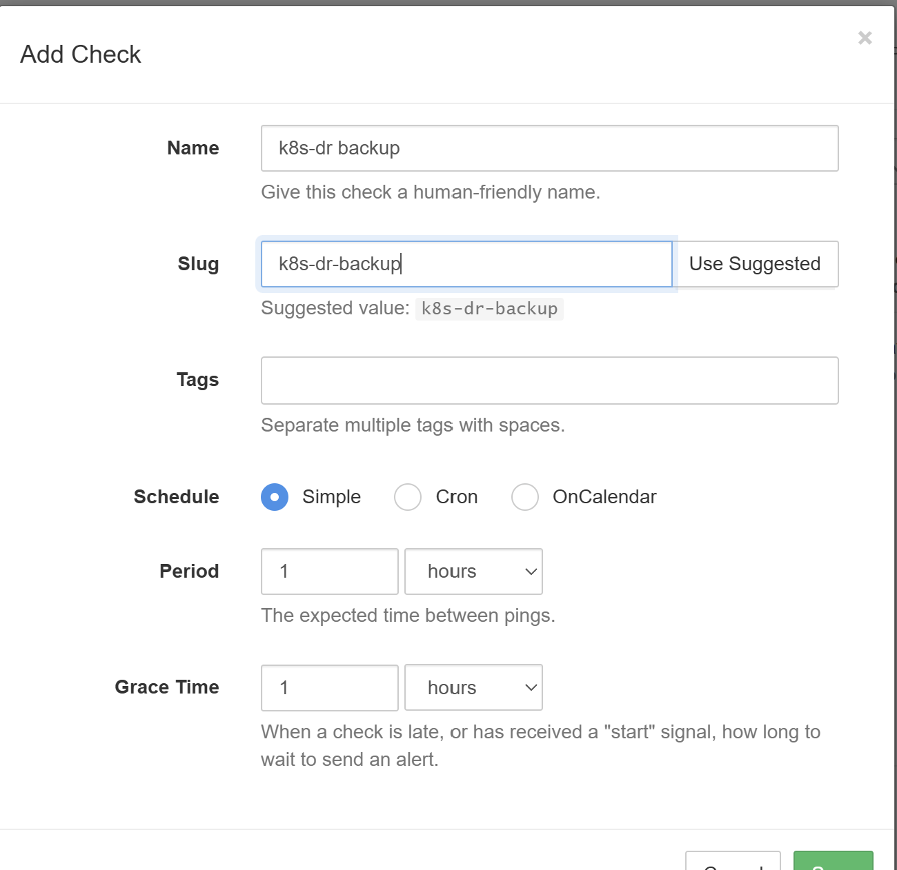
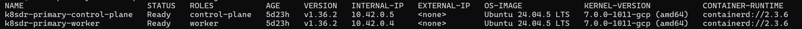
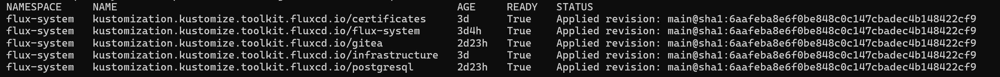
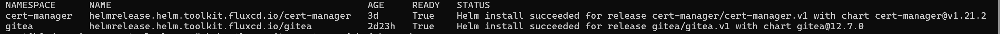
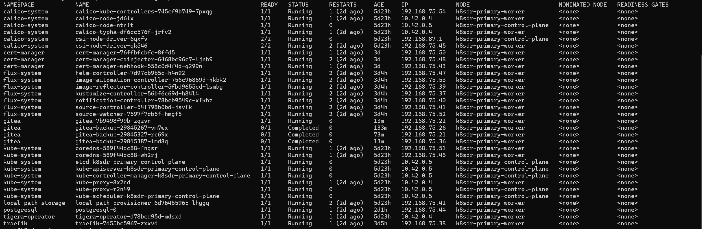
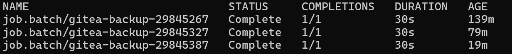
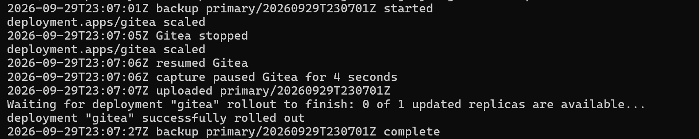
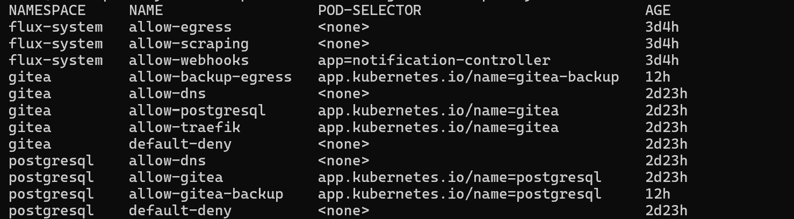
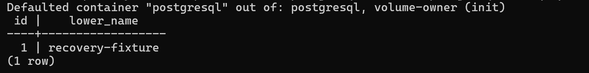
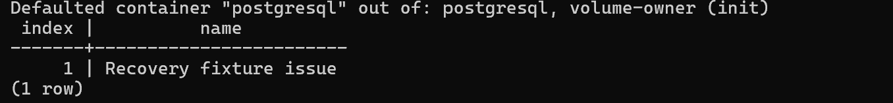

# Consistent backups

Status: Complete. The [milestone gate](#milestone-gate) passed on 2026-09-29.

## Scope

Hourly consistent backups of PostgreSQL and the Gitea volume, stored outside Finland in a hardened bucket, and a verified restore into a separate environment. [Decision 0007](../decisions/0007-consistent-backups.md) records the design.

## Work completed

### Decision record

- Added [decision 0007](../decisions/0007-consistent-backups.md). It settles the items decision 0006 deferred to milestone 4 and replaces restic with age-encrypted objects, because restic needs delete permission that the create-only writer and the retention policy remove.
- Amended decision 0002's application backup row and linked decision 0006's deferred items and the production readiness row to decision 0007.

### Harden the backup bucket

`infra/shared` changes:

- A 14-day unlocked retention policy, an explicit 7-day soft delete policy, a lifecycle rule that deletes live objects at 14 days, and one that deletes noncurrent versions 1 day after they become noncurrent.
- A new `backup_clusters` map from cluster name to its worker node service account. Each entry gets `roles/storage.objectCreator` conditioned to its `<cluster>/` prefix and `roles/storage.objectViewer` on the bucket.
- Removed the `backup_operator_member` variable and its `roles/storage.objectAdmin` grant. That account is a project owner.

`terraform plan` for `infra/shared` on 2026-09-29, summarized:

```text
~ google_storage_bucket.backups: add 2 lifecycle_rule blocks and retention_policy (1209600 s, unlocked)
- google_storage_bucket_iam_member.backup_operator (roles/storage.objectAdmin)
+ google_storage_bucket_iam_member.backup_reader["primary"] (roles/storage.objectViewer)
+ google_storage_bucket_iam_member.backup_writer["primary"] (roles/storage.objectCreator, primary/ prefix condition)
Plan: 2 to add, 1 to change, 1 to destroy.
```

The soft delete policy shows no change because the explicit value matches the existing default.

### Backup-age heartbeat

Created the Healthchecks.io check `k8s-dr-backup` with a 1-hour period and a 1-hour grace time, so it alerts when no verified set completes within the 2-hour RPO. The ping URL is held with the recovery credentials and is not in the repository.



### Backup tool image

- Added `backup-image/Dockerfile`: the pinned PostgreSQL 18.6 image plus `age`, `curl`, `jq`, and `kubectl` 1.36.2 verified by SHA-256.
- Added the `Backup image` workflow. It builds on pull requests and publishes `ghcr.io/sindredg/k8s-dr-backup` from `main`.
- `scripts/check_pins.py` now checks GHCR digests as well as Docker Hub digests.
- Corrected decision 0007: other pods on the worker can reach the metadata server, and the decision records why that exposure is accepted.

### Backup CronJob

- Added the `gitea-backup` CronJob in `deploy/apps/gitea/backup.yaml`. It runs at minute 7 of every hour, one run at a time, with no retries and a 30-minute deadline.
- `backup/backup.sh` scales Gitea to zero, streams `pg_dump` and the Gitea volume through `age` to both public keys, scales Gitea back to one, uploads each object with `Content-MD5` and `x-goog-if-generation-match: 0`, and uploads `manifest.json` last. It pings the heartbeat at start, on success with the pause duration, and on failure.
- The script and the age public keys ship in a generated ConfigMap with Flux substitution disabled. `cluster-settings` gains `backup_cluster: primary` for the object prefix.
- `backup.sops.yaml` holds the bucket name and the ping URL, encrypted for the SOPS key.
- The Role can read the Gitea Deployment and Pods and patch only the `gitea` scale subresource.
- Network policies allow the backup Pod to reach PostgreSQL, the metadata server on port 80, and any address on ports 443 and 6443. PostgreSQL admits it on port 5432. Tests list every allowed flow.

### Restore Job

- Added `backup/restore.sh` to the `gitea-backup` ConfigMap and removed the ConfigMap's name hash, so a Job created outside Kustomize can mount it by name.
- Added `ansible/playbooks/restore.yml` and `make restore`. The playbook suspends the target's backup CronJob, creates the backup age key Secret, runs the `gitea-restore` Job, prints its log, and deletes the Secret and resumes the CronJob on every exit.
- The Job selects the newest set with a manifest or a named set, checks every size and digest, and decrypts both archives before it stops Gitea, recreates the database, and replaces the volume. It logs the backup age and the restore duration.
- The Job runs as the backup ServiceAccount with the backup Pod label, so the existing Role and network policies cover it.
- `RESTORE_NAMESPACE` has no default, so a restore cannot replace the live primary service by mistake.
- Added the [backup and restore procedure](../runbooks/backup-restore.md).

### Test restore environment

- Added `deploy/restore-test/`: Kustomize overlays that copy PostgreSQL and Gitea into `postgresql-restore` and `gitea-restore`, and two Flux Kustomizations that no cluster path includes. The Gitea copy has no Gateway and no backup CronJob, and its network policies and database host point at the copies.
- SOPS Secrets cannot move namespace, because the MAC covers the namespace (`sops --decrypt` reported `MAC mismatch` after the change). `ansible/playbooks/restore_test_env.yml` copies the four decrypted Secrets inside the cluster instead.
- Added `make restore-test-env`, `make restore-test-env-delete`, and `make restore-test-forward`.
- The fixture targets accept `GIT_URL`, such as `http://localhost:3000`, for an endpoint that is not HTTPS on port 443.
- Extended the [backup and restore procedure](../runbooks/backup-restore.md#test-a-restore).

## Validation

### Bucket hardening applied

`terraform apply` in `infra/shared` on 2026-09-29 applied the plan above:

```text
Apply complete! Resources: 2 added, 1 changed, 1 destroyed.
```


A following `terraform plan` reported `No changes. Your infrastructure matches the configuration.`

### First reconciliation of the CronJob failed

- **Symptom:** after the CronJob change merged, the `gitea` Kustomization reported `ConfigMap/gitea-backup-9gf79t552m namespace not specified` and applied nothing. The running service was unaffected.
- **Cause:** the `gitea` Kustomization sets no default namespace, and a `configMapGenerator` entry does not inherit one from the other resources. `kubectl kustomize` renders the object without complaint; only the API server rejects it.
- **Fix:** set `namespace: gitea` on the generator. A test now requires it.

### Hourly backups run

After the fix, the CronJob ran every hour from 11:07 UTC on 2026-09-29. On 2026-09-29 at 14:34 UTC, `kubectl -n gitea get cronjob,jobs` showed the three retained Jobs `Complete` in 30 seconds each, and the bucket held four complete sets:

```text
$ gcloud storage ls -l "gs://<bucket>/primary/**"
     23895  2026-09-29T11:07:14Z  gs://<bucket>/primary/20260929T110707Z/gitea-data.tar.gz.age
       537  2026-09-29T11:07:14Z  gs://<bucket>/primary/20260929T110707Z/manifest.json
    365731  2026-09-29T11:07:13Z  gs://<bucket>/primary/20260929T110707Z/postgresql.dump.age
...
    365732  2026-09-29T14:07:06Z  gs://<bucket>/primary/20260929T140701Z/postgresql.dump.age
TOTAL: 12 objects, 1561864 bytes (1.49MiB)
```

The 12:07 run log:

```text
2026-09-29T12:07:01Z backup primary/20260929T120701Z started
2026-09-29T12:07:06Z Gitea stopped
2026-09-29T12:07:06Z resumed Gitea
2026-09-29T12:07:06Z capture paused Gitea for 4 seconds
2026-09-29T12:07:08Z uploaded primary/20260929T120701Z
deployment "gitea" successfully rolled out
2026-09-29T12:07:27Z backup primary/20260929T120701Z complete
```

`pause_seconds` measures from the scale-down request to the scale-up request. Gitea serves again only after its init containers and readiness probe pass, so the service was unavailable for up to 26 seconds, from 12:07:01 to 12:07:27. The drill must use that window, not `pause_seconds`, when it excludes a scheduled capture.

The newest set verified locally with the [runbook checks](../runbooks/backup-restore.md#check-the-backups): both digests matched the manifest, the backup key decrypted the volume archive and the offline key decrypted the dump, the volume archive contains `git/gitea-repositories/recovery-fixture/recovery-fixture.git` and `gitea/conf/app.ini`, and the dump starts with `PGDMP`.

### First test restore: the wait loop missed the finished Job

- **Symptom:** `make restore RESTORE_NAMESPACE=gitea-restore` kept printing `FAILED - RETRYING: Wait for the restore Job to finish` for about 25 minutes. A read-only `kubectl -n gitea-restore get job` showed the Job `Complete` in 41 seconds; its log ended with `restored primary/20260929T160701Z in 37 seconds`.
- **Cause:** the `command` module splits arguments like a shell. It removed the double quotes in `jsonpath={.status.conditions[?(@.status=="True")].type}`, so kubectl received `@.status==True`, which matches no condition. Running the same argument through `ansible localhost -m command -a 'echo ...'` printed `@.status==True`.
- **Fix:** single quotes around the expression, as `validate_services.yml` already uses. A test now requires single quotes around every jsonpath expression that contains a double quote.
- **Verify:** the milestone gate run below finished the wait after three polls.

The playbook's `always` block deleted the key Secret. The restore itself was correct; only the wait was wrong.

## Milestone gate

Run on 2026-09-29 from the operator machine with the wait-loop fix:

```bash
make restore-test-env
make restore RESTORE_NAMESPACE=gitea-restore
make restore-test-forward   # in the background
make check-fixtures GIT_URL=http://localhost:3000
make write-check GIT_URL=http://localhost:3000
make restore-test-env-delete
```

`make restore-test-env` reported `failed=0` in 18 seconds. Its namespace and Flux tasks reported no change, because the environment from the first attempt still existed. The restore replaces the whole database and volume, so the checks below reflect only the restored set.

`make restore` recap `failed=0`, `run_with_iap` elapsed 43 seconds. The Job log:

```text
2026-09-29T17:28:56Z restoring primary/20260929T170701Z; backup age at restore start 1315 seconds
2026-09-29T17:28:57Z digests match the manifest
2026-09-29T17:28:57Z both archives decrypt and read
2026-09-29T17:29:01Z Gitea stopped
DROP DATABASE
CREATE DATABASE
2026-09-29T17:29:02Z restored the database
2026-09-29T17:29:02Z restored the Gitea volume
2026-09-29T17:29:02Z resumed Gitea
deployment "gitea" successfully rolled out
2026-09-29T17:29:23Z restored primary/20260929T170701Z in 27 seconds
```

`make check-fixtures GIT_URL=http://localhost:3000`, recap `failed=0`:

```text
User recovery-fixture signed in.
Repository recovery-fixture/recovery-fixture exists.
Commit 3775f53a1042434d76ec940d3d49360e1b3a0847 is on main.
Issue #1: Recovery fixture issue
Newest commit on main: 9363cd271b9cfe9acf21a59597bc407a790b1a62 Write check 2026-09-27T22:18:50Z
```

`make write-check GIT_URL=http://localhost:3000`, recap `failed=0`:

```text
Push accepted at 2026-09-29T17:29:58Z by http://localhost:3000/
Commit 302cb8a30cd6961eba60a66251be090cbd22cf55 on main: Write check 2026-09-29T17:29:56Z
```

The push reached only the test copy. `make restore-test-env-delete` reported `failed=0` in 33 seconds. A read-only check afterwards found neither restore namespace, only the five service Flux Kustomizations, and the live `gitea` Deployment at 1/1.

| Measure | Result |
| --- | --- |
| Restored set | `primary/20260929T170701Z` |
| Backup age at restore start | 1315 seconds (21 minutes 55 seconds) |
| Restore duration, Job script | 27 seconds, of which Gitea startup took 21 |
| Restore duration, `make restore` | 43 seconds |
| Fixtures | Login, commit `3775f53`, and issue #1 present |
| New push | Accepted at 2026-09-29T17:29:58Z |

The gate passed: the restored service contains the expected commit and issue and accepts a new push.

### Cluster state at milestone close

Captured from an IAP SSH session on the control plane between 23:20 and 23:45 UTC on 2026-09-29, with `main` at `6aafeba`.

Both nodes are `Ready` on Kubernetes 1.36.2 with containerd 2.3.6 (`kubectl get nodes -o wide`):



Every Flux Kustomization applied `6aafeba`, and both Helm releases are `Ready` (`kubectl get kustomizations,helmreleases -A`):





Every long-running pod is `Running`, and the service and backup pods are on the worker (`kubectl get pods -A -o wide`):



The last three hourly backup Jobs completed in 30 seconds each (`kubectl -n gitea get jobs`). The 23:07 run paused Gitea for 4 seconds, and the Deployment was ready again 21 seconds after the scale-up (`kubectl -n gitea logs job/gitea-backup-29845387`):





The backup network policies are in place next to the milestone 3 policies (`kubectl get networkpolicy -A`):



The live database holds the fixture repository and issue (`kubectl -n postgresql exec postgresql-0 -- psql -U gitea -c ...`):





Ansible reaches both nodes through the IAP tunnels (`python3 scripts/run_with_iap.py ... ansible all -m ping`):


## Limitations

- The test restore ran on the primary cluster and shares the worker with the live service. Milestone 5 runs the same Job on the recovery cluster.
- The restore duration covers a set of about 390 KB. It grows with data size; milestone 6 measures it again inside the full recovery.
- The checks ran through a port-forward, not through a Gateway and certificate. Milestone 5 tests the public recovery endpoint.
- No scheduled restore test exists yet. Decision 0007 defers it until the manual restores show a need.
