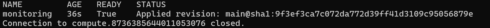
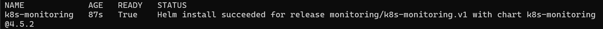
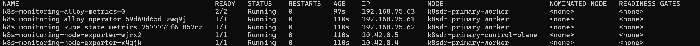
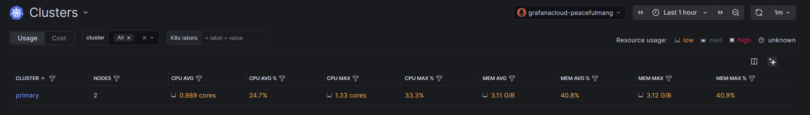
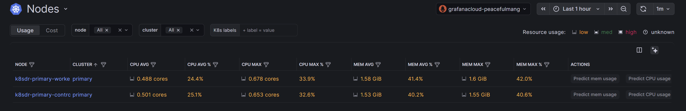
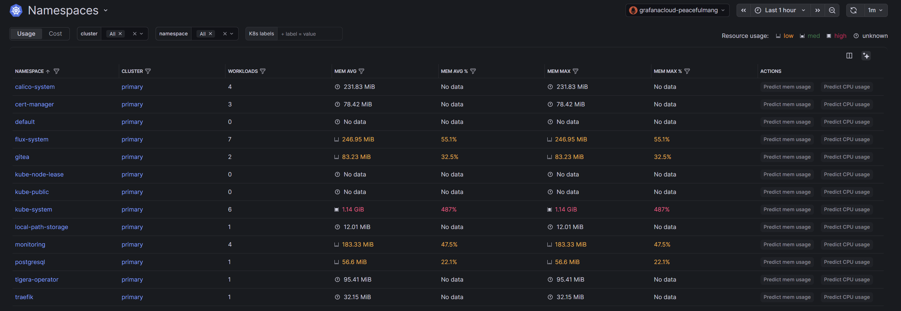
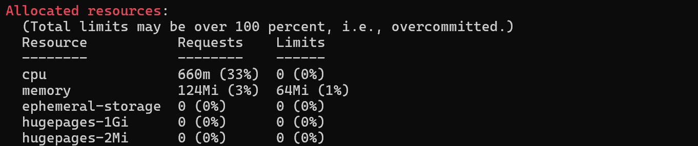
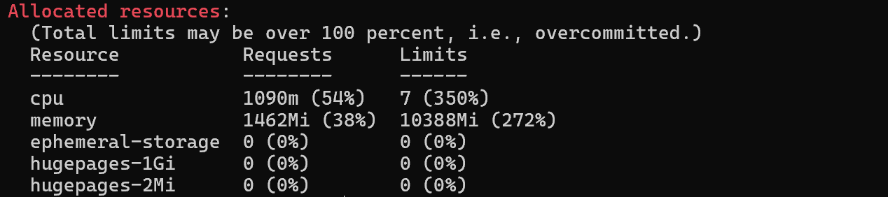
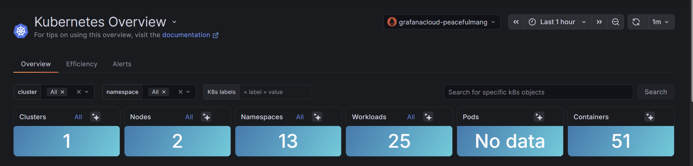
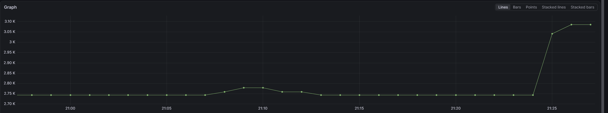

# Cluster metrics before milestone 6

Status: Complete. The gate passed on 2026-10-02.

## Scope

Send node, pod, and Kubernetes object metrics from each cluster to Grafana Cloud, so the milestone 6 drill has dashboards that outlive the primary region. [Decision 0009](../decisions/0009-cluster-metrics.md) records the design. This is not a milestone; it adds no recovery step.

## Work completed

- Added `deploy/monitoring`: the `monitoring` namespace, the Grafana HelmRepository, the `k8s-monitoring` 4.5.2 HelmRelease, and the `grafana-cloud-metrics` SOPS Secret with the Prometheus instance ID and access policy token.
- Enabled only `clusterMetrics` and `hostMetrics.linuxHosts`. Self-reporting, Fleet Management, Beyla, logs, and the cost and energy services are off.
- Set memory requests and limits on every workload: requests total 336 MiB and limits 896 MiB with two nodes.
- Added the `monitoring` Flux Kustomization with `wait: false` and no dependents, and the `cluster_name` setting that labels the metrics `cluster="primary"`.
- Added `tests/test_monitoring.py`. `make pins` checks the new chart through the existing HelmRelease scan.

## Gate

Run the `kubectl` commands on the control plane over IAP SSH:

```bash
gcloud compute ssh <control-plane> --zone <zone> --tunnel-through-iap -- \
  sudo KUBECONFIG=/etc/kubernetes/admin.conf kubectl <command>
```

1. Record node memory before the merge: `kubectl describe nodes | grep -A8 'Allocated resources'`.
2. After the merge, check Flux: `kubectl -n flux-system get kustomization monitoring` and `kubectl -n monitoring get helmrelease k8s-monitoring`. Expected: both `Ready=True`.
3. Check the workloads: `kubectl -n monitoring get pods -o wide`. Expected: the operator, `alloy-metrics-0`, kube-state-metrics, and one node-exporter per node, all `Running`.
4. In Grafana Cloud, open **Kubernetes Monitoring**. Expected: cluster `primary` with two nodes and the `gitea` and `postgresql` pods.
5. In Explore, run `count({cluster="primary"})`. Expected: well under 10,000 active series.
6. Repeat step 1. Expected: each node keeps memory requests below 80% of allocatable.

## Validation

### Before the merge

On 2026-09-30, `kubectl describe nodes` reported these memory requests against about 3,808 MiB allocatable per node:

| Node | Memory requests | Memory limits |
| --- | --- | --- |
| `k8sdr-primary-control-plane` | 100Mi (2%) | 0 (0%) |
| `k8sdr-primary-worker` | 1100Mi (28%) | 9556Mi (250%) |

The cluster has no Metrics API, so `kubectl top` is unavailable. The release adds 312 MiB of requests to the worker (Alloy, the operator, kube-state-metrics, one node-exporter) and 24 MiB to the control plane, which leaves the worker near 37%.

### After the merge

On 2026-10-01, after `main` reached `9f3ef3c`:

| Gate step | Result |
| --- | --- |
| 2. Flux | `monitoring` Kustomization `Ready=True` at `main@sha1:9f3ef3c`; HelmRelease `k8s-monitoring` `Ready=True`, chart 4.5.2 installed |
| 3. Workloads | `alloy-metrics-0` (2/2), the Alloy operator, kube-state-metrics, and one node-exporter per node, all `Running` with 0 restarts |
| 4. Grafana Cloud | Cluster `primary` with 2 nodes and 13 namespaces, including `gitea` and `postgresql` with workloads and memory usage |
| 5. Active series | About 2,750, rising to about 3,090, on 2026-10-02; under the 10,000 limit |
| 6. Node memory | Control plane 124Mi (3%), worker 1462Mi (38%); both below 80% |

















The worker's memory requests rose from 1100Mi to 1462Mi, 50Mi more than the 312Mi the release was sized at.

The Kubernetes Overview page counts 1 cluster, 2 nodes, 13 namespaces, 25 workloads, and 51 containers, but its Pods tile shows "No data". The cause is not confirmed.



### Active series

On 2026-10-02, `count({cluster="primary"})` in Explore stayed near 2,750 for 25 minutes and then rose to about 3,090. Both values are well under the free-tier limit of 10,000. The cause of the rise is not confirmed.


