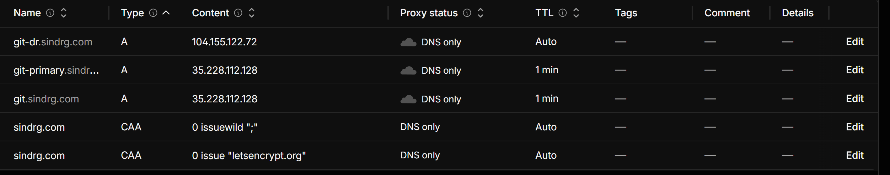

# Cold recovery

Status: Complete. The gate passed on 2026-10-03, and the recovery environment is removed.

## Scope

Build an independent Gitea service in the recovery region from code and one verified backup set, for [milestone 5](../../plan.md#5-cold-recovery). [Decision 0008](../decisions/0008-cold-recovery.md) records the design.

## Work completed

### Shared Flux sync and suspended recovery backups

- `deploy/clusters/primary/sync.yaml` moved to `deploy/sync/`, with a `kustomization.yaml` so that each cluster directory can include it. The primary's `kustomization.yaml` now lists `../../sync`. The objects Flux applies are unchanged.
- `cluster-settings` gains `backup_suspend`, and the backup CronJob sets `suspend: ${backup_suspend}`. The primary sets `"false"`. A recovery cluster starts with `"true"`, so a bootstrap alone cannot write a `recovery/` set or ping the heartbeat while the primary is stopped. Enabling recovery backups is a reviewed change to the recovery `cluster-settings` after the restore passes its checks.
- `ansible/playbooks/restore.yml` reads the CronJob's `suspend` value before it pauses backups and resumes them only if they were running. Before this change it always resumed them, which would have enabled backups on a recovery cluster as a side effect of the restore.

Limitation: Flux now owns the `suspend` field. On a cluster whose settings enable backups, a Flux reconcile during a restore into `gitea` resets the pause that the playbook set. Restores into `gitea` are for a recovery cluster, where the settings keep backups suspended, and the test restore namespace has no CronJob.

Checked before the merge, without a cluster:

| Check | Command | Result |
| --- | --- | --- |
| The primary renders the same objects | `kubectl kustomize deploy/clusters/primary` on `main` and on the branch, then `diff` | One added line: `backup_suspend: "false"` in `cluster-settings` |
| The CronJob gains only the new field | `kubectl kustomize deploy/apps/gitea` on `main` and on the branch, then `diff` | One added line: `suspend: ${backup_suspend}` |
| The substituted value is a boolean | `envsubst` with `backup_suspend=false` on the render, then parse the CronJob | `suspend` is the boolean `false` |

`envsubst` stands in for Flux's substitution here. The cluster check after the merge is in the gate below.

### Per-cluster hostname

- `cluster-settings` gains `git_cluster_host`; the primary sets `git-primary.sindrg.com`.
- A second Certificate, `git-cluster-tls`, covers that name. Each name has its own certificate, so a cluster build uses one `git.sindrg.com` certificate of the five that Let's Encrypt allows per week.
- The `gitea` Gateway gains the listeners `http-cluster` and `https-cluster` for that name. Both HTTPRoutes attach to the listeners of both names.
- `validate_services.yml` waits for both certificates, requires each route to be accepted by both listeners, and checks the HTTP redirect for both names.

Checked before the merge: `kubectl kustomize deploy/apps/gitea`, substituted with the primary settings, renders four listeners (`git.sindrg.com` and `git-primary.sindrg.com` on 8000 and 8443) and both names on each route.

Not yet shown on a cluster: that the existing `git.sindrg.com` listeners keep serving while `git-cluster-tls` is being issued. A first install has the same order (the Gateway exists before `git-tls` does), so this is expected to hold.

### Cluster selection and recovery settings

- `CLUSTER ?= primary` in the `Makefile` selects the Terraform root `infra/$(CLUSTER)`, the inventory `ansible/inventory/generated/$(CLUSTER)/hosts.json`, the Flux directory through `flux_cluster`, and the settings file that gives the fixture targets their default host.
- The inventory moved from `ansible/inventory/generated/hosts.json` to a directory per cluster. The IAP runner keeps `known_hosts` beside the inventory, so host keys are per cluster too. Run `make inventory` once after this change to write the primary inventory at its new path.
- `deploy/clusters/recovery/` holds the recovery settings: `git_host` `git.sindrg.com`, `git_cluster_host` `git-dr.sindrg.com`, backup prefix `recovery`, and `backup_suspend` `"true"`.

Checked before the merge: `make -n bootstrap CLUSTER=recovery` prints the recovery inventory and `-e flux_cluster=recovery`; `kubectl kustomize deploy/clusters/recovery` renders the same five Flux Kustomizations as the primary.

### Recovery Terraform root

- `infra/recovery` calls `infra/modules/regional_cluster` for `europe-west1` with the state prefix `recovery`. It reads no primary output or state, and exposes the same outputs as `infra/primary`, so `make inventory CLUSTER=recovery` works unchanged.
- The recovery worker data disk has no `prevent_destroy`, so `terraform destroy` removes the whole environment after a gate or drill.
- CI validates the root. A test requires both regional roots to declare the same outputs.
- The [regional recovery runbook](../runbooks/regional-recovery.md) now has commands for provisioning, the backup grant, the bootstrap, the restore, the endpoint checks, and the teardown.
- [Decision 0008](../decisions/0008-cold-recovery.md#amendment-recovery-backups-stay-suspended-until-the-cutover) gains an amendment: recovery backups stay suspended until the cutover, and the recovery cluster keeps the shared heartbeat.

Checked without applying:

| Check | Command | Result |
| --- | --- | --- |
| The root is valid | `terraform -chdir=infra/recovery validate` | `Success! The configuration is valid.` |
| The plan creates only recovery resources | `terraform -chdir=infra/recovery plan -lock=false` against the remote state, with `europe-west1-b` and a subnet that does not overlap the primary | `Plan: 20 to add, 0 to change, 0 to destroy.` |

### Offline manifest validation

`make manifests` and a CI step render every Flux path for both clusters, apply the cluster settings, require a namespace on every namespaced object, and validate the output with kubeconform 0.8.0 in strict mode. The CRD schemas come from one pinned commit of the datreeio catalog. Unit tests include a ConfigMap without a namespace that the check must reject. See the [service deployment runbook](../runbooks/service-deployment.md#check-the-manifests-offline) for what the check cannot prove.

| Check | Command | Result |
| --- | --- | --- |
| Both clusters render and validate | `make manifests` | `Summary: 130 resources found in 16 files - Valid: 130, Invalid: 0, Errors: 0, Skipped: 0` |
| A schema error is rejected | kubeconform on a CronJob with `suspend: maybe` | `Invalid: 1`: `at '/spec/suspend': got string, want null or boolean` |

## Gate

Passed on 2026-10-03; see [Validation](#validation). Steps 1 and 2 check the changes to the primary. Steps 3 to 8 are the milestone gate: the recovered service passes the fixture checks while the primary is stopped.

1. After the merge, confirm that Flux applied the revision and that the primary CronJob is not suspended:

   ```bash
   make validate-services
   gcloud compute ssh <control-plane> --tunnel-through-iap -- \
     sudo KUBECONFIG=/etc/kubernetes/admin.conf kubectl get cronjob/gitea-backup \
     --namespace gitea --output=jsonpath='{.spec.suspend}'
   ```

   Expected: validation passes and the command prints `false`. The next hourly run writes a `primary/` set.

2. Create the `git-primary` DNS record as in the [service deployment runbook](../runbooks/service-deployment.md#public-endpoint), then check the primary through its own name:

   ```bash
   dig +short git-primary.sindrg.com @1.1.1.1
   make validate-services
   make check-fixtures GIT_HOST=git-primary.sindrg.com
   make check-fixtures
   ```

   Expected: the primary's public address; validation shows `git-tls` and `git-cluster-tls` Ready from `letsencrypt-production`; the fixture checks pass through both names.

3. Record the last write and wait for a backup that contains it:

   ```bash
   make write-check
   BUCKET="$(terraform -chdir=infra/shared output -raw backup_bucket_name)"
   gcloud storage ls "gs://${BUCKET}/primary/*/manifest.json" | tail -n 1
   ```

   Expected: the write time, and after the next run at minute 7, a set newer than it.

4. Build the recovery cluster with steps 3 to 6 of the [regional recovery runbook](../runbooks/regional-recovery.md#procedure).

   Expected: 20 resources added in `infra/recovery` and 2 in `infra/shared`; the bootstrap and both validations end with `failed=0`; the CronJob is suspended and no `recovery/` object exists.

5. Isolate the primary by stopping both VMs, and confirm that nothing in the primary region answers:

   ```bash
   PROJECT_ID="$(terraform -chdir=infra/primary output -raw project_id)"
   PRIMARY_ZONE="$(terraform -chdir=infra/primary output -raw zone)"
   PRIMARY_VMS="$(terraform -chdir=infra/primary output -json instance_names | python3 -c 'import json,sys; print(" ".join(json.load(sys.stdin).values()))')"
   gcloud compute instances stop $PRIMARY_VMS --project "$PROJECT_ID" --zone "$PRIMARY_ZONE"
   gcloud compute instances list --project "$PROJECT_ID" --format='table(name,zone.basename(),status)'
   curl -sS --max-time 10 -o /dev/null -w '%{http_code}\n' https://git-primary.sindrg.com/
   ```

   Expected: both primary VMs `TERMINATED`, both recovery VMs `RUNNING`, and the request fails. The Healthchecks.io alert fires while the primary is stopped; that is expected.

6. Restore and check the recovered service with steps 7 and 8 of the runbook.

   Expected: the restore log names the set from step 3; `make check-fixtures GIT_HOST=git-dr.sindrg.com` and `make write-check GIT_HOST=git-dr.sindrg.com` end with `failed=0`; the newest commit that `check-fixtures` reports is the write from step 3; the CronJob is still suspended and no `recovery/` object exists.

7. Start the primary and confirm that it resumes unchanged:

   ```bash
   gcloud compute instances start $PRIMARY_VMS --project "$PROJECT_ID" --zone "$PRIMARY_ZONE"
   make validate-cluster
   make validate-services
   make check-fixtures
   ```

   Wait until `curl -s -o /dev/null -w '%{http_code}' https://git.sindrg.com/api/healthz` prints `200` before validating; the API server needs about three minutes after a start.

   Expected: all pass. The primary does not hold the commit that step 6 pushed to the recovery cluster; this gate does not fail back.

8. Remove the recovery environment with the [teardown steps](../runbooks/regional-recovery.md#remove-the-recovery-environment).

   Expected: 2 grants destroyed in `infra/shared`, then 20 resources destroyed in `infra/recovery`.

## Validation

All times are UTC on 2026-10-03. Both clusters ran `main` at `17e10f3`.

### Primary after the merge (steps 1 and 2)

| Check | Command | Result |
| --- | --- | --- |
| Flux applied the revision | `kubectl get kustomization -n flux-system` | All six Ready at `main@sha1:17e10f3b` |
| Services | `make validate-services` | `ok=13 failed=0`, 50 s |
| Backups not suspended | `kubectl get cronjob/gitea-backup -n gitea -o jsonpath='{.spec.suspend}'` | `false` |
| Certificates | `kubectl get certificates -n gitea` | `git-cluster-tls` for `git-primary.sindrg.com` Ready from `letsencrypt-production`. `git-tls` kept its expiry of 2026-12-25, so it was not reissued. |
| Per-cluster name | `make check-fixtures GIT_HOST=git-primary.sindrg.com` | `failed=0` |

The `git.sindrg.com` listeners kept serving while the new certificate was issued, which the per-cluster hostname section left open.

### Last write and backup (step 3)

```text
$ make write-check
Push accepted at 2026-10-03T19:00:24Z by https://git.sindrg.com/
Commit 766bd4445975b21db19983561b26a06243eeff06 on main: Write check 2026-10-03T19:00:21Z
```

The next hourly run wrote the set `primary/20261003T190701Z` with a manifest.

### Recovery cluster (step 4)

| Check | Command | Result |
| --- | --- | --- |
| Infrastructure | `terraform -chdir=infra/recovery apply recovery.tfplan` | `Apply complete! Resources: 20 added, 0 changed, 0 destroyed.` |
| Backup grants | `terraform -chdir=infra/shared apply shared.tfplan` | `Apply complete! Resources: 2 added, 0 changed, 0 destroyed.` The plan targeted the two grants, so it left the uptime check of decision 0011 unapplied. |
| DNS | `dig +short git-dr.sindrg.com @1.1.1.1` | The recovery address. The record was created with TTL `Auto`, not 1 min; see [Limitations](#limitations). |
| Bootstrap | `make bootstrap CLUSTER=recovery` | Control plane `ok=75 failed=0`, worker `ok=63 failed=0`; 19:05:40 to 19:12:22, 402 s |
| Cluster | `make validate-cluster CLUSTER=recovery` | `ok=10 failed=0`, 18 s |
| Services | `make validate-services CLUSTER=recovery` | `ok=13 failed=0`, 24 s |
| Nodes and Flux | `kubectl get nodes`, `kubectl get kustomization -n flux-system` | Both nodes Ready on v1.36.2; all six Kustomizations Ready at `main@sha1:17e10f3b` |
| Certificates | `kubectl get certificates -n gitea` | `git-tls` for `git.sindrg.com` and `git-cluster-tls` for `git-dr.sindrg.com`, both Ready from `letsencrypt-production` before any DNS change to `git.sindrg.com` |
| Backups suspended | `kubectl get cronjob/gitea-backup -n gitea -o jsonpath='{.spec.suspend}'`; `kubectl get jobs -n gitea` | `true`; no Jobs |
| No recovery set | `gcloud storage ls gs://<bucket>/recovery/` | `One or more URLs matched no objects.` |

The backup grants, applied:


The Cloudflare records during the gate. `git.sindrg.com` stays on the primary address:



### Isolation (step 5)

`gcloud compute instances stop` ran from 19:29:09 to 19:30:28.

```text
NAME                          ZONE             STATUS
k8sdr-recovery-control-plane  europe-west1-b   RUNNING
k8sdr-recovery-worker         europe-west1-b   RUNNING
k8sdr-primary-control-plane   europe-north1-a  TERMINATED
k8sdr-primary-worker          europe-north1-a  TERMINATED
```

`curl --max-time 10 https://git-primary.sindrg.com/` got no response.

### Restore and checks while the primary was stopped (step 6)

```text
$ make restore CLUSTER=recovery RESTORE_NAMESPACE=gitea
2026-10-03T19:31:10Z restoring primary/20261003T190701Z; backup age at restore start 1449 seconds
2026-10-03T19:31:11Z digests match the manifest
2026-10-03T19:31:11Z both archives decrypt and read
2026-10-03T19:31:34Z restored primary/20261003T190701Z in 24 seconds
control-plane              : ok=15   changed=5    unreachable=0    failed=0    skipped=1
run_with_iap: started 2026-10-03T19:30:55Z, finished 2026-10-03T19:31:41Z, elapsed 47s, exit 0
```

The skipped task is `Resume the backup CronJob unless it was suspended before`.

```text
$ make check-fixtures GIT_HOST=git-dr.sindrg.com
User recovery-fixture signed in.
Repository recovery-fixture/recovery-fixture exists.
Commit 3775f53a1042434d76ec940d3d49360e1b3a0847 is on main.
Issue #1: Recovery fixture issue
Newest commit on main: 766bd4445975b21db19983561b26a06243eeff06 Write check 2026-10-03T19:00:21Z
localhost                  : ok=15   changed=0    unreachable=0    failed=0

$ make write-check GIT_HOST=git-dr.sindrg.com
Push accepted at 2026-10-03T19:31:54Z by https://git-dr.sindrg.com/
Commit 2bf76c74aaa9bbab3f714f6ea26f726aca35afa6 on main: Write check 2026-10-03T19:31:52Z
localhost                  : ok=16   changed=7    unreachable=0    failed=0
```

The restored HEAD is the write from step 3, so no acknowledged write was lost:

```text
$ python3 scripts/drill_report.py rpo --restored-sha 766bd4445975b21db19983561b26a06243eeff06 \
    --isolated-at 2026-10-03T19:29:09Z --backup-set 20261003T190701Z
Last acknowledged primary write: 2026-10-03T19:00:24Z 766bd4445975b21db19983561b26a06243eeff06
Restored HEAD acknowledged:      2026-10-03T19:00:24Z 766bd4445975b21db19983561b26a06243eeff06
Observed data loss:              0h 00m 00s
Acknowledged writes lost:        0
Potential loss window:           0h 22m 08s (backup age at isolation)
```

This gate made one write and then waited for a backup, so the zero is by construction. The milestone 6 drill measures data loss with writes every five minutes.

After the restore, `suspend` was still `true`, the only Job in `gitea` was `gitea-restore`, and the bucket had no `recovery/` object. The fixture checks follow the requested host: Gitea served the API and Git over HTTPS through `git-dr.sindrg.com` while configured for `git.sindrg.com`, which decision 0008 listed as a limit to confirm.

### Primary restart (step 7)

`gcloud compute instances start` ran from 19:32:15 to 19:32:26.

- **Symptom:** `make validate-cluster` at 19:32:33 failed on its first task: `The connection to the server 10.42.0.5:6443 was refused`.
- **Confirmed cause:** the validation ran seven seconds after the start command returned, before the API server was up. The [hardening worklog](04c-service-hardening.md#validation-ran-before-the-api-server-was-up) records the same symptom after a restart.
- **Fix:** wait for the service. `https://git.sindrg.com/api/healthz` returned 200 at 19:35:08, about three minutes after the start.
- **Verification:** `make validate-cluster` at 19:35:17: `ok=10 failed=0`. `make validate-services`: `ok=13 failed=0`. `make check-fixtures`: `failed=0`, newest commit `766bd44`.

The primary does not hold commit `2bf76c7`, which went to the recovery cluster. This gate does not fail back.

### Gate result

The recovered service passed the same fixture and write checks through its own endpoint while both primary VMs were stopped. The [milestone 5](../../plan.md#5-cold-recovery) gate is met.

| Stage | Duration |
| --- | --- |
| Bootstrap, including the Flux reconcile | 402 s |
| Restore command | 47 s, of which the restore Job took 24 s |
| Primary stopped | 19:29:09 to 19:32:15 |

These are stage timings, not an RTO. No external probe ran, and `git.sindrg.com` stayed on the primary.

### Removal of the recovery environment (step 8)

| Step | Command | Result |
| --- | --- | --- |
| Remove the backup grants | `terraform -chdir=infra/shared apply shared-teardown.tfplan`, a plan that targets the two grants | `Apply complete! Resources: 0 added, 0 changed, 2 destroyed.` |
| Delete the `git-dr` record | `dig +short git-dr.sindrg.com @1.1.1.1` | No answer |
| Destroy the recovery root | `terraform -chdir=infra/recovery apply recovery-destroy.tfplan` | `Apply complete! Resources: 0 added, 0 changed, 20 destroyed.` |
| Nothing left | `gcloud compute instances list`; disks, addresses, and networks filtered for `recovery`; `terraform -chdir=infra/recovery state list` | Only the two primary VMs, both `RUNNING`; no recovery disk, address, or network; empty state |
| Primary unaffected | `curl https://git.sindrg.com/api/healthz` at 19:49 | 200 |


The recovery environment existed from about 19:03 to 19:49, under an hour.

## Limitations

- The gate did not change `git.sindrg.com` or enable recovery backups. Both belong to the milestone 6 drill.
- The `infra/shared` grants were applied and are removed with `-target`, so the uptime check stays out until [decision 0011](../decisions/0011-external-uptime-probe.md) is accepted.
- The `git-primary` and `git-dr` DNS records are created by hand in Cloudflare. In this gate `git-dr` had TTL `Auto` instead of 1 min. That did not affect the checks, because the name was new and is never cut over. The drill must set 1 min on any record it changes.
