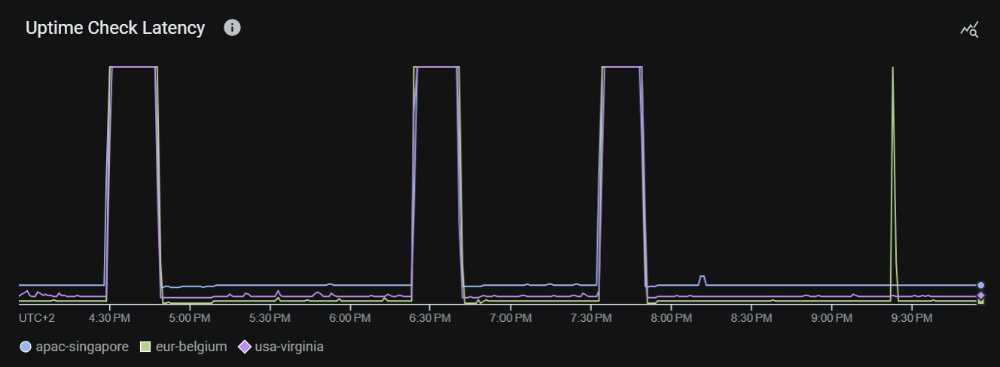
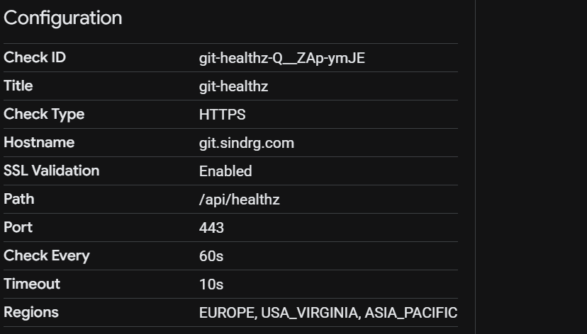
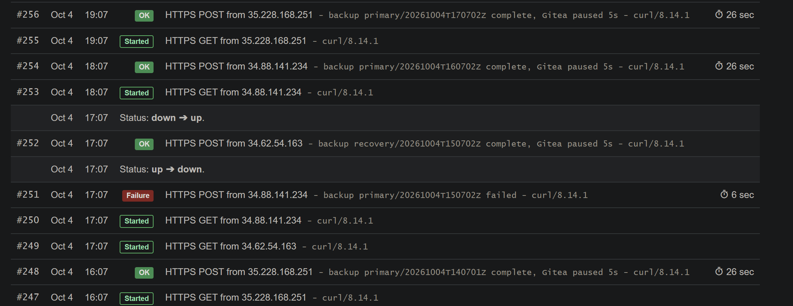
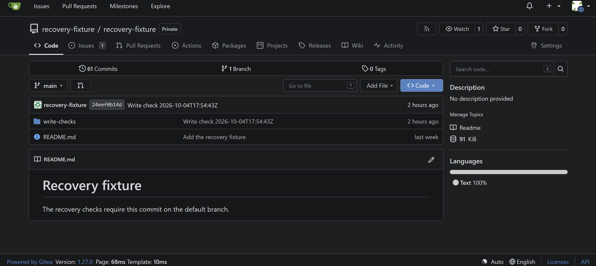
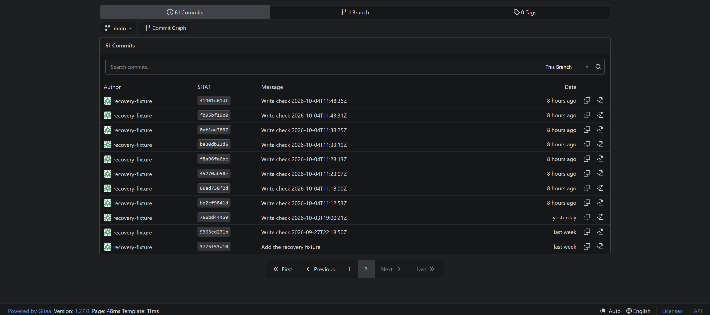

# Disaster drill

Status: Complete. Two drills ran on 2026-10-04 and both met the targets; see the [comparison](#comparison). This file is the record of [milestone 6](../../plan.md#6-disaster-drill).

## Scope

Simulate the loss of the primary region, execute the [regional recovery runbook](../runbooks/regional-recovery.md), and measure recovery time and data loss as [decision 0002](../decisions/0002-recovery-contract.md#amendment-measure-data-loss-from-a-write-log) defines them.

## Preparation

- `make write-check` appends each acknowledged write to a local log when `WRITE_LOG` is set, and `make write-loop` repeats it every `WRITE_INTERVAL` seconds (default 300) into `.drill/writes.tsv`.
- `scripts/drill_report.py` records stage events in `.drill/timeline.tsv`, prints the timeline as a table, and reports observed data loss, the lost writes, and the potential loss window. It ignores writes after isolation, so a push to the recovery cluster cannot hide a lost primary write.
- `.drill/` is ignored by Git and stays on the operator machine.
- `make preflight` checks every recovery dependency from the operator machine without changing anything, and tells a missing prerequisite from a failed check. See the [regional recovery runbook](../runbooks/regional-recovery.md#preconditions).

- [Decision 0011](../decisions/0011-external-uptime-probe.md) defines the external probe: a Cloud Monitoring uptime check on `https://git.sindrg.com/api/healthz` every 60 seconds, in `infra/shared`. It was applied on 2026-10-03 and added one resource. On 2026-10-04, `terraform -chdir=infra/shared plan -lock=false` reports `No changes. Your infrastructure matches the configuration.`, and the [command that reads its results](../decisions/0011-external-uptime-probe.md#reading-the-results) returned only `true` lines from `apac-singapore`, `eur-belgium`, and `usa-virginia` for 08:31 to 08:40 UTC. The series has a point every 10 seconds per region; the decision records what that means for the measurement.

First run of the preflight, with the recovery root planned but not applied:

```text
$ make preflight
Recovery preflight at 2026-10-03T12:36:50Z

ok       tools            git terraform gcloud sops age age-keygen jq curl sha256sum
ok       git-source       main is a6b21890cd7d at https://github.com/sindredg/k8s-dr.git
ok       key-sops         matches a recipient in .sops.yaml
ok       key-backup       matches a recipient in deploy/apps/gitea/backup/recipients.txt
ok       fixture-secret   recovery/fixtures.sops.yaml decrypts
ok       state-shared     state is reachable; the plan has no changes
ok       state-recovery   state is reachable; the plan has changes
ok       backup-set       20261003T120701Z verifies and decrypts; age 30 minutes
ok       fixtures         the user, repository, commit, and issue are present on the serving cluster
ok       cloudflare-token active; expires in 28 days
ok       cloudflare-zone  git.sindrg.com is DNS only with a 60-second TTL
manual   cloudflare-login confirm that you can sign in to the Cloudflare dashboard for the cutover

11 passed, 0 failed, 0 missing
```

With both key paths pointed at missing files, the same command reports `MISSING` for `key-sops`, `key-backup`, `fixture-secret`, `backup-set`, and `cloudflare-token`, `FAIL` for `fixtures`, which needs the key, and exits `1`.

The Cloudflare token expires on 2026-11-01. Rotate it before a drill that runs within a week of that date; the preflight fails inside that week.

Checked with sample logs, not against the service: a log with writes at 11:05 and 11:10, a restored HEAD of the 11:05 write, and a later recovery write reports `Observed data loss: 0h 05m 00s` and one lost write. Naming the recovery write as the restored HEAD fails with a message to record the HEAD before any recovery write.

## Drill 1

Date: 2026-10-04. The service recovered in Belgium and both targets were met. The drill then returned to the primary.

### Result

| Measure | Value | Target | Met |
| --- | --- | --- | --- |
| RTO: first failed probe to all checks passing through `git.sindrg.com` | 19 min 17 s (14:28:40 to 14:47:57 UTC) | At most 4 hours | Yes |
| Observed data loss: last acknowledged write to the restored HEAD | 25 min 28 s | At most 2 hours | Yes |
| Potential loss window: backup age at isolation | 21 min 02 s | Reported, no target | |
| Acknowledged writes lost | 5 | Reported, no target | |
| Manual actions | Every step is a typed command. Up to the end of the RTO: 18 commands, one of them a rerun, and one edit of `backup_clusters`. After it: one merged change, a second edit, and one apply. | Reported, no target | |
| Incremental cloud cost | Not measured. The recovery environment, with the same resources as the primary, existed from 14:31 to 15:13 UTC, 42 minutes. | Reported, no target | |

The observed loss is larger than the backup age at isolation. The 14:07 backup captured its recovery point before the write that was acknowledged at 14:07:39, so the restored HEAD is the 14:02:34 write.

### Preflight

Output of `make preflight` before isolation. It ran at 10:33 UTC, four hours before the isolation, and was not repeated; the restore verified the set it used.

```text
Recovery preflight at 2026-10-04T10:33:02Z

ok       tools            git terraform gcloud sops age age-keygen jq curl sha256sum
ok       git-source       main is 497a56ed3ab1 at https://github.com/sindredg/k8s-dr.git
ok       key-sops         matches a recipient in .sops.yaml
ok       key-backup       matches a recipient in deploy/apps/gitea/backup/recipients.txt
ok       fixture-secret   recovery/fixtures.sops.yaml decrypts
ok       state-shared     state is reachable; the plan has no changes
ok       state-recovery   state is reachable; the plan has changes
ok       backup-set       20261004T100701Z verifies and decrypts; age 26 minutes
ok       fixtures         the user, repository, commit, and issue are present on the serving cluster
ok       cloudflare-token active; expires in 27 days
ok       cloudflare-zone  git.sindrg.com is DNS only with a 60-second TTL
manual   cloudflare-login confirm that you can sign in to the Cloudflare dashboard, the fallback for make dns-set

11 passed, 0 failed, 0 missing
```

### Recovery point

| Item | Value |
| --- | --- |
| Isolation time (UTC) | `gcloud compute instances stop` ran from 14:28:03 to 14:30:36; both primary VMs `TERMINATED` |
| First failed probe (UTC) | 14:28:40 |
| Restored set | `primary/20261004T140701Z` |
| Last acknowledged primary write | 14:28:02, commit `09f75c3` |
| Restored HEAD | 14:02:34, commit `21f4058` |

`make write-loop` logged 34 acknowledged writes from 11:12:56 to 14:28:02. The loop stopped at 13:10 and was restarted at 13:42. The gap is older than the restored set and does not change the result. Its first failed push was at 14:33:16.

Output of `python3 scripts/drill_report.py rpo`:

```text
$ python3 scripts/drill_report.py rpo --restored-sha 21f405800ef827ff799f3cf35ae9dd120f18b3ae \
    --isolated-at 2026-10-04T14:28:03Z --backup-set 20261004T140701Z
Last acknowledged primary write: 2026-10-04T14:28:02Z 09f75c3da53959acc48887579fb70b35e82c7f66
Restored HEAD acknowledged:      2026-10-04T14:02:34Z 21f405800ef827ff799f3cf35ae9dd120f18b3ae
Observed data loss:              0h 25m 28s
Acknowledged writes lost:        5
  2026-10-04T14:07:39Z 9ea65917093062eb065079d8e30e60144d0d3137
  2026-10-04T14:12:44Z ca914da3afaae42177b24addb8daed21626f78db
  2026-10-04T14:17:49Z a49634868def1163750208feb65c78a02252552a
  2026-10-04T14:22:56Z e29eb2bd98df95857ce228988ce4e0badb2eb361
  2026-10-04T14:28:02Z 09f75c3da53959acc48887579fb70b35e82c7f66
Potential loss window:           0h 21m 02s (backup age at isolation)
```

The uptime check, read with the command in [decision 0011](../decisions/0011-external-uptime-probe.md#reading-the-results):

| Checker region | First failed check | Last failed check | First passing check after the cutover |
| --- | --- | --- | --- |
| `apac-singapore` | 14:28:40 | 14:47:40 | 14:47:50 |
| `eur-belgium` | 14:29:20 | 14:48:10 | 14:48:20 |
| `usa-virginia` | 14:29:30 | 14:47:30 | 14:47:40 |

### Stage timeline

Output of `python3 scripts/drill_report.py timeline`:

| Stage | Start (UTC) | End (UTC) | Duration | Notes |
| --- | --- | --- | --- | --- |
| detection | 2026-10-04T14:28:03Z | 2026-10-04T14:30:47Z | 0h 02m 44s | 14:28:03 isolation: gcloud compute instances stop on both primary VMs |
| provisioning | 2026-10-04T14:30:47Z | 2026-10-04T14:34:13Z | 0h 03m 26s | 14:34:13 20 resources, 2 backup grants, git-dr record |
| bootstrap | 2026-10-04T14:34:35Z | 2026-10-04T14:42:21Z | 0h 07m 46s | 14:42:21 442 s, failed=0; the playbook includes the Flux install |
| flux-reconcile | 2026-10-04T14:42:21Z | 2026-10-04T14:43:12Z | 0h 00m 51s | 14:43:12 validate-cluster and validate-services |
| restore | 2026-10-04T14:43:58Z | 2026-10-04T14:45:06Z | 0h 01m 08s | 14:45:06 primary/20261004T140701Z, restore Job 28 s |
| verification | 2026-10-04T14:45:06Z | 2026-10-04T14:46:45Z | 0h 01m 39s | 14:46:30 check-fixtures right after the restore failed on its first request; healthz answered 200 at 14:45:52; rerun |
| dns-cutover | 2026-10-04T14:46:45Z | 2026-10-04T14:47:47Z | 0h 01m 02s | 14:47:47 record set at 14:47:00 |
| probe-recovery | 2026-10-04T14:47:47Z | 2026-10-04T14:50:15Z | 0h 02m 28s | 14:50:15 all checks through git.sindrg.com passed at 14:47:57; last region passing at 14:48:20 |

Gap between the stage durations and the measured RTO, and its cause: the stages sum to 18 min 36 s between 14:28:03 and 14:47:47. The RTO of 19 min 17 s starts 37 seconds later, at the first failed probe, and ends at 14:47:57, when the write check through `git.sindrg.com` passed. The difference is 68 seconds between stages (generating the inventory, and listing the bucket before the restore) and the two checks after the cutover. The `detection` stage is the duration of the stop command, not a wait for the probe. The `probe-recovery` end was recorded late; the checks passed at 14:47:57 and the last region passed at 14:48:20.

| Stage | Command | Result |
| --- | --- | --- |
| Provisioning | `terraform -chdir=infra/recovery apply recovery.tfplan` | `Plan: 20 to add, 0 to change, 0 to destroy.`, applied |
| Backup grants | `terraform -chdir=infra/shared apply shared.tfplan` | `Plan: 2 to add, 0 to change, 0 to destroy.`, applied |
| `git-dr` record | `make dns-set DNS_NAME=git-dr DNS_ADDRESS=<recovery address>` | `was: git-dr.sindrg.com has no A record`, `set at 2026-10-04T14:34:09Z` |
| Bootstrap | `make bootstrap CLUSTER=recovery` | Control plane `ok=75 failed=0`, worker `ok=63 failed=0`; 14:34:43 to 14:42:05, 442 s |
| Cluster and services | `make validate-cluster CLUSTER=recovery`; `make validate-services CLUSTER=recovery` | `ok=10 failed=0`, 23 s; `ok=13 failed=0`, 28 s |
| No recovery set | `gcloud storage ls gs://<bucket>/recovery/` | `One or more URLs matched no objects.` |
| Restore | `make restore CLUSTER=recovery RESTORE_NAMESPACE=gitea` | `restoring primary/20261004T140701Z; backup age at restore start 2237 seconds`, `digests match the manifest`, `restored primary/20261004T140701Z in 28 seconds`; `ok=15 failed=0`, 59 s |
| Fixtures on the recovery cluster | `make check-fixtures GIT_HOST=git-dr.sindrg.com` | Failed once, then `failed=0` at 14:46:35; newest commit `21f4058`, `Write check 2026-10-04T14:02:31Z` |
| Push to the recovery cluster | `make write-check GIT_HOST=git-dr.sindrg.com` | `Push accepted at 2026-10-04T14:46:45Z by https://git-dr.sindrg.com/` |
| Cutover | `make dns-set DNS_NAME=git DNS_ADDRESS=<recovery address>` | `set at 2026-10-04T14:47:00Z`; `1.1.1.1` and the local resolver returned the recovery address by 14:47:47 |
| Fixtures through the public name | `make check-fixtures` | `failed=0` at 14:47:52 |
| Push through the public name | `make write-check` | `Push accepted at 2026-10-04T14:47:57Z by https://git.sindrg.com/` |
| Recovery backups | Merged `backup_suspend: "false"` for the recovery cluster at 14:54:27 | `recovery/20261004T150702Z` holds both archives and a manifest |
| Fence the primary | `terraform -chdir=infra/shared apply shared-fence.tfplan` | `Apply complete! Resources: 0 added, 0 changed, 2 destroyed.` at 14:55 |

The check in runbook step 6 that reads `suspend` on the recovery CronJob was not run in this drill. The empty `recovery/` listing before the restore is the evidence that no backup ran.

### Failures and manual actions

#### The first fixture check after the restore failed

- **Symptom:** `make check-fixtures GIT_HOST=git-dr.sindrg.com` at about 14:45:10 failed on its first request, ten seconds after the restore command returned. `curl https://git-dr.sindrg.com/api/healthz` got no HTTP status at 14:45:45, although the TLS handshake completed with the `git-dr.sindrg.com` certificate.
- **Cause (hypothesis):** Gitea was still starting after the restore scaled it back up. The pod was not inspected.
- **Fix:** wait for `/api/healthz` to return 200 before the fixture check. The runbook now has the wait in step 8.
- **Verification:** the endpoint returned 200 from 14:45:52, and the rerun at 14:46:35 reported `failed=0`. The failure cost about 80 seconds of the RTO.

#### Enabling recovery backups failed CI

- **Symptom:** the change of `backup_suspend` to `"false"` failed `make check`: two tests pinned the suspended value, and the first fix of the render test missed an import.
- **Confirmed cause:** `tests/test_services.py` pins the recovery settings, and `tests/test_check_manifests.py` expected a suspended CronJob for the recovery cluster by name.
- **Fix:** the render test now reads the expected value from the cluster settings, so the change is the setting and one test line. The runbook says so in step 9.
- **Verification:** `make check` passed with 196 tests, and the change merged at 14:54:27. This step is after the RTO stops.

### Return to the primary

The first run of the [return steps](../runbooks/regional-recovery.md#return-to-the-primary-after-a-drill).

| Step | Command | Result |
| --- | --- | --- |
| Start the primary | `gcloud compute instances start` at 14:56 | `https://git-primary.sindrg.com/api/healthz` returned 200 at 14:59:26 |
| Validate it | `make validate-cluster`; `make validate-services`; `make check-fixtures GIT_HOST=git-primary.sindrg.com` | `ok=10 failed=0`, 147 s; `ok=13 failed=0`, 26 s; `failed=0`, newest commit `09f75c3`, the last write before the isolation |
| Fence held | `gcloud storage ls gs://<bucket>/primary/` after the 15:07 run | No `primary/20261004T15*` set while the primary ran without its grants. The Job is `Failed` in a later `kubectl get jobs`, and it sent a failure ping; see [Console evidence](#console-evidence). |
| Point `git` back | `make dns-set DNS_NAME=git DNS_ADDRESS=<primary address>` | `set at 2026-10-04T15:07:37Z` |
| Check the public name | `make check-fixtures`; `make write-check` | `failed=0`; `Push accepted at 2026-10-04T15:09:13Z by https://git.sindrg.com/` |
| Grants | `terraform -chdir=infra/shared apply shared-return.tfplan` | `Apply complete! Resources: 2 added, 0 changed, 2 destroyed.` |
| Delete `git-dr` | `make dns-delete DNS_NAME=git-dr` | `deleted at 2026-10-04T15:09:55Z` |
| Suspend recovery backups | Merged `backup_suspend: "true"` for the recovery cluster | `main` at `55e947d` |
| Destroy the recovery root | `terraform -chdir=infra/recovery apply recovery-destroy.tfplan` | `Apply complete! Resources: 0 added, 0 changed, 20 destroyed.` |
| Nothing left | `gcloud compute instances list`; disks, addresses, and networks filtered for `recovery`; `terraform -chdir=infra/recovery state list`; `terraform -chdir=infra/shared plan` | Only the two primary VMs, both `RUNNING`; no recovery disk, address, or network; empty state; `No changes.` |

The two pushes that the recovery cluster accepted, at 14:46:45 and 14:47:57, are discarded with it. The public name was served from Belgium from 14:47 to 15:07.

### Runbook changes

Changes made to the runbook after this drill, before the repeat:

- Step 1: restart the write loop if it stops, and keep it running until its pushes fail.
- Step 8: wait for `/api/healthz` on `git-dr.sindrg.com` before the fixture check.
- Step 9: wait until a public resolver returns the recovery address before the checks, and change the settings test with the setting.
- Return to the primary: the expected results are now the measured ones.

## Drill 2

Date: 2026-10-04, with the runbook as changed after drill 1. The service recovered in Belgium, both targets were met, and no step failed. The drill then returned to the primary.

### Result

| Measure | Value | Target | Met |
| --- | --- | --- | --- |
| RTO: first failed probe to all checks passing through `git.sindrg.com` | 17 min 36 s (16:23:20 to 16:40:56 UTC) | At most 4 hours | Yes |
| Observed data loss: last acknowledged write to the restored HEAD | 15 min 16 s | At most 2 hours | Yes |
| Potential loss window: backup age at isolation | 15 min 12 s | Reported, no target | |
| Acknowledged writes lost | 3 | Reported, no target | |
| Manual actions | Every step is a typed command. Up to the end of the RTO: 19 commands, two of them waits, and one edit of `backup_clusters`. No rerun. | Reported, no target | |
| Incremental cloud cost | Not measured. The recovery environment existed from 16:25 to 16:53 UTC, 28 minutes. | Reported, no target | |

### Preflight

`make preflight` was not repeated before drill 2. The 16:07 backup, the first after the return from drill 1, was the precondition that was checked: `primary/20261004T160702Z` had a manifest, and the restore verified it.

### Recovery point

| Item | Value |
| --- | --- |
| Isolation time (UTC) | `gcloud compute instances stop` ran from 16:22:14 to 16:24:36; both primary VMs `TERMINATED` |
| First failed probe (UTC) | 16:23:20 |
| Restored set | `primary/20261004T160702Z` |
| Last acknowledged primary write | 16:21:03, commit `a941acb` |
| Restored HEAD | 16:05:47, commit `8fb3c20` |

`make write-loop` logged 14 acknowledged writes from 15:14:50 to 16:21:03 without a gap. Its first failed push was at 16:26:17.

```text
$ python3 scripts/drill_report.py rpo --restored-sha 8fb3c2046cdd815e7cd203a333bf090b4e701946 \
    --isolated-at 2026-10-04T16:22:14Z --backup-set 20261004T160702Z
Last acknowledged primary write: 2026-10-04T16:21:03Z a941acb94ab2a98e780cc6f816aa3d35801b858c
Restored HEAD acknowledged:      2026-10-04T16:05:47Z 8fb3c2046cdd815e7cd203a333bf090b4e701946
Observed data loss:              0h 15m 16s
Acknowledged writes lost:        3
  2026-10-04T16:10:52Z 63279203c13e4b134a711ec6cd6ce9a2a2cb92f6
  2026-10-04T16:15:58Z 189a1a8786b9d5493e0f314eada117f8f20cc886
  2026-10-04T16:21:03Z a941acb94ab2a98e780cc6f816aa3d35801b858c
Potential loss window:           0h 15m 12s (backup age at isolation)
```

| Checker region | First failed check | Last failed check | First passing check after the cutover |
| --- | --- | --- | --- |
| `apac-singapore` | 16:23:50 | 16:40:40 | 16:40:50 |
| `eur-belgium` | 16:23:20 | 16:41:10 | 16:41:20 |
| `usa-virginia` | 16:23:30 | 16:40:20 | 16:40:30 |

### Stage timeline

| Stage | Start (UTC) | End (UTC) | Duration | Notes |
| --- | --- | --- | --- | --- |
| detection | 2026-10-04T16:22:14Z | 2026-10-04T16:24:48Z | 0h 02m 34s | 16:22:14 isolation: gcloud compute instances stop on both primary VMs |
| provisioning | 2026-10-04T16:24:48Z | 2026-10-04T16:27:52Z | 0h 03m 04s | 16:27:52 20 resources, 2 backup grants, git-dr record |
| bootstrap | 2026-10-04T16:27:54Z | 2026-10-04T16:36:29Z | 0h 08m 35s | 16:36:29 497 s, failed=0; the playbook includes the Flux install |
| flux-reconcile | 2026-10-04T16:36:29Z | 2026-10-04T16:37:42Z | 0h 01m 13s | 16:37:42 validate-cluster and validate-services |
| restore | 2026-10-04T16:38:03Z | 2026-10-04T16:39:13Z | 0h 01m 10s | 16:39:13 primary/20261004T160702Z, restore Job 27 s |
| verification | 2026-10-04T16:39:13Z | 2026-10-04T16:39:53Z | 0h 00m 40s |  |
| dns-cutover | 2026-10-04T16:39:53Z | 2026-10-04T16:40:47Z | 0h 00m 54s | 16:40:47 record set at 16:40:00 |
| probe-recovery | 2026-10-04T16:40:47Z | 2026-10-04T16:40:57Z | 0h 00m 10s | 16:40:57 all checks through git.sindrg.com passed |

The stages sum to 18 min 10 s between 16:22:14 and 16:40:47, with 23 seconds between stages. The RTO starts 66 seconds after the isolation began, at the first failed probe, and ends at 16:40:56, when the write check through `git.sindrg.com` passed.

The commands are those of drill 1. Results that differ or that the comparison uses:

| Stage | Result |
| --- | --- |
| Provisioning | `Plan: 20 to add`, applied; `Plan: 2 to add` in `infra/shared`, applied; `git-dr` record `set at 2026-10-04T16:27:47Z` |
| Bootstrap | Control plane `ok=75 failed=0`, worker `ok=63 failed=0`; 16:27:57 to 16:36:14, 497 s |
| Cluster and services | `ok=10 failed=0`, 44 s; `ok=13 failed=0`, 28 s |
| No new recovery set | `gcloud storage ls gs://<bucket>/recovery/` listed only `recovery/20261004T150702Z/`, the set from drill 1 |
| Restore | `restoring primary/20261004T160702Z; backup age at restore start 1882 seconds`, `digests match the manifest`, `restored primary/20261004T160702Z in 27 seconds`; `ok=15 failed=0`, 59 s |
| Wait for the endpoint | `https://git-dr.sindrg.com/api/healthz` returned 200 at 16:39:43, 36 seconds after the restore command returned |
| Fixtures and push on the recovery cluster | `failed=0` at 16:39:48 on the first run, newest commit `8fb3c20`; `Push accepted at 2026-10-04T16:39:53Z by https://git-dr.sindrg.com/` |
| Cutover | `set at 2026-10-04T16:40:00Z`; resolvers returned the recovery address by 16:40:47 |
| Checks through the public name | `failed=0` at 16:40:51; `Push accepted at 2026-10-04T16:40:56Z by https://git.sindrg.com/` |
| Recovery backups | Merged `backup_suspend: "false"` at 16:42:44. CI passed on the first run. The recovery cluster was removed before its next hourly run, so this drill wrote no set. |
| Fence the primary | `Apply complete! Resources: 0 added, 0 changed, 2 destroyed.` |

The `suspend` check in runbook step 6 was not run in this drill either.

### Failures and manual actions

None. The wait added to step 8 ended after 36 seconds and the fixture check passed on its first run.

### Return to the primary

| Step | Result |
| --- | --- |
| Start the primary at 16:43:12 | `https://git-primary.sindrg.com/api/healthz` returned 200 at 16:45:51 |
| Validate it | `make validate-cluster` `ok=10 failed=0`, 76 s; `make validate-services` `ok=13 failed=0`, 48 s; `make check-fixtures GIT_HOST=git-primary.sindrg.com` `failed=0`, newest commit `a941acb` |
| Point `git` back | `set at 2026-10-04T16:48:09Z`; `make check-fixtures` `failed=0`; `Push accepted at 2026-10-04T16:49:29Z by https://git.sindrg.com/` |
| Grants | `Apply complete! Resources: 2 added, 0 changed, 2 destroyed.` |
| Delete `git-dr` | `deleted at 2026-10-04T16:50:00Z` |
| Suspend recovery backups | Merged; `main` at `d5c9fba` |
| Destroy the recovery root | `Apply complete! Resources: 0 added, 0 changed, 20 destroyed.` |
| Nothing left, at 16:54 | Only the two primary VMs, both `RUNNING`; no recovery disk, address, or network; empty recovery state; `infra/shared` plans `No changes.` |

The public name was served from Belgium from 16:40 to 16:48.

### Runbook changes

None after this drill.

## Comparison

| Measure | Drill 1 | Drill 2 |
| --- | --- | --- |
| RTO | 19 min 17 s | 17 min 36 s |
| Observed data loss | 25 min 28 s, 5 writes | 15 min 16 s, 3 writes |
| Backup age at isolation | 21 min 02 s | 15 min 12 s |
| Failed steps | 1 rerun before the RTO stopped; 1 failed CI run after it | None |

| Stage | Drill 1 | Drill 2 | Note |
| --- | --- | --- | --- |
| Detection (the stop command) | 2 min 44 s | 2 min 34 s | |
| Provisioning | 3 min 26 s | 3 min 04 s | |
| Bootstrap | 7 min 46 s | 8 min 35 s | The playbook took 442 s and 497 s. The largest stage in both drills. |
| Flux reconcile (validation) | 51 s | 1 min 13 s | |
| Restore | 1 min 08 s | 1 min 10 s | The restore Job took 28 s and 27 s. |
| Verification | 1 min 39 s | 40 s | Drill 1 includes the failed fixture check and its rerun. |
| DNS cutover | 1 min 02 s | 54 s | Bounded by the 60-second TTL. |

The restore is repeatable: two builds from nothing, two different sets, the same commands, and both targets met with a wide margin. The data loss differs because it depends on when in the hourly interval the isolation falls: it can approach one hour plus the time since the last write. The bootstrap is about 45% of the recovery time.

## Console evidence

Screenshots taken after the drills. The charts use UTC+2, so 4:30 PM is 14:30 UTC.

The uptime check `git-healthz` over the afternoon. The three wide gaps are drill 1, drill 2, and [drill 3](07-faster-recovery.md#drill-3). The narrow dips are backups:


The same period as latency. A failed check is drawn at the 10-second timeout:



The configuration of the check:



The Healthchecks.io log around the fence of drill 1. At 15:07 UTC the fenced primary reported `backup primary/20261004T150702Z failed` and the check went down. In the same minute the recovery cluster reported `backup recovery/20261004T150702Z complete` and the check came back up:



The log shows two things about the heartbeat:

- The check changed status only at 15:07 UTC. The outages of drills 1 and 2 were shorter than its one-hour period plus one hour of grace, so stopping the primary raised no alert. The log ends before drill 3.
- Both clusters ping one check, so a success from the recovery cluster cleared the failure of the primary within the minute. [Decision 0008](../decisions/0008-cold-recovery.md#amendment-recovery-backups-stay-suspended-until-the-cutover) records that the check cannot tell the clusters apart.

The fixture repository on the primary after the drills, and the oldest page of its commit list, which starts with the fixture commit and holds the first writes of the drill 1 loop:





## Limits of these drills

- The isolation stops the VMs. The drills do not cover a partial failure, a loss of the Google Cloud project, or a loss of Cloudflare.
- The uptime check shares the project with both clusters, as [decision 0011](../decisions/0011-external-uptime-probe.md#known-limits) records.
- The fixture repository is small. Restore time for a large instance is not measured.
- Both drills ran on the same day with the same operator machine, already authenticated, with the keys in place. Time to notice the outage, decide, and find the credentials is not in the RTO.
- The return to the primary discards the recovery copy. No failback was tested.
- Cloud cost was not read from billing.
